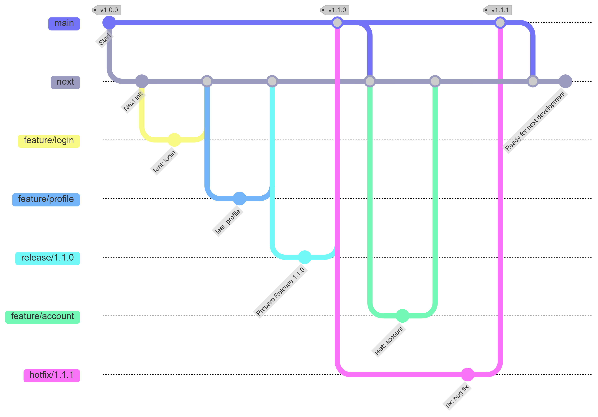

## Git Workflow

### 1. Branches

- `main`: Stable, production-ready code. Tags are created here.
- `next`: Integration branch for ongoing development.
- `feature/*`: Feature development branches.
- `release/*`: For preparing a release.
- `hotfix/*`: Critical fixes, directly from main.

### 2. Tags

- Tags are created only on main after merging release or hotfix branches.



### 3. Branch Workflows

- **next branch**:
  - All ongoing development and feature merges happen on the next branch.
  - After merging hotfix or release to the main branch, we need to merge the main branch to the next branch.

- **main branch**:
  - The main branch is used to create the tag and create the hotfix branch.

- **Release Workflow**:
  - Prepare releases on `release/*` from `next`, merge into `main`, create a tag, and then merge `main` to `next`.

- **Hotfix Workflow**:
  - Critical fixes start from `main`, are fixed on `hotfix/*`, merged back to `main` (with tags), and then merge `main` to `next`.

## Version Strategy

We follow **Semantic Versioning (SemVer)** for our version strategy, which uses the format **MAJOR.MINOR.PATCH**:

- **MAJOR** version increments when making incompatible changes.
- **MINOR** version increments when adding functionality in a backward-compatible manner.
- **PATCH** version increments when making backward-compatible bug fixes.

Additional labels for pre-release and build metadata are available as extensions to the **MAJOR.MINOR.PATCH** format.

[Reference link](https://semver.org/#semantic-versioning-specification-semver)

**Example:**
`1.0.0-alpha < 1.0.0-alpha.1 < 1.0.0-alpha.beta < 1.0.0-beta < 1.0.0-beta.2 < 1.0.0-beta.11 < 1.0.0-rc.1 < 1.0.0`

---

### Docusaurus Release Examples

- **[MAJOR version release](https://github.com/facebook/docusaurus/releases/tag/v3.0.0)**: MUST include the breaking changes and the release note MUST include the migration guide. It COULD include the features and bugs.
- **[MINOR version release](https://github.com/facebook/docusaurus/releases/tag/v3.5.0)**: MUST include the features and COULD include bugs.
- **[PATCH version release](https://github.com/facebook/docusaurus/releases/tag/v3.5.1)**: MUST include bugs.

## Changelog Format and Maintenance Process

## 2.0.0 (2024-12-24)

🔺 **BREAKING CHANGES**

- Change authentication method.

**Features**

- Add real-time data synchronization ([f8360e2](https://github.com/huynguyen-hl/project-identity-resolver/commit/f8360e2e5318b8729cf7aac009aa7b3c7e708348)).
- Change authentication method ([b0993b6](https://github.com/huynguyen-hl/project-identity-resolver/commit/b0993b6391269eb62a297bf4b28781bba8c45e91)).

**Bug Fixes**

- Correct README file typo error ([b242705](https://github.com/huynguyen-hl/project-identity-resolver/commit/b24270561be61a64fd42f1bb5936d627e1ae3604)).
- Prevent memory leak in background tasks ([e61e433](https://github.com/huynguyen-hl/project-identity-resolver/commit/e61e43332cb037985ab507c96d1c2b827b0f24a7)).

**Code Refactoring**

- Improve code organization in storage service ([b242705](https://github.com/huynguyen-hl/project-identity-resolver/commit/b24270561be61a64fd42f1bb5936d627e1ae3604)).

**Tests**

- Add unit tests for storage service ([b242705](https://github.com/huynguyen-hl/project-identity-resolver/commit/b24270561be61a64fd42f1bb5936d627e1ae3604)).

**Changed**

- Updated API response format ([b242705](https://github.com/huynguyen-hl/project-identity-resolver/commit/b24270561be61a64fd42f1bb5936d627e1ae3604)).

**Documentation**

- Update README with new features ([b242705](https://github.com/huynguyen-hl/project-identity-resolver/commit/b24270561be61a64fd42f1bb5936d627e1ae3604)).

**Miscellaneous/Chore**

- Cleanup unused variables ([b242705](https://github.com/huynguyen-hl/project-identity-resolver/commit/b24270561be61a64fd42f1bb5936d627e1ae3604)).

---

## 1.0.0 (2024-12-23)

🔺 **BREAKING CHANGES**

- Change authentication method.

**Features**

- Add real-time data synchronization ([f8360e2](https://github.com/huynguyen-hl/project-identity-resolver/commit/f8360e2e5318b8729cf7aac009aa7b3c7e708348)).
- Change authentication method ([b0993b6](https://github.com/huynguyen-hl/project-identity-resolver/commit/b0993b6391269eb62a297bf4b28781bba8c45e91)).

**Bug Fixes**

- Correct README file typo error ([b242705](https://github.com/huynguyen-hl/project-identity-resolver/commit/b24270561be61a64fd42f1bb5936d627e1ae3604)).
- Prevent memory leak in background tasks ([e61e433](https://github.com/huynguyen-hl/project-identity-resolver/commit/e61e43332cb037985ab507c96d1c2b827b0f24a7)).

**Code Refactoring**

- Improve code organization in storage service ([b242705](https://github.com/huynguyen-hl/project-identity-resolver/commit/b24270561be61a64fd42f1bb5936d627e1ae3604)).

**Tests**

- Add unit tests for storage service ([b242705](https://github.com/huynguyen-hl/project-identity-resolver/commit/b24270561be61a64fd42f1bb5936d627e1ae3604)).

**Changed**

- Updated API response format ([b242705](https://github.com/huynguyen-hl/project-identity-resolver/commit/b24270561be61a64fd42f1bb5936d627e1ae3604)).

**Documentation**

- Update README with new features ([b242705](https://github.com/huynguyen-hl/project-identity-resolver/commit/b24270561be61a64fd42f1bb5936d627e1ae3604)).

**Miscellaneous/Chore**

- Cleanup unused variables ([b242705](https://github.com/huynguyen-hl/project-identity-resolver/commit/b24270561be61a64fd42f1bb5936d627e1ae3604)).

---

## Commit Message Guidelines

To ensure the `CHANGELOG.md` file is generated correctly, each commit message should follow the **[Conventional Commits](https://www.conventionalcommits.org/en/v1.0.0/)** standard.

### Examples

```bash
# New features or significant enhancements
git commit -m "feat: add real-time data synchronization"

# Bug fixes and error corrections
git commit -m "fix: prevent memory leak in background tasks"

# Code refactor
git commit -m "refactor: improve code organization in storage service"

# Adding or updating tests
git commit -m "test: add unit tests for storage service"

# Changes in existing functionality
git commit -m "changed: updated API response format"

# Documentation only changes
git commit -m "docs: update README with new features"

# Maintenance tasks and other miscellaneous changes
git commit -m "chore: cleanup unused variables"
```

### Breaking Changes

When introducing breaking changes, include a ! after the commit type.

### Example

```bash
git commit -m "feat!: change authentication method"
```

## Version Dependency Management

### Overview

The version.json file serves as a central metadata file to define the versioning and dependencies of a service. It ensures compatibility checks can be automated in CI/CD pipelines and provides clear documentation for integrators about which service versions work together.

### Example Structure

```bash
// version.json
{
  "version": "1.0.0",
  "apiVersion": "1.0.0",
  "docVersion": "1.0.0",
  "dependencies": {
    "vckit": {
      "repoUrl": "https://github.com/uncefact/project-vckit.git",
      "versions": ["1.0.0", "1.0.1", "1.0.2"]
    },
    "storage-service": {
      "repoUrl": "https://github.com/uncefact/project-identity-resolver.git",
      "versions": ["1.0.0", "1.0.1", "1.0.2"]
    },
    "idr": {
      "repoUrl": "https://github.com/pyx-industries/pyx-identity-resolver.git",
      "versions": ["1.0.0", "1.0.1", "1.0.2"]
    }
  }
}
```

### Key Fields

- `version`: The version of the current service. Must align with the Git tag.
- `apiVersion`: The API version exposed by the service, the field is optional.
- `docVersion`: The version of the documentation.
- `dependencies`: A list of dependent services with their repositories and compatible version list, the field is optional.
- `repoUrl`: URL of the repository for the dependent service.
- `versions`: Specifies compatible versions.

### Rules

1. **Version Update**:
   - Update the `version.json` file whenever preparing a release.
   - Ensure that the version field matches the Git tag of the release.

2. **Dependency Validation**:
   - Validate the listed versions or ranges in the dependencies field.
   - Confirm compatibility through integration tests for all specified versions.

3. **Semantic Versioning**:
   - Follow semantic versioning guidelines.

4. **Automation**:
   - Automate the validation of dependencies using CI/CD pipelines to fetch tags from repositories and validate their existence.

5. **Documentation**:
   - Ensure `version.json` is accessible to developers and integrators.
   - Document any changes in version compatibility in release notes.
