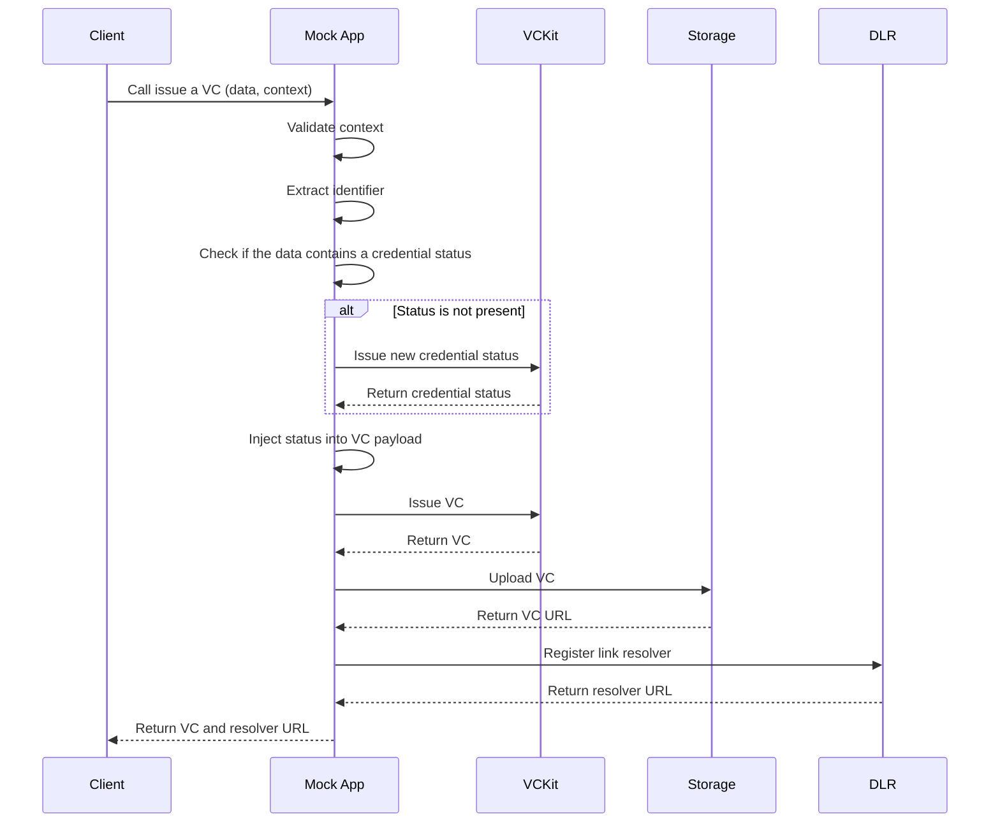

import Disclaimer from '../../\_disclaimer.mdx';

<Disclaimer />

## Description

The Credential Status is being injected into the Verifiable Credential (VC) to manage the status of the VC. The status can be used to activate or revoke the VC. The status is managed by the issuer of the VC.

## Diagram

The sequence diagram below illustrates the flow of injecting the status into the VC:

## Managing the status of a Verifiable Credential

To manage the status of a Verifiable Credential ([activate](https://uncefact.github.io/project-vckit/docs/get-started/api-server-get-started/basic-operations#activating-a-vc) or [revoke](https://uncefact.github.io/project-vckit/docs/get-started/api-server-get-started/basic-operations#revoking-a-vc)), you can refer to the [VCkit](https://uncefact.github.io/project-vckit/docs/) documentation.

