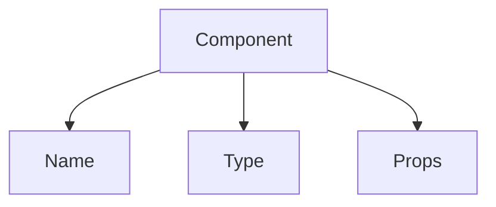

import Disclaimer from '../.././\_disclaimer.mdx';

<Disclaimer />

Components are reusable UI elements that make up the visual and interactive parts of a feature. Some components encapsulate additional logic other than just UI functionalities, like downloading credentials, storing credentials to local storage and generating barcodes.

## Available Components

- [Json Form](./json-form)
- [Custom Button](./custom-button)
- [Barcode Generator](./barcode-generator)
- [Local Storage Loader](./local-storage-loader)
- [Conformity Credential](./conformity-credential)
- [Conformity Credential Checkbox](./conformity-credential-checkbox)

## Diagram



## Config

| Property | Required | Description | Type |
|----------|----------|-------------|------|
| name | Yes | The name of the component (depends on component used)| [Component](#available-components) |
| type | Yes | The type of the component (depends on component used) | [ComponentType](/docs/mock-apps/common/component-type) |
| props | Yes | Properties passed to the component (depends on component used)| [Component](#available-components) |

## Example

```json
{
    "name": "CustomButton",
    "type": "Submit",
    "props": {
        "label": "Submit",
        "description": "Click to submit the form"
    }
}
```

For detailed information about each component, please refer to their respective documentation pages linked above.