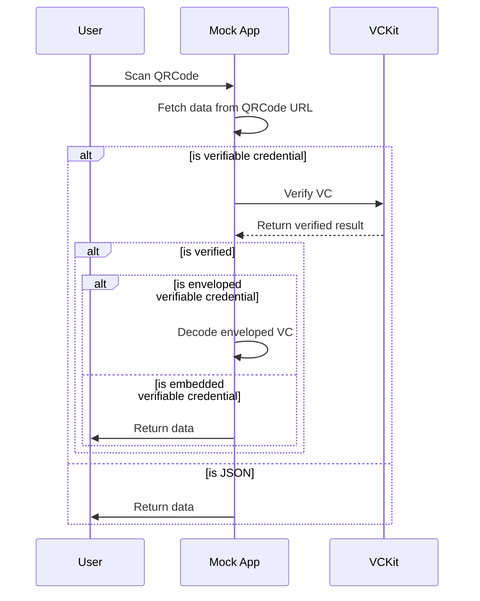

import Disclaimer from '../../\_disclaimer.mdx';

<Disclaimer />

## Description

The QRCodeScannerDialogButton component is responsible for rendering a button that allows the user to scan a QR code. The component will return the data that is scanned by the user.

## Example

```json
{
  "name": "QRCodeScannerDialogButton",
  "type": "EntryData",
  "props": {
    "style": { "margin": "40px auto", "paddingTop": "40px", "width": "80%" }
  }
}
```

## Diagram



## Definitions

| Property | Required | Description                                                      | Type                                                                    |
| -------- | -------- | ---------------------------------------------------------------- | ----------------------------------------------------------------------- |
| name     | Yes      | The name of the component(should be "QRCodeScannerDialogButton") | String                                                                  |
| type     | Yes      | The type of the component (should be "EntryData")                | [ComponentType](/docs/mock-apps/common/component-type)                  |
| props    | Yes      | The properties for the QRCodeScannerDialogButton                 | [Props](/docs/mock-apps/components/qr-code-scanner-dialog-button#props) |

### Props

| Property  | Required | Description                                                                                           | Type   |
| --------- | -------- | ----------------------------------------------------------------------------------------------------- | ------ |
| style     | No       | The style for the component                                                                           | Object |
| type      | No       | The type of data (should be 'VerifiableCredential' and 'JSON'), the default is 'VerifiableCredential' | String |
| vcOptions | No       | The options for the VC data processing                                                                | Object |

#### vcOptions

| Property       | Required | Description                                                                  | Type   |
| -------------- | -------- | ---------------------------------------------------------------------------- | ------ |
| credentialPath | Yes      | The path for the credential data that is fetched from the QR code URL        | String |
| vckitAPIUrl    | No       | The URL for the vckit API                                                    | String |
| headers        | No       | The headers for the vckit API, example: \{ Authorization: "Bearer test123"\} | Object |
