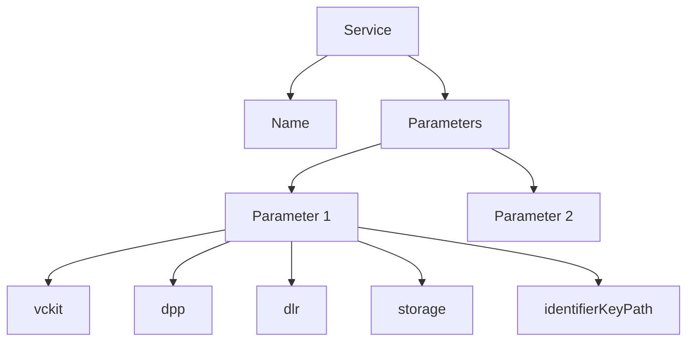

import Disclaimer from '../.././\_disclaimer.mdx';

<Disclaimer />

Services are units of business logic that perform specific operations or interactions with external systems. They handle data processing, API calls, and other backend functionalities.

## Diagram



## Config

| Property   | Required | Description                                                              | Type                                 |
| ---------- | -------- | ------------------------------------------------------------------------ | ------------------------------------ |
| name       | Yes      | The name of the service (depends on service used)                        | [Service](/docs/mock-apps/services/) |
| parameters | Yes      | An array of parameter objects for the services (depends on service used) | [Service](/docs/mock-apps/services/) |

## Example

```json
{
  "services": [
    {
      "name": "processDPP",
      "parameters": [
        {
          "vckit": {
            "vckitAPIUrl": "http://localhost:3332/v2",
            "issuer": "did:web:uncefact.github.io:project-vckit:test-and-development",
            "headers": {
              "Authorization": "Bearer test123"
            }
          },
          "dpp": {
            "context": ["https://dpp-json-ld.s3.ap-southeast-2.amazonaws.com/dppld.json"],
            "renderTemplate": [],
            "type": ["VerifiableCredential", " DigitalProductPassport"],
            "dlrLinkTitle": "Steel Passport",
            "dlrIdentificationKeyType": "gtin",
            "dlrVerificationPage": "http://localhost:3000/verify"
          },
          "dlr": {
            "dlrAPIUrl": "http://localhost:8080",
            "dlrAPIKey": "5555555555555"
          },
          "storage": {
            "url": "http://localhost:3334/v1/documents",
            "params": {
              "bucket": "verifiable-credentials"
            },
            "options": {
              "method": "POST",
              "headers": {
                "Content-Type": "application/json"
              }
            }
          },
          "identifierKeyPath": "/product/itemIdentifiers/0/identifierValue"
        }
      ]
    },
    {
      "name": "mergeToLocalStorage",
      "parameters": [
        {
          "storageKey": "Steel_Mill_1_dpps",
          "objectKeyPath": "/vc/credentialSubject/product/itemIdentifiers/0/identifierValue"
        }
      ]
    }
  ]
}
```
