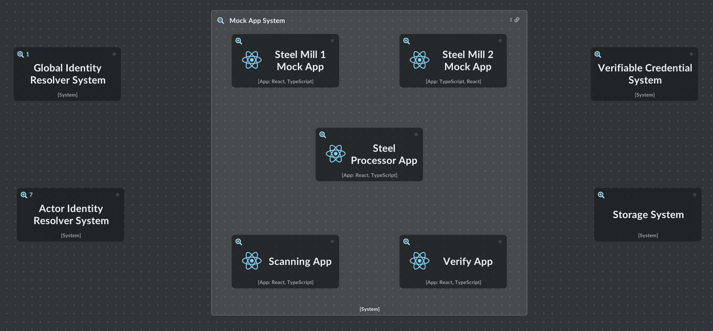

import Disclaimer from '.././\_disclaimer.mdx';

<Disclaimer />

The [United Nations Transparency Protocol (UNTP)](https://uncefact.github.io/spec-untp/) mock apps are designed to model value chain participation and facilitate the testing and demonstration of UNTP implementation within a value chain. These apps provide a flexible and configurable system that allows implementors to compose and customise workflows to suit their specific needs.

## Key Features and Benefits

1. **Value Chain Modeling**: The mock apps enable implementors to model their value chain from raw materials to the final product. This allows for a comprehensive understanding of how UNTP can be integrated and utilised within the actors specific industry or use case.

2. **Integration Testing**: Implementors can use the mock apps to test the integration of their own UNTP implementation. By composing mock apps and their functions, implementors can ensure that the credentials they produce can be seamlessly integrated and consumed by other actors participating in UNTP and vice versa.

3. **Demonstration and Showcasing**: The mock apps serve as a powerful tool for demonstrating how UNTP can be utilised within a value chain. Implementors can use these apps to showcase the benefits and functionality of UNTP to stakeholders, potential partners, and clients.

4. **Highly Configurable**: The mock apps are composed of events that interact with services, providing a highly configurable system. Implementors can use the core UNTP workflow as is or extend it to meet the requirements of their custom workflows.

5. **Distributed Service Interactions**: The mock apps have the capability to interact with various distributed services chosen by the implementor. This includes requesting [Conformity Credentials (CC)](https://uncefact.github.io/spec-untp/docs/specification/ConformityCredential), issuing [Verifiable Credentials](https://uncefact.github.io/spec-untp/docs/specification/VerifiableCredentials), [storing credentials, and registering links to credentials using an Identity Resolver (IDR)](https://uncefact.github.io/spec-untp/docs/specification/IdentityResolver).

6. **Branding and Customisation**: Each mock app can be branded to distinguish between different actors within the value chain. This allows for a clear representation of the various participants and their roles in the UNTP ecosystem.

By leveraging the mock apps, implementors can gain valuable insights into how UNTP can be integrated into their value chain, test their implementations, and demonstrate the benefits of UNTP to stakeholders. The flexibility and configurability of the mock apps make them a powerful tool for driving the adoption and success of UNTP within various industries and use cases.