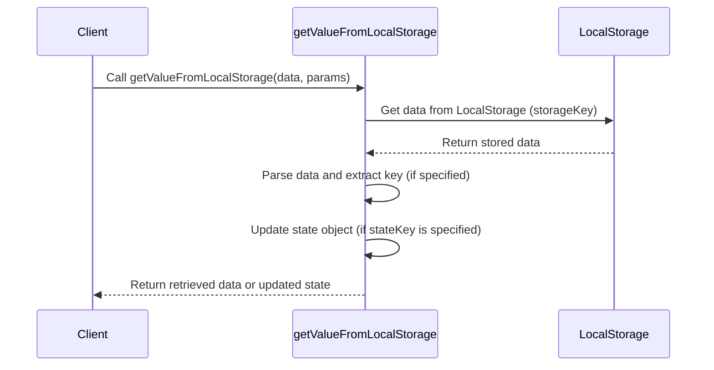

import Disclaimer from '../../\_disclaimer.mdx';

<Disclaimer />

## Description

The `getValueFromLocalStorage` service retrieves data from the browser's local storage. It takes a specific storage key to locate the data and an optional key to extract a particular value from the stored object. If no key is provided, the entire item is returned. Additionally, the function can update a provided state object with the retrieved data if a `stateKey` is specified.

## Diagram



## Example

```json
{
  "name": "getValueFromLocalStorage",
  "parameters": [
    {
      "storageKey": "topLineSteel_dpps",
      "key": "/vc"
    }
  ]
}
```

## Definitions

| Property   | Required | Description                                                                                      | Type   |
| ---------- | -------- | ------------------------------------------------------------------------------------------------ | ------ |
| storageKey | Yes      | The key used to locate the specific data in local storage                                        | String |
| key        | No       | The key to retrieve a specific value within the stored object. If not provided, returns all data | String |
| stateKey   | No       | The key used to update the provided state object with the retrieved data                         | String |
