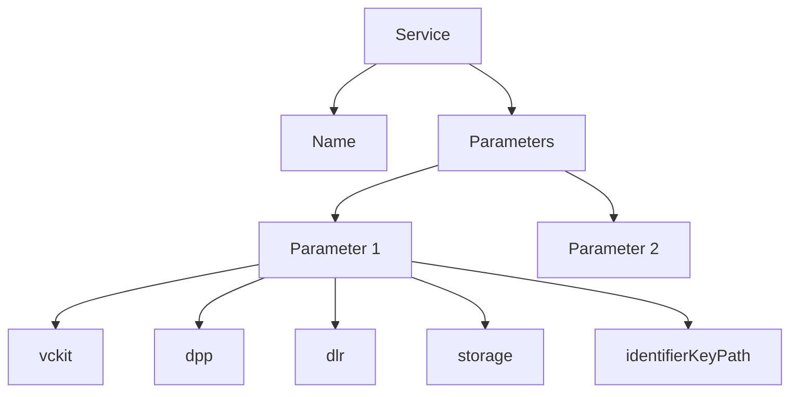

import Disclaimer from '../../_disclaimer.mdx';

<Disclaimer />
<!-- TODO: Implement Process Object event -->
Services are units of business logic that perform specific operations or interactions with external systems. They handle data processing, API calls, and other backend functionalities.

## Available Services
<!-- TODO: Implement processConformityCredential service -->
- [Process DPP](./process-dpp)
- [Process Transaction Event](./process-transaction-event)
- [Process Transformation Event](./process-transformation-event)
- [Process Aggregation Event](./process-aggregation-event)
- [Merge To Local Storage](./merge-to-local-storage)

## Diagram



## Config

| Property | Required | Description | Type |
|----------|----------|-------------|------|
| name | Yes | The name of the service (depends on service used)| [Service](#available-services) |
| parameters | Yes | An array of parameter objects for the services (depends on service used)| [Service](#available-services) |

## Example

```json
{
    "services": [
        {
            "name": "processObjectEvent",
            "parameters": [
                {
                    "vckit": {
                        "vckitAPIUrl": "http://localhost:3332/v2",
                        "issuer": "did:web:agtrace-passports.s3.ap-southeast-2.amazonaws.com"
                    },
                    "dpp": {
                        "context": [
                            "https://dpp-json-ld.s3.ap-southeast-2.amazonaws.com/dppld.json"
                        ],
                        "renderTemplate": [],
                        "type": [
                            "VerifiableCredential",
                            " DigitalProductPassport"
                        ],
                        "dlrLinkTitle": "Steel Passport",
                        "dlrIdentificationKeyType": "gtin",
                        "dlrVerificationPage": "http://localhost:3000/verify"
                    },
                    "dlr": {
                        "dlrAPIUrl": "http://localhost:8080",
                        "dlrAPIKey": "5555555555555"
                    },
                    "storage": {
                        "url": "http://localhost:3001/upload",
                        "params": {
                            "resultPath": "/url"
                        },
                        "options": {
                            "method": "POST",
                            "headers": {
                                "Content-Type": "application/json"
                            }
                        }
                    },
                    "identifierKeyPath": "/product/itemIdentifiers/0/identifierValue"
                }
            ]
        },
        {
            "name": "mergeToLocalStorage",
            "parameters": [
                {
                    "storageKey": "Steel_Mill_1_dpps",
                    "objectKeyPath": "/vc/credentialSubject/product/itemIdentifiers/0/identifierValue"
                }
            ]
        }
    ]
}
```

For detailed information about each service, please refer to their respective documentation pages linked above.