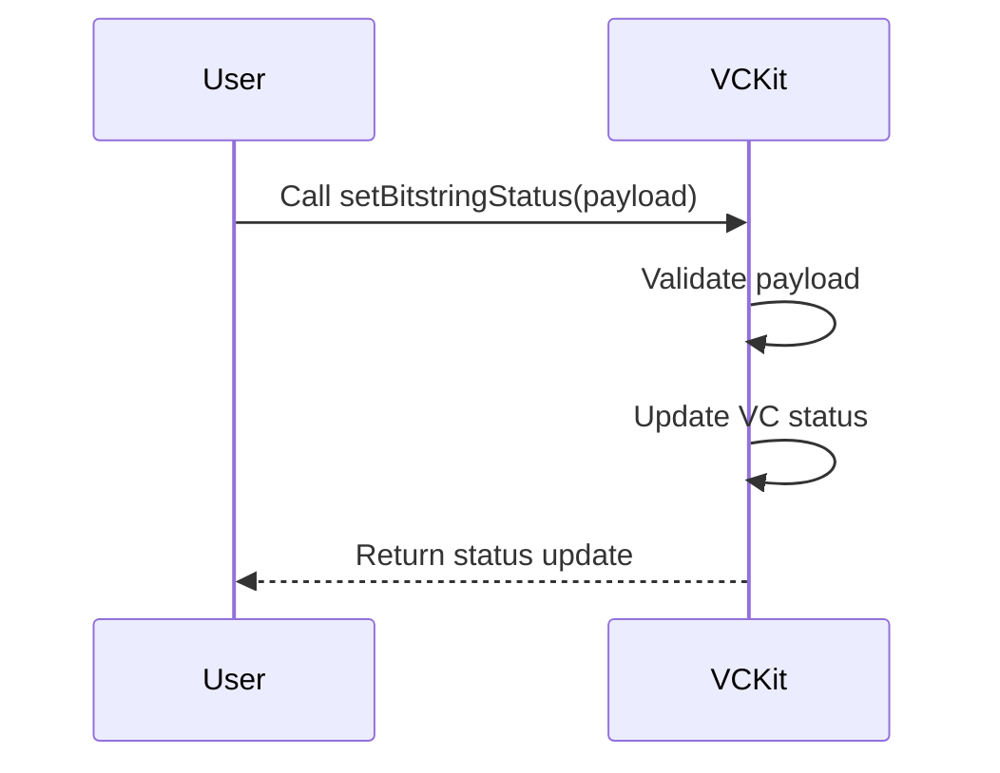

import Disclaimer from '../../\_disclaimer.mdx';

<Disclaimer />

## Description

The Manage Verifiable Credential (VC) Status service is responsible for managing the status of a VC is an important feature of the Verifiable Credential ecosystem. This document explains how to activate and revoke VCs using the VCKit API.

## API Endpoint for Managing VC Status

To manage the status of a Verifiable Credential (activate or revoke), you will use the following API endpoint in the VCKit API:

Set Bitstring Status API Endpoint: `POST http://localhost:3332/agent/setBitstringStatus`

## Diagram

The sequence diagram below illustrates the flow of managing the status of a VC using the `Set Bitstring Status API`:



## Example Request Payload

The request payload for updating the status of a VC should look like this:

```json
{
  "statusListCredential": "http://localhost:3332/credentials/status/bitstring-status-list/26",
  "statusListVCIssuer": "did:web::example.com",
  "statusPurpose": "revocation",
  "index": 0,
  "status": false
}
```

## Definitions

| Property             | Required | Description                                                                                                   | Type    |
| -------------------- | -------- | ------------------------------------------------------------------------------------------------------------- | ------- |
| statusListCredential | Yes      | The URL of the status list associated with the VC. This comes from the `credentialStatus` property in the VC. | String  |
| statusListVCIssuer   | Yes      | The DID of the issuer of the status list, typically your DID (e.g., did:web:...)                              | String  |
| statusPurpose        | Yes      | The purpose for updating the status, which can be `revocation` or other purposes like suspension.             | String  |
| index                | Yes      | The position of the status being updated in the status list, found in the `credentialStatus` of the VC.       | Integer |
| status               | Yes      | The status of the credential. If `false`, the credential is active. If `true`, the credential is revoked.     | Boolean |

## Retrieving Credential Status Information

To manage the status of a VC, you will need to retrieve the status information from the VC. Here's how you can do that:

1.	Verify the VC: In the mock app, go to the Scanning page (/scanning) and scan the barcode associated with the VC.
2.	View VC JSON: Once the VC is verified, you will see the VC JSON tab. Click on it to view the JSON data.
3.	Locate Credential Status: Find the `credentialStatus` object within the VC JSON tab. It might look something like this:

```json
{
  #...others
  "credentialStatus": {
    "id": "http://localhost:3332/credentials/status/bitstring-status-list/26#0",
    "type": "BitstringStatusListEntry",
    "statusPurpose": "revocation",
    "statusListIndex": 0,
    "statusListCredential": "http://localhost:3332/credentials/status/bitstring-status-list/26"
  }
}
```

## Using the Credential Status Data

You can use the data from the `credentialStatus` object to update the status of the VC. Here's how you can use the data:

- statusListCredential: Comes from the `statusListCredential` field.
- statusListVCIssuer: This is your issuer (DID).
- statusPurpose: This will typically be `revocation`.
- index: This is the `statusListIndex` from the `credentialStatus`.
- status: Set this to `false` to activate the credential or `true` to revoke it.

## Example Usage

To revoke a VC, set the status to `true` in the payload:

```json
{
  "statusListCredential": "http://localhost:3332/credentials/status/bitstring-status-list/26",
  "statusListVCIssuer": "did:web:example.com",
  "statusPurpose": "revocation",
  "index": 0,
  "status": true // Revoke
}
```

To activate a VC, set the status to `false`:

```json
{
  "statusListCredential": "http://localhost:3332/credentials/status/bitstring-status-list/26",
  "statusListVCIssuer": "did:web:example.com",
  "statusPurpose": "revocation",
  "index": 0,
  "status": false // Active
}
```

By sending this payload to the [setBitstringStatus](http://localhost:3332/agent/setBitstringStatus) API endpoint, you can manage the status of your Verifiable Credential.