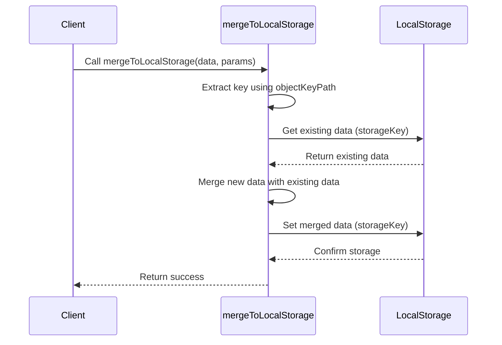

import Disclaimer from '../../_disclaimer.mdx';

<Disclaimer />

## Description

The `mergeToLocalStorage` service is responsible for merging data into the browser's local storage. It takes a specific storage key and an object key path to identify where and how the data should be stored or updated in the local storage.

## Diagram



## Example

```json
{
  "name": "mergeToLocalStorage",
  "parameters": [
    {
      "storageKey": "topLineSteel_dpps",
      "objectKeyPath": "/vc/credentialSubject/productIdentifier/0/identifierValue"
    }
  ]
}
```

## Definitions
<!-- Why not the same attributes as /docs/mock-apps/common/local-storage -->
| Property | Required | Description | Type |
|----------|----------|-------------|------|
| storageKey | Yes | The key used to access the specific data in local storage | String |
| objectKeyPath | Yes | JSON path to the unique identifier within the object to be stored | String |