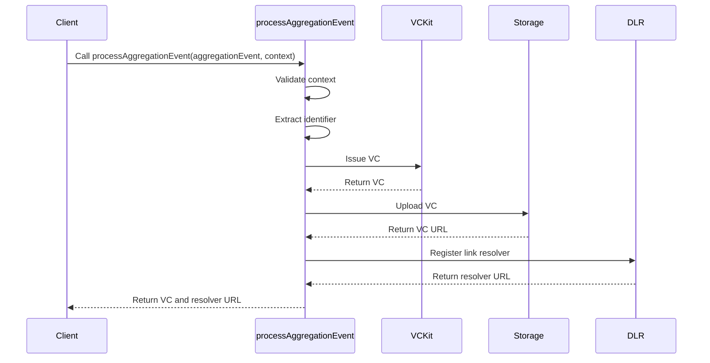

import Disclaimer from '../../_disclaimer.mdx';

<Disclaimer />

## Description

The `processAggregationEvent` service is responsible for processing an [Aggregation Event (DTE)](https://uncefact.github.io/spec-untp/docs/specification/DigitalTraceabilityEvents), issuing a [Verifiable Credential (VC)](https://uncefact.github.io/spec-untp/docs/specification/VerifiableCredentials), uploading it to the [Storage service](/docs/mock-apps/dependent-services/storage-service), registering the link to the stored DTE with the [Identity Resolver service](/docs/mock-apps/dependent-services/identity-resolution-service). It handles the entire lifecycle of creating and managing an aggregation event, from data input to storage and resolution.

## Diagram



## Example

```json
{
  "name": "processAggregationEvent",
  "parameters": [
    {
      "vckit": {
        "vckitAPIUrl": "https://api.vckit.example.com",
        "issuer": "did:example:123456789abcdefghi"
      },
      "epcisAggregationEvent": {
        "context": ["https://www.w3.org/2018/credentials/v1", "https://gs1.org/voc/"],
        "type": ["VerifiableCredential", "EPCISAggregationEvent"],
        "renderTemplate": [
          {
            "type": "html",
            "template": "<div><h2>Aggregation Event</h2><p>Parent: {{parentItem.epc}}</p></div>"
          }
        ],
        "dlrIdentificationKeyType": "sscc",
        "dlrLinkTitle": "Aggregation Event",
        "dlrVerificationPage": "https://verify.example.com"
      },
      "storage": {
        "url": "https://storage.example.com/upload",
        "params": {
          "resultPath": "/url"
        }
      },
      "dlr": {
        "dlrAPIUrl": "https://dlr.example.com/api",
        "dlrAPIKey": "dlr-api-key-12345"
      },
      "identifierKeyPath": "/parentItem/epc"
    }
  ]
}
```

## Definitions

| Property | Required | Description | Type |
|----------|----------|-------------|------|
| vckit | Yes | Configuration for the VCKit service | [VCKit](/docs/mock-apps/common/vckit) |
| epcisAggregationEvent | Yes | Configuration for the EPCIS Aggregation Event | [Credential](/docs/mock-apps/common/credential) |
| storage | Yes | Configuration for storage service | [Storage](/docs/mock-apps/common/storage) |
| dlr | Yes | Configuration for the Digital Link Resolver | [IDR](/docs/mock-apps/common/idr) |
| identifierKeyPath | Yes | JSON path to the identifier in the credential subject | String |