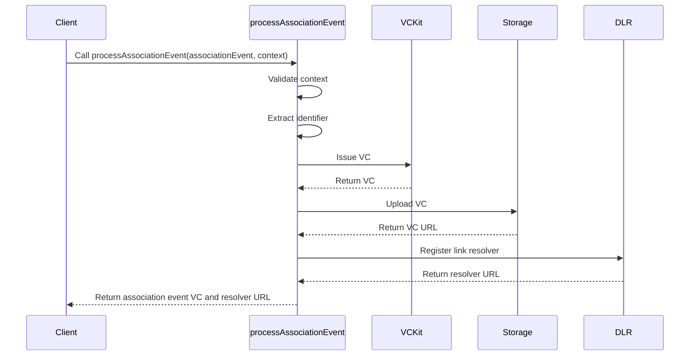

import Disclaimer from '../../\_disclaimer.mdx';

<Disclaimer />

## Description

The `processAssociationEvent` service is responsible for processing an [Association Event (DTE)](https://uncefact.github.io/spec-untp/docs/specification/DigitalTraceabilityEvents), issuing a [Verifiable Credential (VC)](https://uncefact.github.io/spec-untp/docs/specification/VerifiableCredentials), uploading it to the [Storage service](/docs/mock-apps/dependent-services/storage-service), registering the link to the stored DTE with the [Identity Resolver service](/docs/mock-apps/dependent-services/identity-resolution-service). It handles the entire lifecycle of creating and managing an association event, from data input to storage and resolution.

## Diagram



## Example

```json
{
  "name": "processAssociationEvent",
  "parameters": [
    {
      "vckit": {
        "vckitAPIUrl": "https://api.vckit.example.com",
        "issuer": "did:example:123456789abcdefghi"
      },
      "epcisAssociationEvent": {
        "context": [
          "https://jargon.sh/user/unece/traceabilityEvents/v/0.5.0/artefacts/jsonldContexts/traceabilityEvents.jsonld?class=traceabilityEvents"
        ],
        "type": ["VerifiableCredential", "DigitalTraceabilityEvent"],
        "renderTemplate": [
          {
            "template": "<div><h2>Association Event</h2></div>",
            "@type": "WebRenderingTemplate2022"
          }
        ],
        "dlrIdentificationKeyType": "gtin",
        "dlrLinkTitle": "Association Event",
        "dlrVerificationPage": "https://verify.example.com"
      },
      "storage": {
        "url": "https://storage.example.com/upload",
        "params": {
          "bucket": "bucket-name",
          "resultPath": "/url"
        }
      },
      "dlr": {
        "dlrAPIUrl": "https://dlr.example.com/api",
        "dlrAPIKey": "dlr-api-key-12345",
        "namespace": "gs1",
        "linkRegisterPath": "/api/resolver"
      },
      "identifierKeyPath": "/id"
    }
  ]
}
```

## Definitions

| Property              | Required | Description                                                                                                                              | Type                                                            |
| --------------------- | -------- | ---------------------------------------------------------------------------------------------------------------------------------------- | --------------------------------------------------------------- |
| vckit                 | Yes      | Configuration for the VCKit service                                                                                                      | [VCKit](/docs/mock-apps/common/vckit)                           |
| epcisAssociationEvent | Yes      | Configuration for the EPCIS Association Event Event                                                                                      | [Credential](/docs/mock-apps/common/credential)                 |
| storage               | Yes      | Configuration for storage service                                                                                                        | [Storage](/docs/mock-apps/common/storage)                       |
| dlr                   | Yes      | Configuration for the Digital Link Resolver                                                                                              | [IDR](/docs/mock-apps/common/idr)                               |
| identifierKeyPath     | Yes      | JSON path to the identifier in the credential subject or the association for function and arguments of JSON path to construct identifier | [IdentifierKeyPath](/docs/mock-apps/common/identifier-key-path) |
