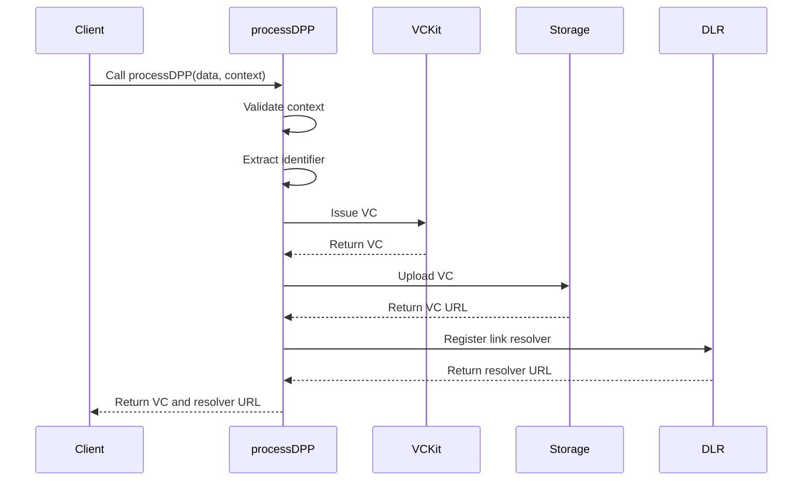

import Disclaimer from '../../_disclaimer.mdx';

<Disclaimer />

## Description

The `processDPP` service is responsible for processing a [Digital Product Passport (DPP)](https://uncefact.github.io/spec-untp/docs/specification/DigitalProductPassport), issuing a [Verifiable Credential (VC)](https://uncefact.github.io/spec-untp/docs/specification/VerifiableCredentials), uploading it to the [Storage service](/docs/mock-apps/dependent-services/storage-service), and registering the link to the stored DPP with the [Identity Resolver service](/docs/mock-apps/dependent-services/identity-resolution-service). It handles the entire lifecycle of creating and managing a DPP, from data input to storage and resolution.

## Diagram



## Example

```json
{
  "name": "processDPP",
  "parameters": [
    {
      "vckit": {
        "vckitAPIUrl": "http://localhost:3332/v2",
        "issuer": "did:web:example.com:steel-mill-1"
      },
      "dpp": {
        "context": ["https://dpp-json-ld.s3.ap-southeast-2.amazonaws.com/dppld.json"],
        "renderTemplate": [
          {
            "template": "<!DOCTYPE html>...",
            "@type": "WebRenderingTemplate2022"
          }
        ],
        "type": ["VerifiableCredential", " DigitalProductPassport"],
        "dlrLinkTitle": "Steel Passport",
        "dlrIdentificationKeyType": "gtin",
        "dlrVerificationPage": "http://localhost:3332/verify"
      },
      "dlr": {
        "dlrAPIUrl": "https://dlr.example.com",
        "dlrAPIKey": "5555555555555"
      },
      "storage": {
        "url": "https://storage.example.com/v1/documents",
        "params": {
          "bucket": "verifiable-credentials",
          "resultPath": "/uri"
        },
        "options": {
          "method": "POST",
          "headers": {
            "Content-Type": "application/json"
          }
        }
      },
      "identifierKeyPath": "/product/itemIdentifiers/0/identifierValue"
    }
  ]
}
```

## Definitions

| Property | Required | Description | Type |
|----------|----------|-------------|------|
| vckit | Yes | Configuration for the VCKit service | [VCKit](/docs/mock-apps/common/vckit) |
| dpp | Yes | Configuration for the Digital Product Passport | [DPP](/docs/mock-apps/common/credential) |
| dlr | Yes | Configuration for the Digital Link Resolver | [IDR](/docs/mock-apps/common/idr) |
| storage | Yes | Configuration for storage service | [Storage](/docs/mock-apps/common/storage) |
| identifierKeyPath | Yes | JSON path to the identifier in the credential subject | String |

