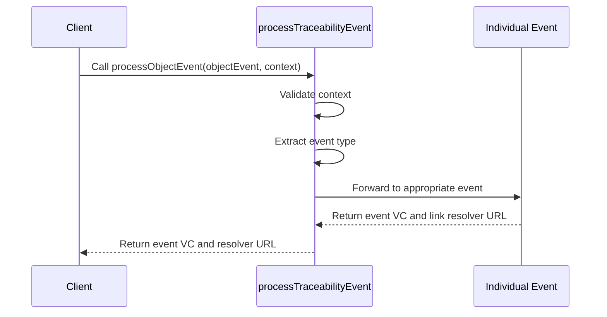

import Disclaimer from '../../\_disclaimer.mdx';

<Disclaimer />

## Description

The `processTraceabilityEvent` service is responsible for processing an [Traceability Event (DTE)](https://uncefact.github.io/spec-untp/docs/specification/DigitalTraceabilityEvents), it only process one event type in one time. The service will check the event type and call the corresponding service to process the event such as [processObjectEvent](/docs/mock-apps/services/process-object-event), [processAggregationEvent](/docs/mock-apps/services/process-aggregation-event), [processTransformationEventOnly](/docs/mock-apps/services/process-transformation-event-only), [processAssociationEvent](/docs/mock-apps/services/process-association-event), and [processTransactionEvent](/docs/mock-apps/services/process-transaction-event).

## Diagram



## Example

```json
{
  "name": "processTraceabilityEvent",
  "parameters": [
    {
      "vckit": {
        "vckitAPIUrl": "http://localhost:3332/v2",
        "issuer": "did:web:uncefact.github.io:project-vckit:test-and-development",
        "headers": {
          "Authorization": "Bearer test123"
        }
      },
      "traceabilityEvent": {
        "context": ["https://www.w3.org/2018/credentials/v1", "https://gs1.org/voc/"],
        "type": ["DigitalTraceabilityEvent"],
        "renderTemplate": [
          {
            "template": "<div><h2>Traceability Event</h2></div>",
            "@type": "WebRenderingTemplate2022"
          }
        ],
        "dlrLinkTitle": "Traceability Event",
        "dlrVerificationPage": "https://verify.example.com"
      },
      "storage": {
        "url": "http://localhost:3334/v1/documents",
        "params": {
          "bucket": "verifiable-credentials"
        },
        "options": {
          "method": "POST",
          "headers": {
            "Content-Type": "application/json"
          }
        }
      },
      "dlr": {
        "dlrAPIUrl": "https://dlr.example.com/api",
        "dlrAPIKey": "dlr-api-key-12345",
        "namespace": "gs1",
        "linkRegisterPath": "/api/resolver"
      },
      "identifierKeyPath": "/0/id",
      "eventTypePath": "/0/type/0"
    }
  ]
}
```

## Definitions

| Property          | Required | Description                                                                                                                         | Type                                                            |
| ----------------- | -------- | ----------------------------------------------------------------------------------------------------------------------------------- | --------------------------------------------------------------- |
| vckit             | Yes      | Configuration for the VCKit service                                                                                                 | [VCKit](/docs/mock-apps/common/vckit)                           |
| traceabilityEvent | Yes      | Configuration for the EPCIS Traceability Event Event                                                                                | [Credential](/docs/mock-apps/common/credential)                 |
| storage           | Yes      | Configuration for storage service                                                                                                   | [Storage](/docs/mock-apps/common/storage)                       |
| dlr               | Yes      | Configuration for the Digital Link Resolver                                                                                         | [IDR](/docs/mock-apps/common/idr)                               |
| identifierKeyPath | Yes      | JSON path to the identifier in the credential subject or the object for function and arguments of JSON path to construct identifier | [IdentifierKeyPath](/docs/mock-apps/common/identifier-key-path) |
| eventTypePath     | Yes      | JSON path to the event type in the credential subject                                                                               | String                                                          |

## Function type

| Type       | Description                                                                                                              |
| ---------- | ------------------------------------------------------------------------------------------------------------------------ |
| ReturnData | It processes the input data or generates data independently and returns the processed result after successful execution. |

