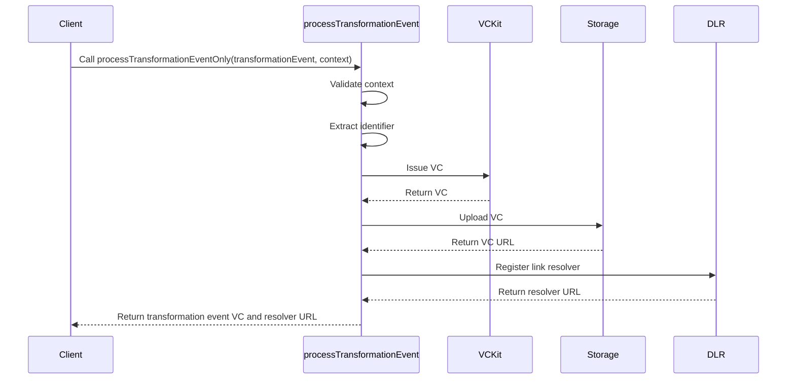

import Disclaimer from '../../\_disclaimer.mdx';

<Disclaimer />

## Description

The `processTransformationEventOnly` service is responsible for processing an [Transformation Event (DTE)](https://uncefact.github.io/spec-untp/docs/specification/DigitalTraceabilityEvents), issuing a [Verifiable Credential (VC)](https://uncefact.github.io/spec-untp/docs/specification/VerifiableCredentials), uploading it to the [Storage service](/docs/mock-apps/dependent-services/storage-service), registering the link to the stored DTE with the [Identity Resolver service](/docs/mock-apps/dependent-services/identity-resolution-service). It handles the entire lifecycle of creating and managing an transformation event, from data input to storage and resolution.

## Diagram



## Example

```json
{
  "name": "processTransformationEvent",
  "parameters": [
    {
      "vckit": {
        "vckitAPIUrl": "http://localhost:3332/v2",
        "issuer": "did:web:uncefact.github.io:project-vckit:test-and-development",
        "headers": {
          "Authorization": "Bearer test123"
        }
      },
      "traceabilityEvent": {
        "context": [
          "https://jargon.sh/user/unece/traceabilityEvents/v/0.5.0/artefacts/jsonldContexts/traceabilityEvents.jsonld?class=traceabilityEvents"
        ],
        "type": ["VerifiableCredential", "DigitalTraceabilityEvent"],
        "renderTemplate": [
          {
            "template": "<div><h2>Transformation Event</h2></div>",
            "@type": "WebRenderingTemplate2022"
          }
        ],
        "dlrLinkTitle": "Transformation Event",
        "dlrVerificationPage": "https://verify.example.com",
        "validUntil": "2025-11-28T04:47:15.136Z"
      },
      "storage": {
        "url": "https://storage.example.com/upload",
        "params": {
          "bucket": "bucket-name"
        }
      },
      "dlr": {
        "dlrAPIUrl": "https://dlr.example.com/api",
        "dlrAPIKey": "dlr-api-key-12345",
        "namespace": "gs1",
        "linkRegisterPath": "resolver"
      },
      "identifierKeyPath": "/0/id"
    }
  ]
}
```

## Definitions

| Property          | Required | Description                                                                                                                              | Type                                                            |
| ----------------- | -------- | ---------------------------------------------------------------------------------------------------------------------------------------- | --------------------------------------------------------------- |
| vckit             | Yes      | Configuration for the VCKit service                                                                                                      | [VCKit](/docs/mock-apps/common/vckit)                           |
| traceabilityEvent | Yes      | Configuration for the EPCIS Transformation Event Event                                                                                   | [Credential](/docs/mock-apps/common/credential)                 |
| storage           | Yes      | Configuration for storage service                                                                                                        | [Storage](/docs/mock-apps/common/storage)                       |
| dlr               | Yes      | Configuration for the Digital Link Resolver                                                                                              | [IDR](/docs/mock-apps/common/idr)                               |
| identifierKeyPath | Yes      | JSON path to the identifier in the credential subject or the association for function and arguments of JSON path to construct identifier | [IdentifierKeyPath](/docs/mock-apps/common/identifier-key-path) |

## Function type

| Type       | Description                                                                                                              |
| ---------- | ------------------------------------------------------------------------------------------------------------------------ |
| ReturnData | It processes the input data or generates data independently and returns the processed result after successful execution. |
