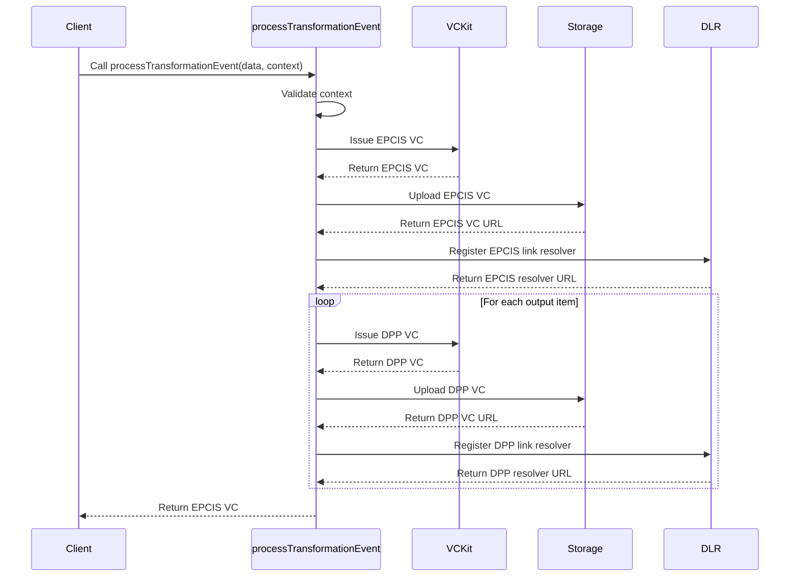

import Disclaimer from '../../_disclaimer.mdx';

<Disclaimer />
<!-- TODO: Confirm the system does delete the transaction events from local storage. If so, update diagram. -->
## Description

The `processTransformationEvent` service is responsible for processing a [Transformation Event (DTE)](https://uncefact.github.io/spec-untp/docs/specification/DigitalTraceabilityEvents), issuing [Verifiable Credentials (VCs)](https://uncefact.github.io/spec-untp/docs/specification/VerifiableCredentials) for both the Transformation Event and [Digital Product Passports (DPPs)](https://uncefact.github.io/spec-untp/docs/specification/DigitalProductPassport), uploading them to the [Storage service](/docs/mock-apps/dependent-services/storage-service), registering the link to the stored DTE and DPPs with the [Identity Resolver service](/docs/mock-apps/dependent-services/identity-resolution-service), and managing Transaction events in local storage associated with the event. It handles the entire lifecycle of creating and managing transformation events and associated DPPs.

## Diagram



## Example

```json
{
  "name": "processTransformationEvent",
  "parameters": [
    {
      "vckit": {
        "vckitAPIUrl": "https://api.vckit.example.com",
        "issuer": "did:example:123456789abcdefghi"
      },
      "epcisTransformationEvent": {
        "context": ["https://www.w3.org/2018/credentials/v1", "https://gs1.org/voc/"],
        "type": ["VerifiableCredential", "EPCISTransformationEvent"],
        "renderTemplate": [
          {
            "type": "html",
            "template": "<div><h2>Transformation Event</h2><p>Output: {{outputItems.0.epc}}</p></div>"
          }
        ],
        "dlrIdentificationKeyType": "gtin",
        "dlrLinkTitle": "Transformation Event",
        "dlrVerificationPage": "https://verify.example.com"
      },
      "dlr": {
        "dlrAPIUrl": "https://dlr.example.com/api",
        "dlrAPIKey": "dlr-api-key-12345"
      },
      "storage": {
        "url": "https://storage.example.com/upload",
        "params": {
          "resultPath": "/url"
        }
      },
      "dpp": {
        "context": ["https://www.w3.org/2018/credentials/v1", "https://schema.org/"],
        "type": ["VerifiableCredential", "DigitalProductPassport"],
        "renderTemplate": [
          {
            "type": "html",
            "template": "<div><h2>Product DPP</h2><p>EPC: {{epc}}</p></div>"
          }
        ],
        "dlrIdentificationKeyType": "gtin",
        "dlrLinkTitle": "Product DPP",
        "dlrVerificationPage": "https://verify.example.com"
      },
      "dppCredentials": [
        {
          "mappingFields": [
            {
              "sourcePath": "/vc/credentialSubject/outputItems/0/epc",
              "destinationPath": "/epc"
            }
          ]
        }
      ],
      "identifierKeyPath": "/outputItems/0/epc",
      "transformationEventCredential": {
        "mappingFields": [
          {
            "sourcePath": "/inputItems",
            "destinationPath": "/inputQuantityList"
          },
          {
            "sourcePath": "/outputItems",
            "destinationPath": "/outputQuantityList"
          }
        ],
        "generationFields": [
          {
            "path": "/eventTime",
            "handler": "generateCurrentDatetime"
          },
          {
            "path": "/eventID",
            "handler": "generateUUID"
          }
        ]
      }
    }
  ]
}
```

## Definitions

| Property | Required | Description | Type |
|----------|----------|-------------|------|
| vckit | Yes | Configuration for the VCKit service | [VCKit](/docs/mock-apps/common/vckit) |
| epcisTransformationEvent | Yes | Configuration for the EPCIS Transformation Event | [Credential](/docs/mock-apps/common/credential) |
| dlr | Yes | Configuration for the Digital Link Resolver | [IDR](/docs/mock-apps/common/idr) |
| storage | Yes | Configuration for storage service | [Storage](/docs/mock-apps/common/storage) |
| dpp | Yes | Configuration for the Digital Product Passport | [Credential](/docs/mock-apps/common/credential) |
| dppCredentials | Yes | Mapping configuration for DPP credentials | [Construct Data](/docs/mock-apps/common/construct-data)[] |
| identifierKeyPath | Yes | JSON path to the identifier in the credential subject | String |
| transformationEventCredential | Yes | Mapping and generation configuration for the transformation event credential | [Construct Data](/docs/mock-apps/common/construct-data) |