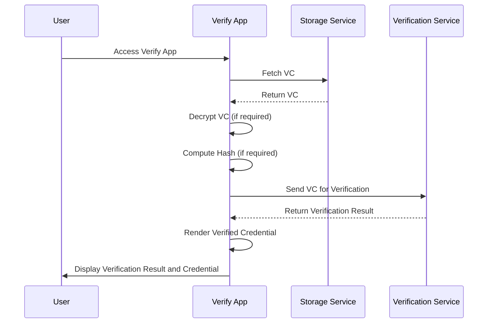

import Disclaimer from '.././\_disclaimer.mdx';

<Disclaimer />

## Description

The Verify App is a crucial component of the [Scanning App](/docs/mock-apps/scanning-app), responsible for verifying UNTP credentials and displaying the verified credentials. It handles the decryption of encrypted Verifiable Credentials (VCs), verification through a dedicated service, and presentation of the results to the user. The main entrypoints into the Verify App are through the [Scanning App](/docs/mock-apps/scanning-app) or by a [Verify Link](/docs/mock-apps/common/verify-link).

## Overall Flow Diagram

## Rendering Verified Credential

The UI of this page includes these information fields: Type, Issued by and Issue date. Besides, the page also contains the tab panel for HTML template, JSON data and the download button.

With the download button, it will download the JSON data or JWT data if the credential is JWT.

## Hash validation (if it exist in URL)

To ensure the integrity of the credential, a hash value is included in the verification link. This hash value is generated using the SHA-256 algorithm, computed from the credential itself. The resulting hash is appended to the verification link as a query parameter.

Upon retrieval of the credential, the application will compute its hash and compare it with the provided value in the URL. If the computed hash matches the provided hash, the credential is considered valid and unaltered.

The hash is optional and can be omitted from the verification link. If the hash is not provided, the credential will not be validated against it.
