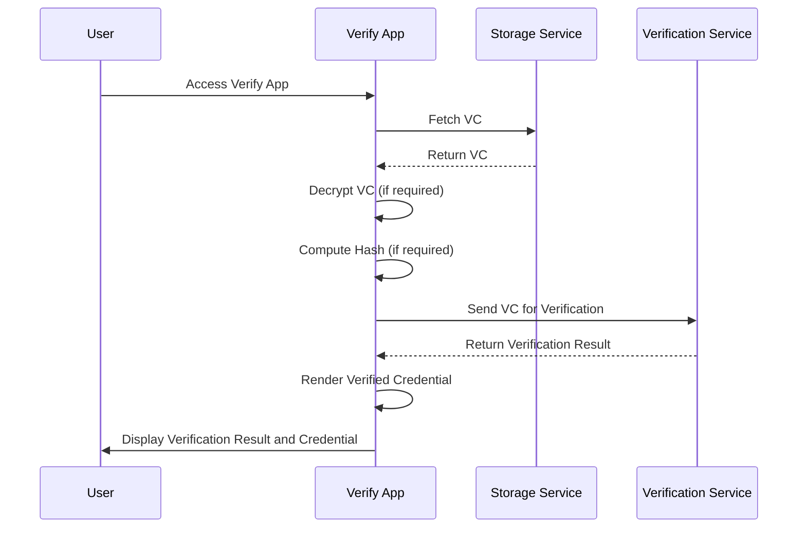

import Disclaimer from '.././\_disclaimer.mdx';

<Disclaimer />

## Description

The Verify App is a crucial component of the [Scanning App](/docs/mock-apps/scanning-app), responsible for verifying UNTP credentials and displaying the verified credentials. It handles the decryption of encrypted Verifiable Credentials (VCs), verification through a dedicated service, and presentation of the results to the user. The main entrypoints into the Verify App are through the [Scanning App](/docs/mock-apps/scanning-app) or by a [Verify Link](/docs/mock-apps/common/verify-link).

## Overall Flow Diagram

