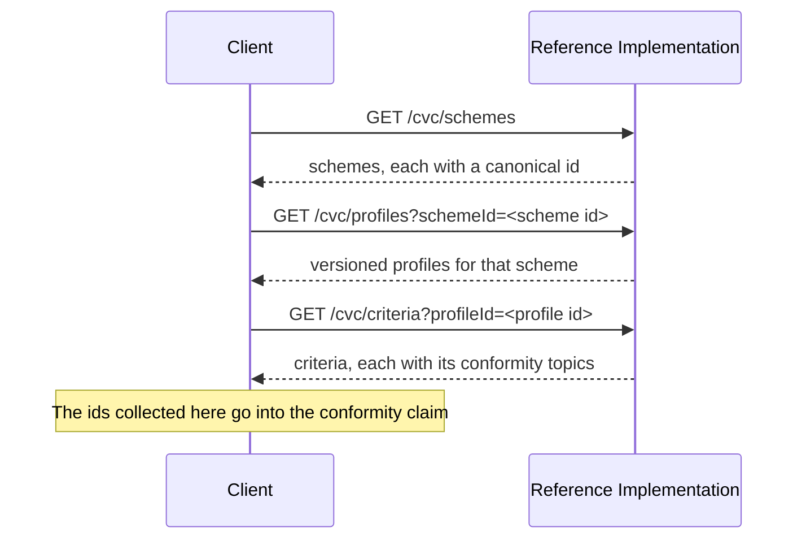

# Conformity Vocabulary Catalogue API

This API lets an issuer browse the conformity schemes registered in this Reference Implementation, drilling from a **scheme** to the **profiles** it publishes, and from a profile to the **criteria** it defines. The URIs these endpoints return are the ones you put in a credential's conformity claim.

Everything here is read-only and answered from the local catalogue. Where those schemes come from, and which of them a tenant can see, is described in [Conformity Vocabulary Catalogue](../data-models/conformity-vocabulary-catalogue).

:::tip[Interactive API documentation]
The Reference Implementation includes a Swagger UI at [`/api-docs`](http://localhost:3003/api-docs) with full request/response schemas you can try directly from the browser. The endpoint descriptions below focus on behaviour and internal logic — refer to Swagger for exact payload shapes. All endpoints require authentication — see [Authentication](../authentication#obtaining-a-token) for how to obtain a Bearer token.
:::

## Concepts

### Scheme, profile, criterion

A conformity scheme is published by whoever owns it, and inlines the profiles it offers; each profile inlines the criteria it requires.

| Level | What it is | Example |
|-------|------------|---------|
| **Scheme** | The programme a claim is made under | "Copper Mark" |
| **Profile** | A versioned assessment profile within that scheme | "Responsible Risk Assessment v3.0" |
| **Criterion** | A single requirement within a profile | "Forced labour" |

### Every `id` is a canonical URI

The `id` on every entry these endpoints return is the entry's **canonical URI**, not an internal database identifier. That URI is what a conformity claim carries, so a client can take an `id` from a response and put it straight into a credential.

Profile and criterion URIs are versioned; a scheme URI is not. Two profiles of the same scheme are different URIs, and the same criterion can differ between profile versions, so a claim is always specific about which revision it was assessed against.

### Visibility

Each request returns the schemes visible to the authenticated tenant: the system catalogue plus that tenant's own entries. Where the same canonical URI exists in both, the system entry takes precedence, so a tenant sees one entry per URI rather than two.

### Drilling down

The three endpoints are meant to be used in sequence, each taking the previous response's `id`.



### Pagination and validation

Results are paginated. All three endpoints take `limit` and `offset`, and reject a malformed value rather than ignoring it.

| Parameter | Behaviour |
|-----------|-----------|
| `limit` | Number of entries per page. Defaults to 20, or the [configured maximum](../operations/api-pagination#maximum-page-size) where that is lower. A value above the maximum is rejected with a 400 naming the maximum, rather than being quietly reduced. |
| `offset` | Number of entries to skip. Defaults to 0. |

A non-integer, negative, or otherwise malformed `limit` or `offset` is a 400 naming the parameter. Repeating a query parameter is also a 400, rather than one of the values being picked silently.

Entries are returned sorted by name.

### Response shape

All three endpoints return the same envelope: the page of entries under `data`, and the counts under `pagination`.

| Field | Description |
|-------|-------------|
| `data` | The entries on this page |
| `pagination.total` | How many entries the tenant can see in total, before paging |
| `pagination.limit` | The page size actually applied |
| `pagination.offset` | The offset actually applied |
| `pagination.hasMore` | Whether another page follows |

A filter value is a URI, so URL-encode it when building the query string.

---

## Endpoints

### List Schemes

```
GET /api/v1/cvc/schemes
```

Returns the conformity schemes registered in this Reference Implementation and visible to the authenticated tenant. There is no filter; this is the entry point for the drill-down.

An empty list is the expected response on a deployment that has not had any schemes seeded, rather than a sign the endpoint is misconfigured. See [Conformity Vocabulary Catalogue](../data-models/conformity-vocabulary-catalogue) for how schemes get there.

| Field | Description |
|-------|-------------|
| `id` | The scheme's canonical URI |
| `name` | Human-readable scheme name |
| `specVersion` | The CVC specification version the scheme document conforms to, for example `0.7.0`. Not a version of the scheme itself |
| `owner` | Present where the scheme document names one, as `{ canonicalId, name }`; either part may be absent |

---

### List Profiles

```
GET /api/v1/cvc/profiles?schemeId=<canonical scheme URI>
```

Returns the versioned profiles the given scheme publishes.

| Parameter | Description |
|-----------|-------------|
| `schemeId` | **Required.** The canonical URI of the scheme, as returned by List Schemes. A missing or blank value is a 400. |

A scheme that is not registered here returns an empty list rather than a 404, because the endpoint answers "what do I hold for this URI", and holding nothing is a valid answer rather than an error.

| Field | Description |
|-------|-------------|
| `id` | The profile's canonical, versioned URI |
| `name` | Human-readable profile name |
| `version` | The profile version, also encoded in the `id` |
| `status` | Lifecycle status, for example `active` |
| `validFrom` | Present where the scheme document states one |

---

### List Criteria

```
GET /api/v1/cvc/criteria?profileId=<canonical profile URI>
```

Returns the criteria the given profile defines, each with the conformity topics that criterion addresses.

| Parameter | Description |
|-----------|-------------|
| `profileId` | **Required.** The canonical URI of the profile, as returned by List Profiles. A missing or blank value is a 400. |

As with profiles, a profile that is not registered here returns an empty list.

| Field | Description |
|-------|-------------|
| `id` | The criterion's canonical, versioned URI |
| `name` | Human-readable criterion name |
| `version` | The criterion version, also encoded in the `id` |
| `status` | Lifecycle status, for example `active` |
| `topics` | The conformity topics this criterion addresses, each `{ canonicalId, name?, definition? }` |
| `tags` | Free-form tags the scheme document attached |

The topics matter when a claim classifies its criteria: a mismatch between what a credential declares and what the criterion defines produces an advisory warning when a UNTP v0.7.0 Digital Conformity Credential is issued. [CVC compliance](./credentials#cvc-compliance-conformity-credentials-only) lists the warning codes and what each one means.

---

## Errors

| Status | When |
|--------|------|
| `400` | A required filter is missing or blank, a pagination parameter is malformed or above the maximum, or a query parameter is repeated |
| `401` | No valid session or bearer token |
| `403` | The authenticated principal has no resolvable tenant |
| `500` | Server error |
