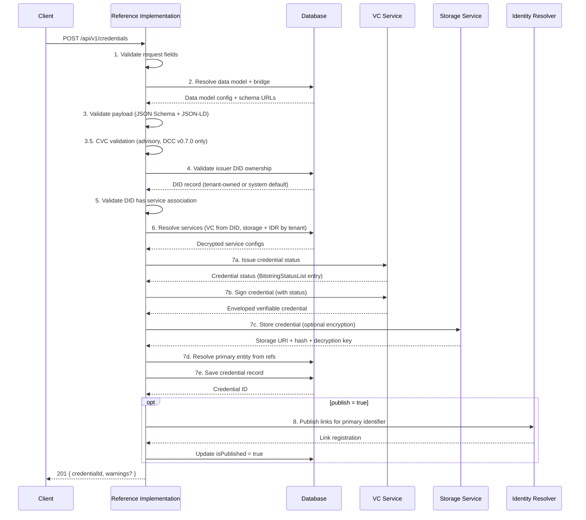
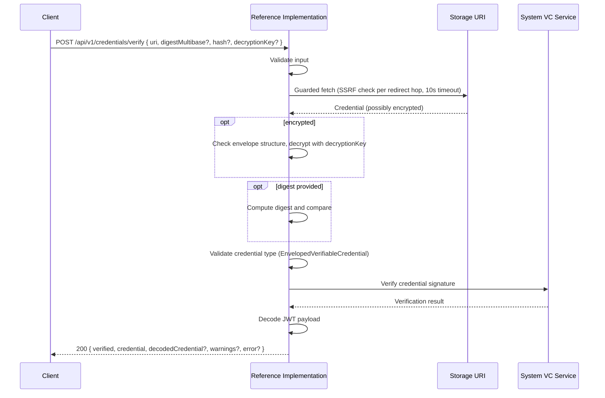

# Credentials API

Credentials are the core output of the Reference Implementation. Everything else in the system — [DIDs](./dids), [services](./services), [data models](./data-models), [identifiers](./identifiers), and [master data](./organisations) — exists to support one goal: **issuing trusted, verifiable digital documents about products, facilities, organisations, and supply chain events**.

A credential is a digitally signed statement. A company issues a credential that says "this product was made sustainably" or "this facility passed a conformity assessment". Because the credential is cryptographically signed, anyone who receives it can verify that the statement hasn't been tampered with and that it really came from the company that claims to have issued it, without needing to contact the issuer directly.

The Credentials API has two sides:

- **Issuance** (authenticated) — a tenant creates a credential, the system validates it, signs it, stores it, and optionally publishes it so it can be discovered by resolving an identifier.
- **Verification** (public, no login required) — anyone with a link to a stored credential can check whether it's genuine, untampered, and still valid.

:::tip[Interactive API documentation]
The Reference Implementation includes a Swagger UI at [`/api-docs`](http://localhost:3003/api-docs) with full request/response schemas you can try directly from the browser. The endpoint descriptions below focus on behaviour and internal logic. Refer to Swagger for exact payload shapes. All endpoints except [Verify](#verify-a-credential) require authentication. See [Authentication](../authentication#obtaining-a-token) for how to obtain a Bearer token.
:::

## Concepts

### What's Inside a Credential?

Every credential issued by the Reference Implementation follows the [W3C Verifiable Credentials Data Model](https://www.w3.org/TR/vc-data-model-2.0/) and the [UNTP Verifiable Credential profile](https://untp.unece.org/docs/specification/VerifiableCredentials). In plain terms, a credential contains:

- **Who issued it** — the issuer's [DID](./dids) (a cryptographic identity)
- **What it says** — the credential subject (e.g., product sustainability data, conformity assessment results)
- **When it was issued** — a timestamp
- **A digital signature** — proof that the issuer really signed it and that nobody changed it afterwards
- **A credential status** — a mechanism for the issuer to revoke or suspend the credential later if needed (managed via [BitstringStatusList](https://www.w3.org/TR/vc-bitstring-status-list/) by the [VC service](../services/verifiable-credential-service))

### How Credentials Are Packaged

UNTP credentials use the [**enveloped** form](https://www.w3.org/TR/vc-data-model-2.0/#enveloped-verifiable-credentials): the credential payload is signed as a [JWT (JSON Web Token)](https://datatracker.ietf.org/doc/html/rfc7519), and the JWT is wrapped inside a [JSON-LD](https://www.w3.org/TR/json-ld11/) envelope. This means you get the best of both worlds — compact, efficient JWT signatures with the semantic richness of linked data.

When the Reference Implementation issues a credential, the result is an `EnvelopedVerifiableCredential` that looks like this:

```json
{
  "@context": ["https://www.w3.org/ns/credentials/v2"],
  "type": "EnvelopedVerifiableCredential",
  "id": "data:application/vc+jwt,eyJhbGciOiJFZDI1NTE5..."
}
```

The `id` field contains the actual JWT. The verification endpoint knows how to unwrap this and decode the original credential payload.

### Credential Types

The type of credential determines what kind of data it contains and which schema is used to validate it. Credential types are defined by [data models](./data-models) — see the [Data Models API](./data-models) for the full list of core UNTP types and how extension data models work.

### Encryption and Privacy

When a credential is issued, two things are created: the **signed credential** (stored externally by the [storage service](./services)) and a **credential record** (stored in the Reference Implementation's database, tracking metadata like the storage URI, hash, and published status).

By default, the [storage service](./services) **encrypts** the signed credential before storing it, so the file at the storage URI is unreadable on its own. The storage service returns the decryption key once, when the credential is stored, and the Reference Implementation saves it on the credential record. Reading the record through this API includes that key, so it can be presented alongside the storage URI during [verification](#verify-a-credential).

This matters for privacy: a credential about a product's supply chain might contain commercially sensitive information. Encryption ensures that only someone with the key can read it, even if they have the storage URL.

| Setting | What Happens |
|---------|-------------|
| `encrypt: true` (default) | Credential encrypted before storage. A `decryptionKey` is returned. |
| `encrypt: false` | Credential stored in plaintext. Anyone with the URL can read it. |

### Integrity Hashing

Every stored credential has a **content hash** — a fingerprint computed from the credential's contents. If even one character changes, the hash changes. This allows anyone to detect that the credential at a storage URI hasn't been swapped or modified after being stored. During [verification](#verify-a-credential), the computed hash is compared against the expected hash.

### Discoverability via the Identity Resolver

A credential on its own is just a file at a URL. To make it useful, it needs to be **discoverable** — someone who knows a product's identifier should be able to find the credential. This is the role of the [UNTP Identity Resolver](https://untp.unece.org/docs/specification/IdentityResolver) and [Decentralised Access Control](https://untp.unece.org/docs/specification/DecentralisedAccessControl) specifications.

This is where the [Identity Resolver](./identifiers#what-are-links) comes in. When a credential is published, the Reference Implementation registers a link with the Identity Resolver that connects the entity's identifier (e.g., a GS1 GTIN) to the credential's storage URL. Now anyone who resolves that identifier can find the credential.

Publishing is optional and resolves from the credential's own identifier, which must belong to an [identifier scheme](./identifiers#what-is-an-identifier-scheme) reachable through an IDR service.

### CVC Compliance (Conformity Credentials Only)

For UNTP v0.7.0 [Digital Conformity Credentials](./data-models), the issuance pipeline performs an extra advisory check: it compares the conformity scheme, profile, and criteria referenced in the credential against the locally known [Conformity Vocabulary Catalogue (CVC)](https://untp.unece.org/docs/specification/ConformityVocabularyCatalog) schemes. Earlier DCC versions are issued without this check. This helps catch mistakes like referencing a non-existent scheme or omitting a required criterion. See [Conformity Vocabulary Catalogue](../data-models/conformity-vocabulary-catalogue) for where those schemes come from, and the [Conformity Vocabulary Catalogue API](./conformity-vocabulary-catalogue) for browsing them.

CVC validation is **advisory only** — it never blocks issuance. If issues are found, the credential is still issued but the response includes warnings.

### The Issuance Pipeline

Issuing a credential involves eight stages. Each stage can fail independently, and failures at different stages produce different HTTP status codes and warning codes. See the [Issue a Credential](#issue-a-credential) endpoint for the full request and response reference.



#### Stage 1: Request Validation

The three required fields are validated:

| Field | Type | Required | Description |
|-------|------|----------|-------------|
| `credentialPayload` | object | Yes | The full credential payload conforming to the UNTP schema for the specified type and version |
| `credentialType` | string | Yes | Must match a registered [data model](./data-models) (e.g., `DigitalProductPassport`) |
| `version` | string | Yes | Must match a registered data model version (e.g., `0.6.1`) |

#### Stage 2: Data Model Resolution

The `credentialType` and `version` are used to look up a registered [data model](./data-models). The data model provides the JSON Schema URL(s) for validation, the JSON-LD context URL, and the [bridge](./data-models#data-model-bridges) that extracts entity references from the payload.

For [extension data models](./data-models#untp-core-data-models-and-extensions), both the parent schema and the extension schema are validated.

#### Stage 3: Payload Validation

The credential payload is validated in two passes:

1. **JSON Schema validation** against the data model's schema URL(s). This catches structural issues such as missing required fields, incorrect types, or invalid enum values.
2. **JSON-LD expansion** to verify the payload is valid linked data with a resolvable `@context`.

If either check fails, the request is rejected with HTTP 400, the error message says why, and a `code` field distinguishes the two things that can go wrong at each pass. `SCHEMA_DOCUMENT_INVALID` and `JSONLD_DOCUMENT_INVALID` mean the payload itself is invalid; the message carries the detail to fix, such as the missing property or the undefined term. `SCHEMA_FETCH_FAILED` and `JSONLD_CONTEXT_FETCH_FAILED` mean a remote schema or `@context` document could not be fetched or used. The schema message names the schema URL; the context message carries the HTTP status or timeout where one applies, and collapses to a general message when the URL itself was rejected. A document failure is fixed by correcting the payload; a fetch failure usually reflects an upstream or network condition rather than a problem with the credential.

#### Stage 3.5: CVC Compliance Validation (Advisory)

For [Digital Conformity Credentials](./data-models) (DCC), the issuance pipeline performs an advisory check against the locally known conformity schemes (operator-seeded in this release). This check verifies that the conformity scheme, profile, and criteria referenced in the credential payload correspond to entries in the catalogue, and that the claimed criteria line up with what the profile defines.

CVC validation is advisory only. It never blocks issuance. If the check fails or no matching scheme is available, the credential is issued with warnings in the response. Warning codes include:

| Code | Meaning |
|------|---------|
| `conformity-scheme.not-found` | A referenced conformity scheme URI is not in the locally known catalogue |
| `conformity-profile.not-found` | A referenced profile URI is not found within the scheme |
| `conformity-profile.not-specified` | The claim references no profile, so criterion and topic checks were not performed (criteria are published per versioned profile) |
| `conformity-criterion.not-in-profile` | A claimed criterion is not one the referenced profile publishes |
| `conformity-criterion.missing` | A criterion the profile defines is absent from the claim |
| `conformity-criterion.topic-mismatch` | A criterion's declared conformity topics do not match those the criterion defines |
| `conformity-assessment.topic-mismatch` | An assessment declares a conformity topic that none of its assessed criteria define |
| `conformity-claim.validation-error` | Validation could not be performed (extraction or infrastructure failure) |

Criterion and topic warnings name the versioned profile URI they were checked against in their message, since profile URIs carry a version segment and the same criterion can differ between profile versions.

Alongside `code` and `message`, a warning can carry structured fields so a client can act on it without reading the message text:

| Field | What it carries |
|-------|-----------------|
| `received` | The value that triggered the warning, such as the criterion URI the profile does not publish |
| `expected` | The value or shape that was expected, where there is one |
| `pointer` | A JSON pointer to the place in the credential you submitted that the warning concerns, for example `/credentialSubject/conformityAssessment/0/assessmentCriteria/1/id` |
| `remediation` | What to do about it, where the check can say |

A pointer appears only where the warning has a location in your credential and that location resolves, so treat it as present-or-absent rather than guaranteed. Two warnings never carry one, because their subject is not in the document at all. `conformity-criterion.missing` names a criterion the claim never declared, so read `expected` for the criterion the profile publishes. `conformity-profile.not-specified` reports the absence of a profile and carries neither `received` nor `expected`, so the message is the whole of it.

The assessment-level topic check runs only when the assessment references at least one criterion and every referenced criterion resolves in the profile. An assessment that references no criteria is not warned, because its own `conformityTopic` is then the claim's only classification (the intended modelling when, for example, a scheme publishes no digital vocabulary of criteria); an unresolved criterion is reported as `conformity-criterion.not-in-profile` instead of producing a topic verdict from incomplete evidence.

#### Stage 4: Issuer DID Ownership Validation

The `issuer.id` field in the credential payload must contain a [DID](./dids) that the authenticated tenant is authorised to use. The Reference Implementation looks up the DID and verifies that it either:

- belongs to the authenticated tenant, or
- is a [system default DID](./dids#system-dids-vs-tenant-dids) — available to all tenants as part of the [incremental adoption ramp](../overview#incremental-adoption)

**If the DID is not registered to the tenant and is not a system default DID, the request is rejected with HTTP 400.** A tenant cannot issue credentials using a DID that belongs to another tenant.

#### Stage 5: DID Service Association Check

The issuer DID must have an associated [VC service instance](./services) — this is the service that holds the DID's key material and will perform signing. If the DID has no association (e.g., the service instance was [force-deleted](./services#delete-a-service-instance)), the request is rejected with HTTP 400. The DID must be re-imported or re-created to restore the association.

#### Stage 6: Service Resolution

The **VC service** is resolved from the issuer DID's associated service instance. This ensures signing always happens on the VC service that holds the DID's key material, regardless of whether the DID is a tenant-owned DID or a [system default DID](./dids#system-dids-vs-tenant-dids). The caller does not need to specify which VC service to use; the DID determines it.

The **storage service** and **IDR service** follow the standard [resolution chain](../services/service-architecture#system-services-vs-tenant-services):

| Service | Purpose | How Resolved |
|---------|---------|-------------|
| **VC Service** | Signs the credential payload | From the issuer DID's associated service instance |
| **Storage Service** | Stores the signed credential | `storageOptions.serviceInstanceId`, or tenant primary, or system default |
| **IDR Service** | Publishes links (only when `publish: true`) | From the resolved identifier's scheme, then its registrar, then the tenant/system default |

#### Stage 7: Sign, Store, and Record

The credential payload is signed by the VC service, producing an [Enveloped Verifiable Credential](https://www.w3.org/TR/vc-data-model-2.0/#enveloped-verifiable-credentials). The signed credential is then stored by the storage service.

**Encryption**: By default, the stored credential is encrypted with AES-GCM. The decryption key is returned in the credential record and must be provided when [verifying](#verify-a-credential) encrypted credentials. Set `storageOptions.encrypt` to `false` to store the credential unencrypted.

**Entity linking**: The data model bridge extracts entity references (organisations, facilities, products) from the credential payload. The primary entity (priority: product > facility > organisation) is linked to the credential record in the database. This link is best-effort enrichment; it never gates the optional publishing step, and a match that fails to link (for example the entity was deleted between extraction and insert) is reported as an advisory `ENTITY_LINK_FAILED` warning rather than affecting the credential or the publish.

#### Stage 8: IDR Publishing (Optional)

When `publishingOptions.publish` is `true`, the Reference Implementation publishes a link to the stored credential on the [Identity Resolver](./identifiers#what-are-links) for the credential's own identifier. This makes the credential discoverable via that identifier's scheme (e.g., resolving a GS1 GTIN leads to the credential).

Publishing resolves its target from the same reference used for entity linking (priority: product > facility > organisation), looked up against the tenant's identifiers rather than against master data. Publishing requires that lookup to resolve to exactly one identifier with:
- An [identifier scheme](./identifiers#what-is-an-identifier-scheme) that has a primary key
- A registrar with a namespace
- An IDR service instance (configured on the scheme, the registrar, or the tenant/system default)

When publishing cannot complete, the credential is still issued and returned, and a warning names the unmet prerequisite along with what to do about it:

| Code | Meaning | What to do |
|------|---------|------------|
| `REFS_EXTRACTION_FAILED` | No identifier could be read from the credential payload. | Check the subject carries the identifier fields its data model defines, such as a `registeredId`. |
| `PUBLISH_REFERENCE_MISSING` | The payload carries no identifier to publish under. | Check the subject carries the identifier fields its data model defines. |
| `PUBLISH_SCHEME_INCOMPLETE` | The identifier resolved to a scheme without a primary key, or a registrar without a namespace. | Complete the scheme and registrar configuration, then issue again. |
| `PUBLISH_IDENTIFIER_UNKNOWN` | No identifier matching the value is registered for the tenant, or the scheme named in `identifierSchemeId` does not hold that value. | Register the identifier under a scheme, or correct `identifierSchemeId`. |
| `PUBLISH_IDENTIFIER_AMBIGUOUS` | The value exists under more than one scheme, so the target is not decidable. | Set `publishingOptions.identifierSchemeId` to the scheme you want to publish under. |
| `PUBLISH_IDR_UNAVAILABLE` | No Identity Resolver service is configured for the scheme, registrar, or tenant. | Ask your operator to configure an IDR service instance. |
| `PUBLISH_TARGET_UNRESOLVED` | The identifier lookup itself failed, so no publish was attempted. | The credential was issued; ask your operator to check the service. |
| `PUBLISH_LINKS_UNBUILDABLE` | The credential links could not be built from the stored credential. | The credential was issued and stored; ask your operator to check the storage response. |
| `IDR_PUBLISH_FAILED` | The Identity Resolver rejected the links. | Check the scheme is registered with the resolver, then issue again once it is. |
| `IDR_PUBLISH_UNCONFIRMED` | The resolver could not be reached or did not answer, so whether the links were registered is unknown. | Ask your operator to check the resolver before issuing again: a second publish of the same links is rejected as a duplicate. |
| `DB_STATUS_UPDATE_FAILED` | The links are live on the resolver, but the stored published status could not be saved. | The credential is discoverable; only the local status is stale. |
| `ENTITY_LINK_FAILED` | The credential could not be linked to its master-data record, which no longer exists. | Optional enrichment only; publishing and the credential itself are unaffected. |
| `DETAILS_EXTRACTION_FAILED` | The credential's name, issuer, subject and validity dates could not be read from it, so they are not recorded against it. | The credential can be retrieved and verified as usual. Only its stored summary is missing. The warning names the correlation ID to quote to your operator, who can find the cause in the logs. |

The IDR entry's `description` field is taken from the linked primary entity's `description`, falling back to the entity's `name`, and then to the link title (`publishingOptions.linkTitle`, or the data model's name) when no entity is linked, since the resolver requires a non-empty description.

**Human verification link**: When publishing without an explicit `humanVerificationUrl`, the published link set includes a link to this Reference Implementation's own verify page. The base is derived from the `RI_APP_URL` environment variable, which is parsed as a URL with `/verify` appended to its path (any query or fragment is dropped, a base path is preserved, and a trailing slash is trimmed); for the default `http://localhost:3003` the link is `http://localhost:3003/verify`. `RI_APP_URL` is configured in the RI's environment (the shipped `.env.example` and Docker Compose files default it to `http://localhost:3003`) and is the same base URL that backs the OIDC post-logout redirect (see [Identity provider requirements](../authentication/idp-requirements)). Supplying `humanVerificationUrl` overrides the default, for deployments that host verification elsewhere.

A supplied `humanVerificationUrl` keeps its own query string and fragment, but the RI strips five reserved parameter names from it before adding its own verification payload: `uri`, `digestMultibase`, `hash`, `decryptionKey`, and `q`. The RI's own verify page reads those parameters directly, so a supplied URL that already used one of them would otherwise shadow the payload. `machineVerificationUrl` is not processed this way. It is published exactly as supplied, with no query-string handling.

The published link does **not** carry the credential's decryption key. The key is not registered on the Identity Resolver; it is shared out of band, so access to an encrypted credential does not travel with its discovery link (regardless of whether a given resolver is publicly readable). A credential stored encrypted (the storage default) therefore needs its decryption key supplied out of band to verify, and the published link alone verifies a credential stored unencrypted. The issuing tenant can retrieve that decryption key from the credential's [Get a Credential](#get-a-credential) response and share it through a channel of its choosing. This differs from a link shared directly as a single-link capability, which may embed the key (see [the verify page](../verify-page#decryption)).

`RI_APP_URL` is validated when the application starts (see [Startup](../operations/startup#base-url-validation)), so a deployment that could not build a safe default link fails at boot rather than at request time. Omitting `humanVerificationUrl` is always a valid request; supplying it overrides the default for deployments that host verification elsewhere.

| Publishing Option | Type | Description |
|-------------------|------|-------------|
| `publish` | boolean | Whether to publish to the identity resolver |
| `linkType` | string | Link relation type (defaults to the IDR service's configured default link type) |
| `linkTitle` | string | Human-readable title for the link (defaults to the data model name) |
| `qualifierPath` | string | Qualifier path for sub-identifiers, e.g., `/10/LOT123/21/SER456` (defaults to `/`) |
| `machineVerificationUrl` | string | URL for machine-readable verification of the credential. Must be a well-formed HTTP(S) URL without embedded credentials |
| `humanVerificationUrl` | string | URL for human-readable verification of the credential (defaults to `${RI_APP_URL}/verify`, this RI's verify page, when publishing). Must be a well-formed HTTP(S) URL without embedded credentials |
| `hreflang` | string[] | Well-formed BCP 47 language tags for the link's target content |
| `additionalRels` | string[] | Additional link relation types to attach beyond `linkType` |
| `public` | boolean | Whether the published link is publicly resolvable |
| `accessRole` | string[] | UNTP access roles allowed to retrieve the published links, from the [UNTP access role vocabulary](https://untp.unece.org/docs/specification/DecentralisedAccessControl) (e.g. `untp:accessRole#Regulator`); attached to the credential and human verification links |

## Issuance Endpoints

### Issue a Credential

```
POST /api/v1/credentials
```

Validates, signs, stores, and optionally publishes a verifiable credential. Returns the credential's database ID and any advisory warnings.

**Request body fields:**

| Field | Type | Required | Description |
|-------|------|----------|-------------|
| `credentialPayload` | object | Yes | Full credential payload conforming to the UNTP schema for the specified type and version |
| `credentialType` | string | Yes | Registered data model type (e.g., `DigitalProductPassport`) |
| `version` | string | Yes | Registered data model version (e.g., `0.6.1`) |
| `storageOptions.serviceInstanceId` | string | No | Explicit storage service instance. If provided, it must be accessible to the tenant (its own, or a system default); otherwise the request is rejected with a 404 |
| `storageOptions.encrypt` | boolean | No | Whether to encrypt (default: `true`) |
| `publishingOptions.publish` | boolean | No | Whether to publish to IDR |
| `publishingOptions.linkType` | string | No | Link relation type |
| `publishingOptions.linkTitle` | string | No | Link title (defaults to data model name) |
| `publishingOptions.identifierSchemeId` | string | No | Scheme to publish under, needed only when the credential's identifier value exists under more than one scheme |
| `publishingOptions.qualifierPath` | string | No | Qualifier path (default: `/`) |
| `publishingOptions.machineVerificationUrl` | string | No | Machine verification URL |
| `publishingOptions.humanVerificationUrl` | string | No | Human verification URL (defaults to `${RI_APP_URL}/verify` when publishing) |
| `publishingOptions.hreflang` | string[] | No | BCP 47 language tags for the link's target content |
| `publishingOptions.additionalRels` | string[] | No | Additional link relation types beyond `linkType` |
| `publishingOptions.public` | boolean | No | Whether the published link is publicly resolvable |
| `publishingOptions.accessRole` | string[] | No | UNTP access roles governing who the published links are surfaced to (e.g. `untp:accessRole#Regulator`) |

Every field is shape-checked at the boundary: a missing or mistyped field is rejected with a 400 that names it, and unknown fields are ignored. The verification URLs must be well-formed HTTP(S) URLs without embedded credentials, `hreflang` entries must be well-formed [BCP 47](https://www.rfc-editor.org/rfc/rfc5646.html) language tags, and `linkType` must not be blank. Passing `null` for `storageOptions` or `publishingOptions` is rejected; omit them instead.

---

### List Credentials

```
GET /api/v1/credentials
```

Returns a paginated list of credentials for the authenticated tenant.

**Query parameters:**

| Parameter | Type | Default | Description |
|-----------|------|---------|-------------|
| `credentialType` | string | none | Filter by credential type (case-sensitive exact match) |
| `isPublished` | `"true"` or `"false"` | none | Filter by published status |
| `limit` | integer | Defaults to 20, or the [configured maximum](../operations/api-pagination#maximum-page-size) when it is lower | A value above the maximum is rejected with a 400 that names the maximum |
| `offset` | integer | `0` | Number of results to skip |

Pagination values must be plain decimal integers, and a repeated query parameter is rejected with a 400.

---

### Get a Credential

```
GET /api/v1/credentials/{id}
```

Retrieves a specific credential record by its database ID. The response includes the storage URI, hash, decryption key (if encrypted), credential type, published status, linked entity IDs, and the descriptive fields (name, issuer, subject, validity period) read from the signed credential at issue time. See the `detailsStatus` field in the Swagger schema for what a null descriptive field means on a given row.

## Verification Endpoint

### Verify a Credential

```
POST /api/v1/credentials/verify
```

**This endpoint does not require authentication.** It is designed for third-party verification of credentials using parameters typically encoded in a QR code or [verification link](../verify-page#verify-link).



**Request body fields:**

| Field | Type | Required | Description |
|-------|------|----------|-------------|
| `uri` | string (URL) | Yes | Storage URI where the credential is stored. Must be HTTP(S) without embedded userinfo credentials. |
| `digestMultibase` | string | No | Expected multibase-encoded digest of the credential content. If provided, the fetched credential's digest is verified against it. |
| `hash` | string | No | Expected SHA-256 hash (64-character hex string), accepted for links created before [the digest migration](../../migration-guides/v0.7.0#dependent-service-updates). Prefer `digestMultibase`. |
| `decryptionKey` | string | No | AES-GCM decryption key (64-character hex string). Required for encrypted credentials. |

The endpoint always returns HTTP 200 for a completed verification attempt, even if the credential fails verification. Check the `verified` field for the outcome. Processing errors that prevent a verification attempt return 422 with a `code` field:

| Code | Meaning |
|------|---------|
| `INVALID_RESPONSE` | The storage URI's response is not valid JSON, or is valid JSON that is not an object (a literal `null`, an array, or a primitive), before or after decryption. |
| `DECRYPTION_REQUIRED` | The credential is encrypted and no `decryptionKey` was supplied. The [verify page](../verify-page#decryption) prompts for the key in this case. |
| `ENVELOPE_INVALID` | The stored encrypted envelope is structurally corrupted (wrong IV or auth-tag length). Re-supplying the key will not help. |
| `DECRYPTION_FAILED` | The decryption key does not match the credential. This is almost always a wrong key, but AES-GCM cannot distinguish a wrong key from ciphertext tampered at valid lengths. |
| `DECRYPTED_NOT_JSON` | Decryption succeeded but the content is not valid JSON, so the stored credential is corrupted. |
| `DIGEST_MISMATCH` | The fetched credential does not match the digest in the request. |
| `UNSUPPORTED_CREDENTIAL_TYPE` | The credential is not an `EnvelopedVerifiableCredential`. |

Upstream failures (storage unreachable, non-2xx, oversized response, VC service failure) return 502 with `UPSTREAM_ERROR` or `VC_SERVICE_ERROR`.

The storage URI is fetched through a guarded resolver that validates the hostname against private and reserved ranges on every redirect hop and pins the connection to the validated address, so neither a redirect nor a DNS change between check and connect can reach a private network.

Decryption happens on the server, so a `decryptionKey` travels in the request body. Production deployments must serve this endpoint over HTTPS so the key is protected in transit.

### Environment Variables

| Variable | Default | Description |
|----------|---------|-------------|
| `VERIFY_ALLOW_PRIVATE_URLS` | `false` | Set to `true` to bypass SSRF checks (development only) |
| `VERIFY_MAX_CREDENTIAL_SIZE` | `10485760` (10 MB) | Maximum credential response size in bytes |
