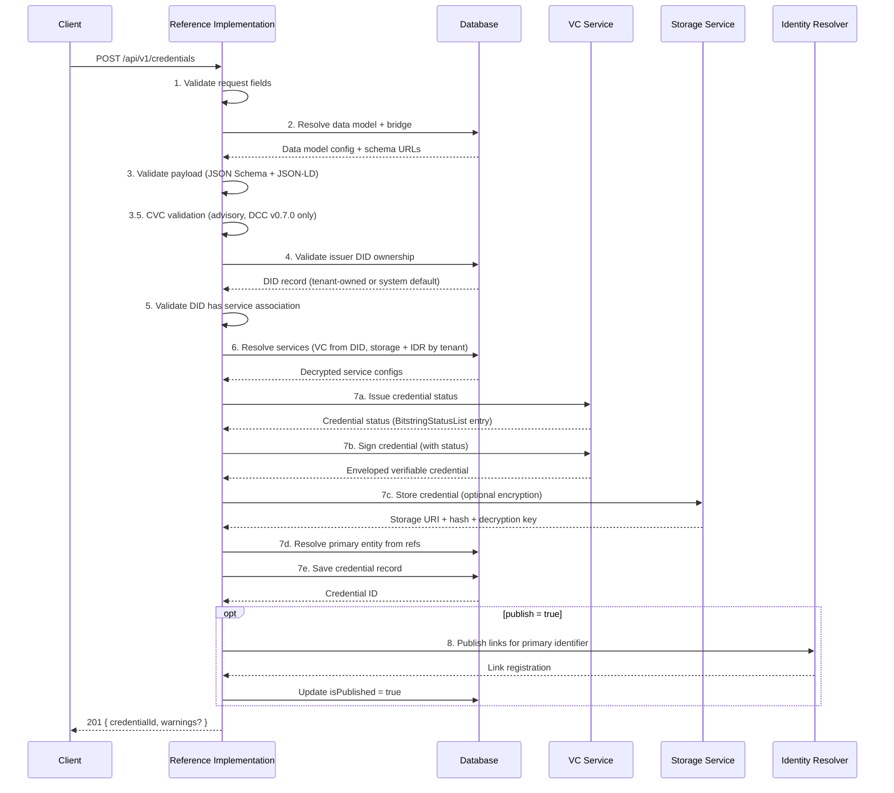
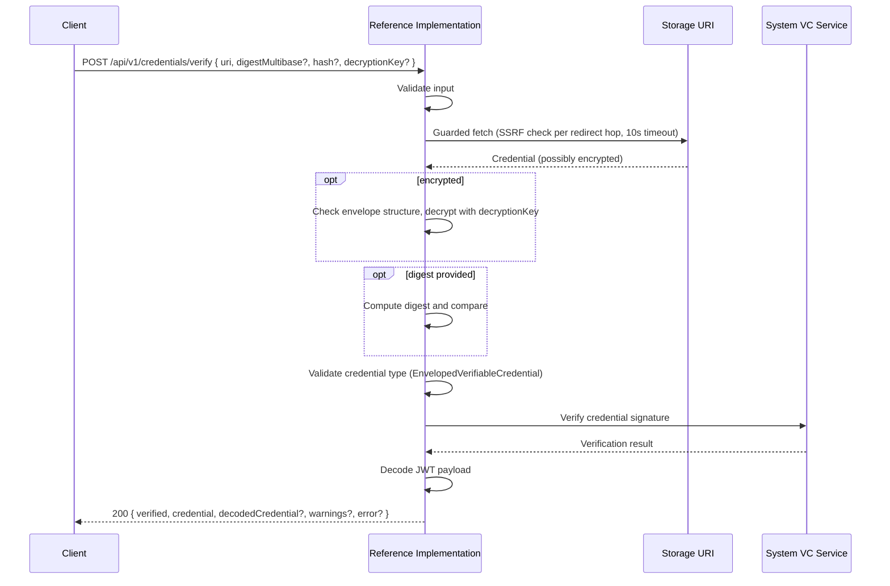

# Credentials API

Credentials are the core output of the Reference Implementation. Everything else in the system — [DIDs](./dids), [services](./services), [data models](./data-models), [identifiers](./identifiers), and [master data](./organisations) — exists to support one goal: **issuing trusted, verifiable digital documents about products, facilities, organisations, and supply chain events**.

A credential is a digitally signed statement. A company issues a credential that says "this product was made sustainably" or "this facility passed a conformity assessment". Because the credential is cryptographically signed, anyone who receives it can verify that the statement hasn't been tampered with and that it really came from the company that claims to have issued it, without needing to contact the issuer directly.

The Credentials API has three related surfaces:

- **Issuance** (authenticated): a tenant creates a credential, the system validates it, signs it, stores it, and optionally publishes it so it can be discovered by resolving an identifier.
- **Library access** (authenticated): a tenant lists and retrieves the credential records it issued or received, including custody details on record detail.
- **Verification** (public, no login required): anyone with a link to a stored credential can check whether it's genuine, untampered, and still valid.

:::tip[Interactive API documentation]
The Reference Implementation includes a Swagger UI at [`/api-docs`](http://localhost:3003/api-docs) with full request/response schemas you can try directly from the browser. The endpoint descriptions below focus on behaviour and internal logic. Refer to Swagger for exact payload shapes. All endpoints except [Verify](#verify-a-credential) require authentication. See [Authentication](../authentication#obtaining-a-token) for how to obtain a Bearer token.
:::

## Concepts

### What's Inside a Credential?

Every credential issued by the Reference Implementation follows the [W3C Verifiable Credentials Data Model](https://www.w3.org/TR/vc-data-model-2.0/) and the [UNTP Verifiable Credential profile](https://untp.unece.org/docs/specification/VerifiableCredentials). In plain terms, a credential contains:

- **Who issued it** — the issuer's [DID](./dids) (a cryptographic identity)
- **What it says** — the credential subject (e.g., product sustainability data, conformity assessment results)
- **When it was issued** — a timestamp
- **A digital signature** — proof that the issuer really signed it and that nobody changed it afterwards
- **A credential status**: unless the deployment sets `DEFAULT_STATUS_PURPOSES=none`, every issued credential carries the deployment's default status entries. See [the `DEFAULT_STATUS_PURPOSES` setting](#issue-a-credential) for the default and override behaviour (managed via [BitstringStatusList](https://www.w3.org/TR/vc-bitstring-status-list/) by the [VC service](../services/verifiable-credential-service))

### How Credentials Are Packaged

UNTP credentials use the [**enveloped** form](https://www.w3.org/TR/vc-data-model-2.0/#enveloped-verifiable-credentials): the credential payload is signed as a [JWT (JSON Web Token)](https://datatracker.ietf.org/doc/html/rfc7519), and the JWT is wrapped inside a [JSON-LD](https://www.w3.org/TR/json-ld11/) envelope. This means you get the best of both worlds — compact, efficient JWT signatures with the semantic richness of linked data.

When the Reference Implementation issues a credential, the result is an `EnvelopedVerifiableCredential` that looks like this:

```json
{
  "@context": ["https://www.w3.org/ns/credentials/v2"],
  "type": "EnvelopedVerifiableCredential",
  "id": "data:application/vc+jwt,eyJhbGciOiJFZDI1NTE5..."
}
```

The `id` field contains the actual JWT. The verification endpoint knows how to unwrap this and decode the original credential payload.

### Credential Types

The type of credential determines what kind of data it contains and which schema is used to validate it. Credential types are defined by [data models](./data-models) — see the [Data Models API](./data-models) for the full list of core UNTP types and how extension data models work.

### Encryption and Privacy

When a credential is issued, two things are created: the **signed credential** (stored externally by the [storage service](./services)) and a **credential record** (stored in the Reference Implementation's database, tracking metadata like the storage URI, hash, and published status).

By default, the [storage service](./services) **encrypts** the signed credential before storing it, so the file at the storage URI is unreadable on its own. The storage service returns the decryption key once, when the credential is stored, and the Reference Implementation saves it on the credential record. Issuance returns the credential record id. An authenticated `GET /api/v1/library/{id}` returns the storage URI and a `decryptionKey` for an encrypted record when this service holds one and can reveal it, and `null` otherwise (see the [library detail contract](./library#retrieve-one-library-record)), so the key can be supplied during [verification](#verify-a-credential).

This matters for privacy: a credential about a product's supply chain might contain commercially sensitive information. Encryption ensures that only someone with the key can read it, even if they have the storage URL.

| Setting                   | What Happens                                                                                                                                                                                    |
| ------------------------- | ----------------------------------------------------------------------------------------------------------------------------------------------------------------------------------------------- |
| `encrypt: true` (default) | Credential encrypted before storage. The [library detail](./library#retrieve-one-library-record) returns a `decryptionKey` when this service holds one and can reveal it, and `null` otherwise. |
| `encrypt: false`          | Credential stored in plaintext. Anyone with the URL can read it.                                                                                                                                |

### Integrity Hashing

Every stored credential has a **content hash** — a fingerprint computed from the credential's contents. If even one character changes, the hash changes. This allows anyone to detect that the credential at a storage URI hasn't been swapped or modified after being stored. During [verification](#verify-a-credential), the computed hash is compared against the expected hash.

### Discoverability via the Identity Resolver

A credential on its own is just a file at a URL. To make it useful, it needs to be **discoverable** — someone who knows a product's identifier should be able to find the credential. This is the role of the [UNTP Identity Resolver](https://untp.unece.org/docs/specification/IdentityResolver) and [Decentralised Access Control](https://untp.unece.org/docs/specification/DecentralisedAccessControl) specifications.

This is where the [Identity Resolver](./identifiers#what-are-links) comes in. When a credential is published, the Reference Implementation registers a link with the Identity Resolver that connects the entity's identifier (e.g., a GS1 GTIN) to the credential's storage URL. Now anyone who resolves that identifier can find the credential.

Publishing is optional and resolves from the credential's own identifier, which must belong to an [identifier scheme](./identifiers#what-is-an-identifier-scheme) reachable through an IDR service.

### CVC Compliance (Conformity Credentials Only)

For UNTP v0.7.0 [Digital Conformity Credentials](./data-models), the issuance pipeline performs an extra advisory check: it compares the conformity scheme, profile, and criteria referenced in the credential against the locally known [Conformity Vocabulary Catalogue (CVC)](https://untp.unece.org/docs/specification/ConformityVocabularyCatalog) schemes. Earlier DCC versions are issued without this check. This helps catch mistakes like referencing a non-existent scheme or omitting a required criterion. See [Conformity Vocabulary Catalogue](../data-models/conformity-vocabulary-catalogue) for where those schemes come from, and the [Conformity Vocabulary Catalogue API](./conformity-vocabulary-catalogue) for browsing them.

CVC validation is **advisory only** — it never blocks issuance. If issues are found, the credential is still issued but the response includes warnings.

### The Issuance Pipeline

Issuing a credential involves eight stages. Each stage can fail independently, and failures at different stages produce different HTTP status codes and warning codes. See the [Issue a Credential](#issue-a-credential) endpoint for the full request and response reference.



#### Stage 1: Request Validation

The three required fields are validated:

| Field               | Type   | Required | Description                                                                                  |
| ------------------- | ------ | -------- | -------------------------------------------------------------------------------------------- |
| `credentialPayload` | object | Yes      | The full credential payload conforming to the UNTP schema for the specified type and version |
| `credentialType`    | string | Yes      | Must match a registered [data model](./data-models) (e.g., `DigitalProductPassport`)         |
| `version`           | string | Yes      | Must match a registered data model version (e.g., `0.6.1`)                                   |

#### Stage 2: Data Model Resolution

The `credentialType` and `version` are used to look up a registered [data model](./data-models). The data model provides the JSON Schema URL(s) for validation, the JSON-LD context URL, and the [bridge](./data-models#data-model-bridges) that extracts entity references from the payload.

For [extension data models](./data-models#untp-core-data-models-and-extensions), both the parent schema and the extension schema are validated.

#### Stage 3: Payload Validation

The credential payload is validated in two passes:

1. **JSON Schema validation** against the data model's schema URL(s). This catches structural issues such as missing required fields, incorrect types, or invalid enum values.
2. **JSON-LD expansion** to verify the payload is valid linked data with a resolvable `@context`.

If either check fails, the request is rejected with HTTP 400, the error message says why, and a `code` field distinguishes the two things that can go wrong at each pass. `SCHEMA_DOCUMENT_INVALID` and `JSONLD_DOCUMENT_INVALID` mean the payload itself is invalid; the message carries the detail to fix, such as the missing property or the undefined term. `SCHEMA_FETCH_FAILED` and `JSONLD_CONTEXT_FETCH_FAILED` mean a remote schema or `@context` document could not be fetched or used. The schema message names the schema URL. The context message names the failing `@context` URL where the processor recorded one, and carries the HTTP status or timeout where one applies; the reason collapses to a general one when the URL itself was rejected, so a rejected URL cannot be used to probe what the service can reach. A document failure is fixed by correcting the payload; a fetch failure usually reflects an upstream or network condition rather than a problem with the credential. The UNTP core schemas and contexts for every release from 0.6.0 onwards, and the W3C Verifiable Credentials Data Model v2 context, ship inside the service, so an outage at their publishing host does not produce a fetch failure for those versions: the bundled copy is used and the server log records that it was, together with the fetch error. A fetch failure for one of those URLs is therefore not a host outage: it means the URL was refused by the guard, the fetch hit an unexpected error, or the schema could not be compiled. A fetch failure for any other URL means that host could not be used.

#### Stage 3.5: CVC Compliance Validation (Advisory)

For [Digital Conformity Credentials](./data-models) (DCC), the issuance pipeline performs an advisory check against the locally known conformity schemes (operator-seeded in this release). This check verifies that the conformity scheme, profile, and criteria referenced in the credential payload correspond to entries in the catalogue, and that the claimed criteria line up with what the profile defines. It also checks the score codes the credential carries against the scores the catalogue publishes, and tells you when a scheme or profile reference names a real entry at the wrong catalogue tier, such as a profile URI used where a scheme URI belongs.

CVC validation is advisory only. It never blocks issuance. If the check fails or no matching scheme is available, the credential is issued with warnings in the response. Warning codes include:

| Code                                            | Meaning                                                                                                                                                                             |
| ----------------------------------------------- | ----------------------------------------------------------------------------------------------------------------------------------------------------------------------------------- |
| `conformity-scheme.not-found`                   | A referenced conformity scheme URI is not in the locally known catalogue                                                                                                            |
| `conformity-profile.not-found`                  | A referenced profile URI is not found within the scheme                                                                                                                             |
| `conformity-profile.not-specified`              | The claim references no profile, so assessment performance scores were not checked and criterion and topic checks were not performed (criteria are published per versioned profile) |
| `conformity-criterion.not-in-profile`           | A claimed criterion is not one the referenced profile publishes                                                                                                                     |
| `conformity-criterion.missing`                  | A criterion the profile defines is absent from the claim                                                                                                                            |
| `conformity-criterion.topic-mismatch`           | A criterion's declared conformity topics do not match those the criterion defines                                                                                                   |
| `conformity-assessment.topic-mismatch`          | An assessment declares a conformity topic that none of its assessed criteria define                                                                                                 |
| `conformity-attestation.score-not-in-framework` | The attestation's profile score code is not published by the referenced scheme framework                                                                                            |
| `conformity-assessment.score-not-in-framework`  | An assessment score code is not published by any applicable scheme, profile or referenced-criterion framework                                                                       |
| `conformity-scheme.wrong-tier`                  | The referenced scheme id is a known profile or criterion id. `expected` carries the schemes containing the matched entry                                                            |
| `conformity-profile.wrong-tier`                 | The referenced profile id is a known scheme or criterion id. `expected` carries the selected scheme's profile ids                                                                   |
| `conformity-claim.validation-error`             | Validation did not complete because of extraction, infrastructure or catalogue changes between reads. Other conformity warnings in the same response still apply                    |
| `conformity-claim.score-checks-unavailable`     | Score codes were not checked because the scheme's stored document is unavailable. The applicable scheme, profile, criterion and topic checks still ran                              |

Criterion and topic warnings name the versioned profile URI they were checked against in their message, since profile URIs carry a version segment and the same criterion can differ between profile versions.

The two `conformity-claim.*` codes report on the check rather than on the credential, and neither one cancels the warnings beside it. `conformity-claim.score-checks-unavailable` means the scheme's stored document was missing or could not be read, so the score codes alone went unchecked. Ask your operator to refresh the scheme in the catalogue, then issue again if you need them checked. `conformity-claim.validation-error` covers a claim the service could not extract, an infrastructure failure, and the case where the catalogue changed while the claim was being checked, which a retry settles. In all of these cases, every other conformity warning in the same response came from a check that did run and still applies. Which checks those are depends on the claim: with no profile reference, the criterion and topic checks do not run at all, and `conformity-profile.not-specified` says so.

Alongside `code` and `message`, a warning can carry structured fields so a client can act on it without reading the message text:

| Field         | What it carries                                                                                                                                                                                                                             |
| ------------- | ------------------------------------------------------------------------------------------------------------------------------------------------------------------------------------------------------------------------------------------- |
| `received`    | The value that triggered the warning, such as the criterion URI the profile does not publish                                                                                                                                                |
| `expected`    | The value or shape that was expected, where there is one                                                                                                                                                                                    |
| `pointer`     | A JSON pointer to the place in the credential you submitted that the warning concerns, including score codes such as `/credentialSubject/profileScore/code` or `/credentialSubject/conformityAssessment/0/assessedPerformance/1/score/code` |
| `remediation` | What to do about it, where the check can say                                                                                                                                                                                                |

A pointer appears only where the warning has a location in your credential and that location resolves, so treat it as present-or-absent rather than guaranteed. Two of the catalogue warnings never carry one, because their subject is not in the document at all. `conformity-criterion.missing` names a criterion the claim never declared, so read `expected` for the criterion the profile publishes. `conformity-profile.not-specified` reports the absence of a profile and carries neither `received` nor `expected`, so the message is the whole of it. The two `conformity-claim.*` codes carry no pointer either, since their subject is the check rather than a place in your credential.

The assessment-level topic check runs only when the assessment references at least one criterion and every referenced criterion resolves in the profile. An assessment that references no criteria draws no topic warning, because its own `conformityTopic` is then the claim's only classification (the intended modelling when, for example, a scheme publishes no digital vocabulary of criteria); an unresolved criterion is reported as `conformity-criterion.not-in-profile` instead of producing a topic verdict from incomplete evidence. Its score codes are still checked, against the frameworks the scheme and the selected profile publish.

#### Stage 4: Issuer DID Ownership Validation

The `issuer.id` field in the credential payload must contain a [DID](./dids) that the authenticated tenant is authorised to use. The Reference Implementation looks up the DID and verifies that it either:

- belongs to the authenticated tenant, or
- is a [system default DID](./dids#system-dids-vs-tenant-dids) — available to all tenants as part of the [incremental adoption ramp](../overview#incremental-adoption)

**If the DID is not registered to the tenant and is not a system default DID, the request is rejected with HTTP 400.** A tenant cannot issue credentials using a DID that belongs to another tenant.

#### Stage 5: DID Service Association Check

The issuer DID must have an associated [VC service instance](./services) — this is the service that holds the DID's key material and will perform signing. If the DID has no association (e.g., the service instance was [force-deleted](./services#delete-a-service-instance)), the request is rejected with HTTP 400. The DID must be re-imported or re-created to restore the association.

#### Stage 6: Service Resolution

The **VC service** is resolved from the issuer DID's associated service instance. This ensures signing always happens on the VC service that holds the DID's key material, regardless of whether the DID is a tenant-owned DID or a [system default DID](./dids#system-dids-vs-tenant-dids). The caller does not need to specify which VC service to use; the DID determines it.

The **storage service** and **IDR service** follow the standard [resolution chain](../services/service-architecture#system-services-vs-tenant-services):

| Service             | Purpose                                     | How Resolved                                                                              |
| ------------------- | ------------------------------------------- | ----------------------------------------------------------------------------------------- |
| **VC Service**      | Signs the credential payload                | From the issuer DID's associated service instance                                         |
| **Storage Service** | Stores the signed credential                | `storageOptions.serviceInstanceId`, or tenant primary, or system default                  |
| **IDR Service**     | Publishes links (only when `publish: true`) | From the resolved identifier's scheme, then its registrar, then the tenant/system default |

#### Stage 7: Sign, Store, and Record

The credential payload is signed by the VC service, producing an [Enveloped Verifiable Credential](https://www.w3.org/TR/vc-data-model-2.0/#enveloped-verifiable-credentials). The signed credential is then stored by the storage service.

**Encryption**: By default, the stored credential is encrypted with AES-GCM. Issuance returns the credential record id, and an authenticated `GET /api/v1/library/{id}` returns a `decryptionKey` for an encrypted record when this service holds one and can reveal it, and `null` otherwise (see the [library detail contract](./library#retrieve-one-library-record)). Supply that key when [verifying](#verify-a-credential) an encrypted credential. Set `storageOptions.encrypt` to `false` to store the credential unencrypted.

**Entity linking**: The data model bridge extracts entity references (organisations, facilities, products) from the credential payload. The primary entity (priority: product > facility > organisation) is linked to the credential record in the database. This link is best-effort enrichment; it never gates the optional publishing step, and a match that fails to link (for example the entity was deleted between extraction and insert) is reported as an advisory `ENTITY_LINK_FAILED` warning rather than affecting the credential or the publish.

#### Stage 8: IDR Publishing (Optional)

When `publishingOptions.publish` is `true`, the Reference Implementation publishes a link to the stored credential on the [Identity Resolver](./identifiers#what-are-links) for the credential's own identifier. This makes the credential discoverable via that identifier's scheme (e.g., resolving a GS1 GTIN leads to the credential).

The tenant's registrar and identifier scheme namespaces must already be registered with the Identity Resolver before publishing. The seed registers these namespaces only for the system tenant, so a tenant using its own registrar or scheme must register the corresponding namespaces with the resolver first.

Publishing resolves its target from the same reference used for entity linking (priority: product > facility > organisation), looked up against the tenant's identifiers rather than against master data. Publishing requires that lookup to resolve to exactly one identifier with:

- An [identifier scheme](./identifiers#what-is-an-identifier-scheme) that has a primary key
- A registrar with a namespace
- An IDR service instance (configured on the scheme, the registrar, or the tenant/system default)

When publishing cannot complete, the credential is still issued and returned, and a warning names the unmet prerequisite along with what to do about it:

| Code                                | Meaning                                                                                                                                                                      | What to do                                                                                                                                                                                     |
| ----------------------------------- | ---------------------------------------------------------------------------------------------------------------------------------------------------------------------------- | ---------------------------------------------------------------------------------------------------------------------------------------------------------------------------------------------- |
| `REFS_EXTRACTION_FAILED`            | No identifier could be read from the credential payload.                                                                                                                     | Check the subject carries the identifier fields its data model defines, such as a `registeredId`.                                                                                              |
| `PUBLISH_REFERENCE_MISSING`         | The payload carries no identifier to publish under.                                                                                                                          | Check the subject carries the identifier fields its data model defines.                                                                                                                        |
| `PUBLISH_SCHEME_INCOMPLETE`         | The identifier resolved to a scheme without a primary key, or a registrar without a namespace.                                                                               | Complete the scheme and registrar configuration, then issue again.                                                                                                                             |
| `PUBLISH_IDENTIFIER_UNKNOWN`        | No identifier matching the value is registered for the tenant, or the scheme named in `identifierSchemeId` does not hold that value.                                         | Register the identifier under a scheme, or correct `identifierSchemeId`.                                                                                                                       |
| `PUBLISH_IDENTIFIER_AMBIGUOUS`      | The value exists under more than one scheme, so the target is not decidable.                                                                                                 | Set `publishingOptions.identifierSchemeId` to the scheme you want to publish under.                                                                                                            |
| `PUBLISH_IDR_UNAVAILABLE`           | No Identity Resolver service is configured for the scheme, registrar, or tenant.                                                                                             | Ask your operator to configure an IDR service instance.                                                                                                                                        |
| `PUBLISH_TARGET_UNRESOLVED`         | The identifier lookup itself failed, so no publish was attempted.                                                                                                            | The credential was issued; ask your operator to check the service.                                                                                                                             |
| `PUBLISH_LINKS_UNBUILDABLE`         | The credential links could not be built from the stored credential.                                                                                                          | The credential was issued and stored; ask your operator to check the storage response.                                                                                                         |
| `IDR_PUBLISH_FAILED`                | The Identity Resolver rejected the links.                                                                                                                                    | Check the scheme is registered with the resolver, then issue again once it is.                                                                                                                 |
| `IDR_PUBLISH_UNCONFIRMED`           | The resolver could not be reached or did not answer, so whether the links were registered is unknown.                                                                        | Ask your operator to check the resolver before issuing again: a second publish of the same links is rejected as a duplicate.                                                                   |
| `DB_STATUS_UPDATE_FAILED`           | The links are live on the resolver, but the stored published status could not be saved.                                                                                      | The credential is discoverable; only the local status is stale.                                                                                                                                |
| `ENTITY_LINK_FAILED`                | The credential could not be linked to its master-data record, which no longer exists.                                                                                        | Optional enrichment only; publishing and the credential itself are unaffected.                                                                                                                 |
| `DETAILS_EXTRACTION_FAILED`         | The credential's name, issuer, subject and validity dates could not be read from it, so they are not recorded against it.                                                    | The credential can be retrieved and verified as usual. Only its stored summary is missing. The warning names the correlation ID to quote to your operator, who can find the cause in the logs. |
| `IDEMPOTENCY_RESPONSE_NOT_RECORDED` | The credential was issued and a retry with this key returns it, but the warnings on this response may not be repeated.                                                       | A retry with this key returns this credential. The warnings on this response may differ.                                                                                                       |
| `IDEMPOTENCY_RESPONSE_UNREADABLE`   | The credential was issued by an earlier request with this key, but the response recorded for it could not be read, so any warnings from that response are not repeated here. | The credential itself is unaffected. Quote the correlation ID to your operator, who can find the cause in the logs.                                                                            |

The IDR entry's `description` field is taken from the linked primary entity's `description`, falling back to the entity's `name`, and then to the link title (`publishingOptions.linkTitle`, or the data model's name) when no entity is linked, since the resolver requires a non-empty description.

**Human verification link**: When publishing without an explicit `humanVerificationUrl`, the published link set includes a link to this Reference Implementation's own verify page. The base is derived from the `RI_APP_URL` environment variable, which is parsed as a URL with `/verify` appended to its path (any query or fragment is dropped, a base path is preserved, and a trailing slash is trimmed); for the default `http://localhost:3003` the link is `http://localhost:3003/verify`. `RI_APP_URL` is configured in the RI's environment (the shipped `.env.example` and Docker Compose files default it to `http://localhost:3003`) and is the same base URL that backs the OIDC post-logout redirect (see [Identity provider requirements](../authentication/idp-requirements)). Supplying `humanVerificationUrl` overrides the default, for deployments that host verification elsewhere.

A supplied `humanVerificationUrl` keeps its own query string and fragment, but the RI strips five reserved parameter names from it before adding its own verification payload: `uri`, `digestMultibase`, `hash`, `decryptionKey`, and `q`. The RI's own verify page reads those parameters directly, so a supplied URL that already used one of them would otherwise shadow the payload. `machineVerificationUrl` is not processed this way. It is published exactly as supplied, with no query-string handling.

When the credential was stored encrypted, the published credential link declares `encryptionMethod: AES-256`, so a consumer reading the resolver's link set can tell the target is encrypted before fetching it. That value is the vocabulary the UNTP Identity Resolver API definition declares for the field (`none`, `AES-128`, `AES-256`) rather than the cipher name; the Pyx Identity Resolver bundled with the Reference Implementation validates against the same list, and a consumer that has fetched the document reads the cipher from the stored envelope's `type` field (`aes-256-gcm`), as the Playground does. Neither verification link carries the field, because those links point at verification surfaces rather than at the encrypted document.

The published link does **not** carry the credential's decryption key. The key is not registered on the Identity Resolver; it is shared out of band, so access to an encrypted credential does not travel with its discovery link (regardless of whether a given resolver is publicly readable). A credential stored encrypted (the storage default) therefore needs its decryption key supplied out of band to verify, and the published link alone verifies a credential stored unencrypted. The issuing tenant can retrieve that decryption key from the credential's [library detail](./library#retrieve-one-library-record) and share it through a channel of its choosing. This differs from a link shared directly as a single-link capability, which may embed the key (see [the verify page](../verify-page#decryption)).

`RI_APP_URL` is validated when the application starts (see [Startup](../operations/startup#base-url-validation)), so a deployment that could not build a safe default link fails at boot rather than at request time. Omitting `humanVerificationUrl` is always a valid request; supplying it overrides the default for deployments that host verification elsewhere.

| Publishing Option        | Type     | Description                                                                                                                                                                                                                                                         |
| ------------------------ | -------- | ------------------------------------------------------------------------------------------------------------------------------------------------------------------------------------------------------------------------------------------------------------------- |
| `publish`                | boolean  | Whether to publish to the identity resolver                                                                                                                                                                                                                         |
| `linkType`               | string   | Link relation type (defaults to the IDR service's configured default link type)                                                                                                                                                                                     |
| `linkTitle`              | string   | Human-readable title for the link (defaults to the data model name)                                                                                                                                                                                                 |
| `qualifierPath`          | string   | Qualifier path for sub-identifiers, e.g., `/10/LOT123/21/SER456` (defaults to `/`)                                                                                                                                                                                  |
| `machineVerificationUrl` | string   | URL for machine-readable verification of the credential. Must be a well-formed HTTP(S) URL without embedded credentials                                                                                                                                             |
| `humanVerificationUrl`   | string   | URL for human-readable verification of the credential (defaults to `${RI_APP_URL}/verify`, this RI's verify page, when publishing). Must be a well-formed HTTP(S) URL without embedded credentials                                                                  |
| `hreflang`               | string[] | Well-formed BCP 47 language tags for the link's target content                                                                                                                                                                                                      |
| `additionalRels`         | string[] | Additional link relation types to attach beyond `linkType`                                                                                                                                                                                                          |
| `public`                 | boolean  | Whether the published link is publicly resolvable                                                                                                                                                                                                                   |
| `accessRole`             | string[] | UNTP access roles allowed to retrieve the published links, from the [UNTP access role vocabulary](https://untp.unece.org/docs/specification/DecentralisedAccessControl) (e.g. `untp:accessRole#Regulator`); attached to the credential and human verification links |

## Issuance Endpoints

### Issue a Credential

```
POST /api/v1/credentials
```

Validates, signs, stores, and optionally publishes a verifiable credential. Returns the credential's database ID and any advisory warnings.

**Request body fields:**

| Field                                      | Type     | Required | Description                                                                                                                                                                                                                                                                                                                                                                                                                                                                                |
| ------------------------------------------ | -------- | -------- | ------------------------------------------------------------------------------------------------------------------------------------------------------------------------------------------------------------------------------------------------------------------------------------------------------------------------------------------------------------------------------------------------------------------------------------------------------------------------------------------ |
| `credentialPayload`                        | object   | Yes      | Full credential payload conforming to the UNTP schema for the specified type and version                                                                                                                                                                                                                                                                                                                                                                                                   |
| `credentialType`                           | string   | Yes      | Registered data model type (e.g., `DigitalProductPassport`)                                                                                                                                                                                                                                                                                                                                                                                                                                |
| `version`                                  | string   | Yes      | Registered data model version (e.g., `0.6.1`)                                                                                                                                                                                                                                                                                                                                                                                                                                              |
| `statusPurposes`                           | string[] | No       | Status purposes requested from the VC service. The Reference Implementation supports `revocation` and `suspension` (ADR-058); the underlying provider may support more. Values must be unique and non-empty when supplied. An empty array is refused because a per-request no-status choice is not offered. When omitted, the deployment's `DEFAULT_STATUS_PURPOSES` applies; `none` alone means no status entries, and if the variable is unset the built-in default is `['revocation']`. |
| `storageOptions.serviceInstanceId`         | string   | No       | Explicit storage service instance. If provided, it must be accessible to the tenant (its own, or a system default); otherwise the request is rejected with a 404                                                                                                                                                                                                                                                                                                                           |
| `storageOptions.encrypt`                   | boolean  | No       | Whether to encrypt (default: `true`)                                                                                                                                                                                                                                                                                                                                                                                                                                                       |
| `publishingOptions.publish`                | boolean  | No       | Whether to publish to IDR                                                                                                                                                                                                                                                                                                                                                                                                                                                                  |
| `publishingOptions.linkType`               | string   | No       | Link relation type                                                                                                                                                                                                                                                                                                                                                                                                                                                                         |
| `publishingOptions.linkTitle`              | string   | No       | Link title (defaults to data model name)                                                                                                                                                                                                                                                                                                                                                                                                                                                   |
| `publishingOptions.identifierSchemeId`     | string   | No       | Scheme to publish under, needed only when the credential's identifier value exists under more than one scheme                                                                                                                                                                                                                                                                                                                                                                              |
| `publishingOptions.qualifierPath`          | string   | No       | Qualifier path (default: `/`)                                                                                                                                                                                                                                                                                                                                                                                                                                                              |
| `publishingOptions.machineVerificationUrl` | string   | No       | Machine verification URL                                                                                                                                                                                                                                                                                                                                                                                                                                                                   |
| `publishingOptions.humanVerificationUrl`   | string   | No       | Human verification URL (defaults to `${RI_APP_URL}/verify` when publishing)                                                                                                                                                                                                                                                                                                                                                                                                                |
| `publishingOptions.hreflang`               | string[] | No       | BCP 47 language tags for the link's target content                                                                                                                                                                                                                                                                                                                                                                                                                                         |
| `publishingOptions.additionalRels`         | string[] | No       | Additional link relation types beyond `linkType`                                                                                                                                                                                                                                                                                                                                                                                                                                           |
| `publishingOptions.public`                 | boolean  | No       | Whether the published link is publicly resolvable                                                                                                                                                                                                                                                                                                                                                                                                                                          |
| `publishingOptions.accessRole`             | string[] | No       | UNTP access roles governing who the published links are surfaced to (e.g. `untp:accessRole#Regulator`)                                                                                                                                                                                                                                                                                                                                                                                     |

Every field is shape-checked at the boundary: a missing or mistyped field is rejected with a 400 that names it, and unknown fields are ignored. The verification URLs must be well-formed HTTP(S) URLs without embedded credentials, `hreflang` entries must be well-formed [BCP 47](https://www.rfc-editor.org/rfc/rfc5646.html) language tags, and `linkType` must not be blank. Passing `null` for `storageOptions` or `publishingOptions` is rejected; omit them instead.

The VC service signs the credential with one status entry for each requested purpose. The Reference Implementation supports `revocation` and `suspension` (ADR-058), while the underlying provider may support more. Omitting `statusPurposes` uses the deployment's `DEFAULT_STATUS_PURPOSES` setting, or the built-in `revocation` default when the variable is unset or blank. A request can explicitly ask for both supported purposes by sending `"statusPurposes": ["revocation", "suspension"]`, which overrides the deployment default. A caller-supplied `credentialPayload.credentialStatus` is refused with `CREDENTIAL_STATUS_NOT_ACCEPTED`; the reference implementation mints and manages status entries.

When `DEFAULT_STATUS_PURPOSES=none`, credentials issued without an explicit statusPurposes carry no status entry and can never be revoked or suspended.

Status capture is best effort after signing. If the returned signed credential is unreadable, malformed, ambiguous, missing a requested purpose, or cannot be stored as status facts, the credential is still issued and the response contains `statusCaptureFailed: true` and a `STATUS_CAPTURE_FAILED` warning. After correcting the underlying cause, an operator records the entries with the [credential status entries backfill](../operations/backfills/credential-status-entries).

Minting a status entry is serialised across issuances that share a status list, so issuance can be refused while that coordination is unavailable. Both refusals are `503` and neither issues a credential:

- `STATUS_LIST_BUSY` when the wait for the status-list mutex expires, bounded by `STATUS_LOCK_ACQUIRE_MS`, or when coordination capacity is unavailable. Retry shortly.
- `STATUS_LIST_LOCK_LOST` when the lock is lost before the provider call completes. A status entry may already have been minted with no credential to carry it, so it is left unused on the list. Retry the request.

**Request headers:**

| Header            | Required | Description                                                                                                                           |
| ----------------- | -------- | ------------------------------------------------------------------------------------------------------------------------------------- |
| `Idempotency-Key` | No       | A non-blank string of at most 255 characters after trimming, using only printable ASCII. Keys are scoped to the authenticated tenant. |

When the header is present, a retry while the original is still running, including while it publishes, is rejected with `409` and code `IDEMPOTENCY_KEY_IN_FLIGHT`. Once the original has delivered its response, the same key and the same raw request body replay that `201`, warnings included; the recorded-but-undelivered case below is the one exception to warnings coming back. A later request with the same key and a different body is rejected with `422` and code `IDEMPOTENCY_KEY_MISMATCH`. If the original never delivered a response, a retry after the configured window replays the credential it recorded, or issues afresh only when no credential was recorded. A key whose credential was later removed is free again. Omitting the header leaves issuance unchanged.

A request body over the configured limit returns HTTP `413` with code `REQUEST_BODY_TOO_LARGE`; see the [request body size limit](../operations/api-pagination#request-body-size).

## Verification Endpoint

### Verify a Credential

```
POST /api/v1/credentials/verify
```

**This endpoint does not require authentication.** It is designed for third-party verification of credentials using parameters typically encoded in a QR code or [verification link](../verify-page#verify-link).



**Request body fields:**

| Field             | Type         | Required | Description                                                                                                                                                                                                                                                    |
| ----------------- | ------------ | -------- | -------------------------------------------------------------------------------------------------------------------------------------------------------------------------------------------------------------------------------------------------------------- |
| `uri`             | string (URL) | Yes      | Storage URI where the credential is stored. Must be HTTP(S) without embedded userinfo credentials.                                                                                                                                                             |
| `digestMultibase` | string       | No       | Expected multibase-encoded digest of the credential content. If provided, the fetched credential's digest is verified against it.                                                                                                                              |
| `hash`            | string       | No       | Expected SHA-256 hash as 64-character lowercase hex. The value is compared exactly, so uppercase hex is rejected. Accepted for links created before [the digest migration](../../migration-guides/v0.7.0#dependent-service-updates). Prefer `digestMultibase`. |
| `decryptionKey`   | string       | No       | AES-GCM decryption key (64-character hex string). Required for encrypted credentials.                                                                                                                                                                          |

The endpoint always returns HTTP 200 for a completed verification attempt, even if the credential fails verification. Check the `verified` field for the outcome. Processing errors that prevent a verification attempt return 422 with a `code` field:

| Code                          | Meaning                                                                                                                                                                    |
| ----------------------------- | -------------------------------------------------------------------------------------------------------------------------------------------------------------------------- |
| `INVALID_RESPONSE`            | The storage URI's response is not valid JSON, or is valid JSON that is not an object (a literal `null`, an array, or a primitive), before or after decryption.             |
| `DECRYPTION_REQUIRED`         | The credential is encrypted and no `decryptionKey` was supplied. The [verify page](../verify-page#decryption) prompts for the key in this case.                            |
| `ENVELOPE_INVALID`            | The stored encrypted envelope is structurally corrupted (wrong IV or auth-tag length). Re-supplying the key will not help.                                                 |
| `DECRYPTION_FAILED`           | The decryption key does not match the credential. This is almost always a wrong key, but AES-GCM cannot distinguish a wrong key from ciphertext tampered at valid lengths. |
| `DECRYPTED_NOT_JSON`          | Decryption succeeded but the content is not valid JSON, so the stored credential is corrupted.                                                                             |
| `DIGEST_MISMATCH`             | The fetched credential does not match the digest in the request.                                                                                                           |
| `UNSUPPORTED_CREDENTIAL_TYPE` | The credential is not an `EnvelopedVerifiableCredential`.                                                                                                                  |

Upstream failures (storage unreachable, non-2xx, oversized response, VC service failure) return 502 with `UPSTREAM_ERROR` or `VC_SERVICE_ERROR`.

The storage URI is fetched through a guarded resolver that validates the hostname against private and reserved ranges on every redirect hop and pins the connection to the validated addresses, so neither a redirect nor a DNS change between check and connect can reach a private network.

Decryption happens on the server, so a `decryptionKey` travels in the request body. Production deployments must serve this endpoint over HTTPS so the key is protected in transit.

This endpoint reads the shared credential-fetch settings below on every request, and those readers are not cached. If both names of one pair become set after the process started, the next request is answered `500` with an `error` naming the two conflicting variables. That applies here even though the endpoint is unauthenticated, so an anonymous caller can see the two variable names, though never their values. The remedy is to set the pair to a single name and restart the process, recreating the container where one is in use.

### Shared credential-fetch settings

The following settings are shared by verification, external registration and the supplier-source check used by re-verification. The private-address setting also controls the existing stored-address URL checks on registrar, identifier-link, data-model, service and credential publishing routes.

| Variable                   | Default            | Description                                                                                                                                                                                                                                                                                                                                                                                                                                                                                                                                                                                                                                                                                                                                                                                                                                                                                                                                                                           |
| -------------------------- | ------------------ | ------------------------------------------------------------------------------------------------------------------------------------------------------------------------------------------------------------------------------------------------------------------------------------------------------------------------------------------------------------------------------------------------------------------------------------------------------------------------------------------------------------------------------------------------------------------------------------------------------------------------------------------------------------------------------------------------------------------------------------------------------------------------------------------------------------------------------------------------------------------------------------------------------------------------------------------------------------------------------------- |
| `FETCH_ALLOW_PRIVATE_URLS` | `false`            | Permits private or reserved destinations for caller-supplied credential retrieval and relaxes the stored-address checks for registrars, identifier links, data models, service URLs and credential publishing URLs. The credential fetch still parses the URL, requires a name that resolves, follows and re-checks each redirect hop, pins the connection to the resolved addresses and enforces the response-size limit. The connection is pinned to the set of addresses the name resolved to at validation time. Node's address selection tries those addresses within the request budget, so a `localhost` that resolves to both `::1` and `127.0.0.1` reaches whichever listens. Use it only for local development: with it on, an anonymous caller of the verify endpoint can make the server fetch any address it can route to, including the cloud metadata service. Only exact lowercase `true` enables it, and it does not remove `http(s)` scheme or userinfo validation. |
| `FETCH_MAX_RESPONSE_SIZE`  | `10485760` (10 MB) | Maximum response size in bytes. A value the parser cannot read as a positive number falls back to the default rather than failing startup.                                                                                                                                                                                                                                                                                                                                                                                                                                                                                                                                                                                                                                                                                                                                                                                                                                            |
| `FETCH_TIMEOUT_MS`         | `10000`            | Time budget for fetching the credential, in milliseconds, covering the wait for DNS, connect, redirects and body (maximum 120000). Also applies when registering or re-verifying an external library credential. Startup fails when the value is not a positive integer within that ceiling.                                                                                                                                                                                                                                                                                                                                                                                                                                                                                                                                                                                                                                                                                          |

Old names remain supported during RI v0.5 and produce a startup warning when used alone. Setting both names for one setting, including equal values, fails startup. See the [startup configuration table](../operations/startup#credential-fetch-settings) and the [v0.5 migration guide](../../migration-guides/ri-v0.5#credential-fetch-settings-have-new-names) for the complete mapping and conflict rules.

The redirect chain is capped at three additional hops on both settings. That cap is fixed, not an environment variable, and a chain that exceeds it returns 502 with `UPSTREAM_ERROR`.

## Delete a Credential

```
DELETE /api/v1/credentials/{id}
```

Deletes a credential this service issued, using the credential record id returned by issuance. The library record, its verification history and its issuance idempotency claim are removed in one transaction. The Reference Implementation then deletes the durable copy of the signed artefact from the storage instance, bucket and object id it recorded at issuance, and answers once that attempt has finished.

Deleting a credential does not revoke it. A copy that was already shared with a verifier remains verifiable against its status list. Revocation on delete is planned for a later release. Identifier links published to the Identity Resolver for the credential are not removed and will resolve to a missing artefact.

The lookup is tenant-scoped. A record that exists only in another tenant, one that was already deleted and an id that never existed all answer the same empty `204`, so repeating a delete is safe. An external library record in the caller's tenant is refused; it is deleted with [`DELETE /api/v1/library/{id}`](./library#delete-a-library-record).

The durable-copy deletion is best effort and never changes the response. A copy that cannot be removed is left in place and reported in the operator log with the recorded coordinates: an unreachable storage service, a refused delete, or a credential issued before v0.5 recorded where its copy lives. Repeating the request does not retry the copy: the record is already gone, so the repeat answers `204` without touching storage, and the orphaned object is reclaimed by an operator from the logged coordinates. A crash between the commit and that log line leaves the object with no logged coordinates at all; the storage service's own listing is then the only route to it. Nothing resurrects the database record once its transaction has committed. The issuance idempotency claim is removed with the record, so the key becomes free again, as [Issue a Credential](#issue-a-credential) describes.

Responses:

- `204` with no body: the credential was deleted by this call, was deleted earlier, never existed, or exists only in another tenant.
- `401` when the request carries no valid token.
- `403 EXTERNAL_RECORD_NOT_DELETABLE_HERE` when the id names an external library record, with the message `This id is an external library record; delete it with DELETE /api/v1/library/{id}.` Authentication can separately answer the shared tenant-assignment refusal.
- `409 STATUS_OPERATION_IN_PROGRESS` while a status operation remains pending for the credential. Wait for the pending operation to complete or ask an operator to reconcile it, then retry the deletion.
- Sanitised `500` when the transaction failed and rolled back, or when its commit outcome could not be confirmed. The request is safe to repeat in both cases.

## Retired read routes

### List Credentials (retired) {#list-credentials}

```
GET /api/v1/credentials
```

This route is retired and returns `410 Gone` after authentication and tenant resolution succeed, with `code: ROUTE_RETIRED`. Use the [Library API](./library) for the combined inventory.

### Get a Credential (retired) {#get-a-credential}

```
GET /api/v1/credentials/{id}
```

This route is retired and returns `410 Gone` after authentication and tenant resolution succeed, with `code: ROUTE_RETIRED`. Use [Library API detail](./library#retrieve-one-library-record) with the same record id for the stored credential and its custody fields.

## Read issuer status

```
GET /api/v1/credentials/{id}/status
GET /api/v1/credentials/{id}/status?fresh=true
```

Use the native record id, rather than the signed credential's identifier. The stored response contains `capture`, `statusCaptureError`, `attribution` (`instanceId`, `source`, `at`, or `null`) and `entries`. Each entry contains `entryId`, `statusPurpose`, its last confirmed `value` (`boolean` or `null`), `observedAt`, `valueChangedAt`, `version` and `pending` (`value`, `since`, `deadline`, or `null`). An unobserved entry has `value: null`; absence of an observation is not a clear bit. Capture-state meanings are described in the [library record](./library#issuer-lifecycle).

`fresh=true` adds separate `observed` and `failures` arrays. Observations contain `entryId`, `statusPurpose`, `value` and `observedAt`. Failures name the entry, purpose, error `code` and `message`; a provider error never becomes a bit value. The read uses the recorded issuing instance, or the pinned instance while a change is pending. It writes nothing, advances no version and cannot resolve a pending change. Both forms answer with `Cache-Control: no-store`.

Missing or foreign records answer `404 NOT_FOUND`; external records answer `403 EXTERNAL_CREDENTIAL_STATUS_NOT_MANAGEABLE`. An invalid `fresh` value answers `400 VALIDATION_FAILED`. Authentication requires a valid tenant identity, as on the other credential routes. A malformed native record answers `500 RECORD_UNREADABLE`; database failures use the shared sanitised `500` response.

## Change issuer status

```
PUT /api/v1/credentials/{id}/status/{purpose}
If-Version: 1
Content-Type: application/json

{ "value": true }
```

Select the purpose in the path. Only `revocation` and `suspension` can be changed, and the credential must already carry that entry. Revocation is irreversible: `value: false` is refused even if the previously observed bit was clear. Suspension can be set and cleared. Historical `refresh` entries are also irreversible, but are refused as unsupported before any transition is considered. Entries larger than one bit cannot be changed. Mutation must be [enabled by the operator](../operations/credential-status-recovery#enable-status-changes).

First read the status entry's `version` and send it in `If-Version`. This is the entry version, not an annotation version or verification generation. A stale request is refused, never replayed. Unknown body keys are ignored; `value` must be a JSON boolean. The path purpose is decoded once, must contain 1 to 255 characters and cannot contain control characters.

A successful response records an error-free provider observation that equals the requested value:

```json
{
  "entryId": "clw0statusentry000001",
  "statusPurpose": "revocation",
  "value": true,
  "observedAt": "2026-09-17T01:00:00.000Z",
  "version": 2
}
```

Before contacting the provider, the service records durable pending intent, its issuing instance, configuration digest and deadline. One deadline bounds the preliminary read, lock acquisition, set and read-back. If the preliminary read already equals the requested value, the service commits that observation without setting the bit again. Otherwise success requires both matching read-back and a database commit fenced by the reservation token and original version. A confirmed change updates library lifecycle immediately; it never rewrites a verification generation. The response is an observation, not a verification summary.

| Response                                                        | Meaning and next action                                                                                                                                                                                                                                                                           |
| --------------------------------------------------------------- | ------------------------------------------------------------------------------------------------------------------------------------------------------------------------------------------------------------------------------------------------------------------------------------------------- |
| `400 VALIDATION_FAILED`                                         | Supply a decimal integer header between 1 and 2147483647. A missing or malformed header, invalid body or invalid purpose is refused.                                                                                                                                                              |
| `401` / `403`                                                   | Authentication or tenant assignment refused; an external record answers `403 EXTERNAL_CREDENTIAL_STATUS_NOT_MANAGEABLE`.                                                                                                                                                                          |
| `404 NOT_FOUND` / `STATUS_ENTRY_NOT_FOUND`                      | No tenant-owned native record, or no captured entry for that purpose.                                                                                                                                                                                                                             |
| `409 STATUS_METADATA_UNAVAILABLE`                               | Capture or issuing-service attribution is missing. Follow the backfill or attribution command named in the response.                                                                                                                                                                              |
| `409 STATUS_IRREVERSIBLE`                                       | Revocation cannot be cleared. No provider call occurred.                                                                                                                                                                                                                                          |
| `409 VERSION_CONFLICT`                                          | Re-read the current entry version before deciding on another action.                                                                                                                                                                                                                              |
| `409 STATUS_OPERATION_IN_PROGRESS` / `STATUS_RECOVERY_REQUIRED` | Intent already exists. The latter means its deadline passed; use reconciliation. Time passing never clears intent.                                                                                                                                                                                |
| `413 REQUEST_BODY_TOO_LARGE`                                    | Reduce the request body to the documented fields.                                                                                                                                                                                                                                                 |
| `422 STATUS_PURPOSE_UNSUPPORTED` / `STATUS_ENTRY_UNSUPPORTED`   | Unsupported purpose or entry size. No provider set was dispatched.                                                                                                                                                                                                                                |
| `500 RECORD_UNREADABLE`                                         | Stored status metadata is malformed. Contact the operator; this is not a caller input error.                                                                                                                                                                                                      |
| `502 VC_STATUS_RESPONSE_INVALID`                                | The preliminary response could not establish a bit. The owned reservation was cleared and the prior fact retained.                                                                                                                                                                                |
| `502/503 VC_SERVICE_UNAVAILABLE`                                | A pre-set read, service resolution or definitive set rejection failed. The prior fact is retained; any owned reservation is cleared when safe. A failure to clear is stated in the same response message.                                                                                         |
| `503 STATUS_MUTATION_DISABLED`                                  | Operator enablement is required. No set was dispatched.                                                                                                                                                                                                                                           |
| `503 STATUS_LIST_BUSY` / `STATUS_COORDINATION_UNAVAILABLE`      | Lock contention or unavailable database coordination capacity respectively. No set was dispatched.                                                                                                                                                                                                |
| `503 STATUS_OUTCOME_UNKNOWN`                                    | A set may have applied, read-back failed, or the lock was lost while a set that did not itself fail was in flight. A set call that rejects is answered by the provider's own outcome instead. Pending intent remains and the last confirmed value is unchanged. Reconcile after the grace window. |
| `503 STATUS_OUTCOME_MISMATCH`                                   | Read-back differed from the request. `observed.value` and `observed.observedAt` describe the read; pending intent remains. Reconcile.                                                                                                                                                             |
| `503 STATUS_PROVIDER_CHANGED`                                   | Provider configuration changed across the operation. Pending intent remains. Establish the correct provider identity before recovery.                                                                                                                                                             |
| `503 STATUS_PERSISTENCE_FAILED`                                 | This request could not confirm its observation in storage, or could not confirm clearing its reservation. Read stored status before acting. A changed token cannot overwrite another operation.                                                                                                   |
| `503 STATUS_PERSISTENCE_UNCERTAIN`                              | The commit acknowledgement was lost. Read stored status to learn which state committed; do not assume pending intent remains.                                                                                                                                                                     |

Other database failures before dispatch use the shared sanitised `500` response. While any pending intent exists, deletion and effective service-configuration changes are blocked. [Recovery guidance](../operations/credential-status-recovery) covers both an uncertain write and an unreachable pinned provider.

## Reconcile issuer status

```
POST /api/v1/credentials/{id}/status/{purpose}/reconcile
If-Version: 1
Content-Type: application/json

{}
```

Reconciliation reads the provider and records what it observes. It never sets a bit. With pending intent, it waits until the recorded deadline plus `STATUS_RECONCILE_GRACE_MS`, reads the pinned issuing instance and commits only if the inspected token and version still match. Before that time it answers `409 STATUS_OPERATION_IN_PROGRESS`. A failed read normally answers `503 VC_SERVICE_UNAVAILABLE`; malformed stored status input answers `500 RECORD_UNREADABLE`, an unrepresentable management entry answers `422 STATUS_ENTRY_UNSUPPORTED`, and an invalid provider response answers `502 VC_STATUS_RESPONSE_INVALID`. These failures leave all pending intent and confirmed facts unchanged, and the deterministic 422 and 502 cases say that retrying will not help.

If the current provider configuration differs from the original pin, the response is `503 STATUS_PROVIDER_CHANGED`. Establish that the replacement configuration identifies the intended provider, then explicitly send `{ "acceptProviderChange": true }`. An operator's configuration repair preserves the original digest and does not supply this acknowledgement on your behalf.

With no pending intent, reconciliation establishes a first or later observation using the recorded attribution. It skips the pending deadline and digest comparison, then rechecks attribution and configuration before committing. A concurrent reservation blocks persistence even if the version did not change. Both branches advance the entry version and return the same observation shape as a successful change; only a successful pending reconciliation clears the inspected intent.

Reconciliation separates a deterministic fault from an unavailable provider, because only the second is worth retrying. An entry this service cannot represent answers `422 STATUS_ENTRY_UNSUPPORTED`, and an unreadable provider observation answers `502 VC_STATUS_RESPONSE_INVALID`. Both leave the pending intent unchanged and will answer the same way on a repeat, so resolve the entry or the provider before reconciling again.

The shared `400`, `401`, `403`, `404`, `409 STATUS_METADATA_UNAVAILABLE`, `409 VERSION_CONFLICT`, `413` and `500 RECORD_UNREADABLE` responses apply here too. A concurrent change or failed commit answers `503 STATUS_PERSISTENCE_FAILED`; a lost commit acknowledgement answers `503 STATUS_PERSISTENCE_UNCERTAIN`. Re-read stored status before further action.

After the deadline no RI request for this reservation is still on the wire, but a request VCKit had already accepted may still be applied afterwards; reconcile records what it observes, and a later drift check can still differ. The provider offers no outcome lookup or fencing.

Stop admission, drain, wait for provider quiescence, then reconcile. Reconciliation is evidence of the observed bit at its timestamp, not proof that a delayed provider write can no longer arrive.
