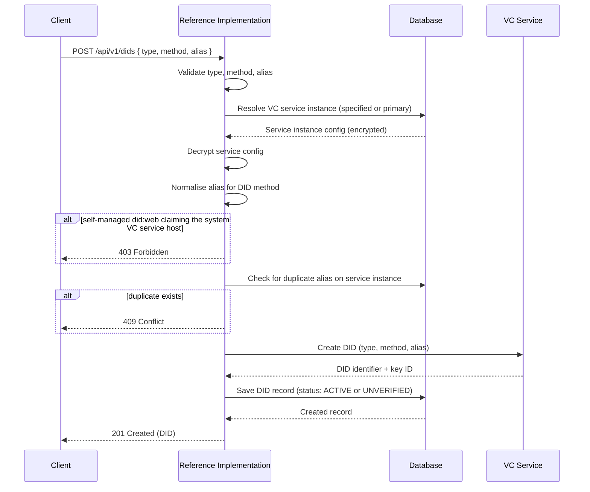
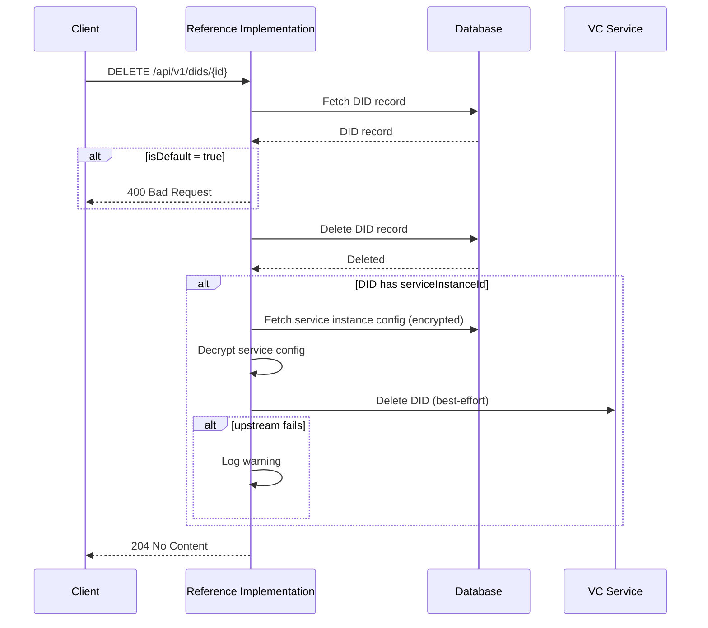
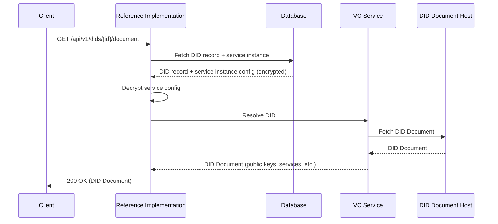
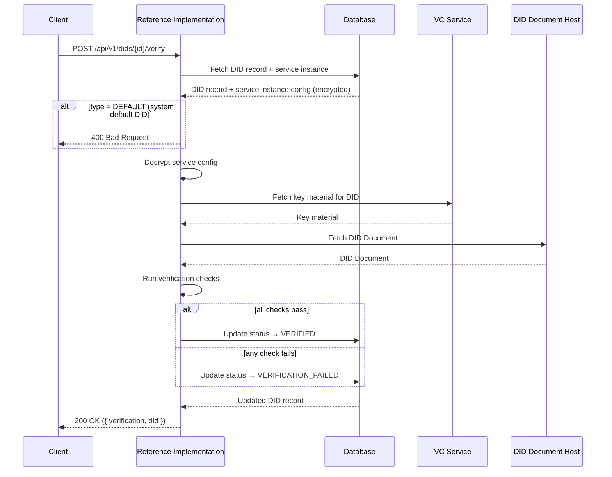
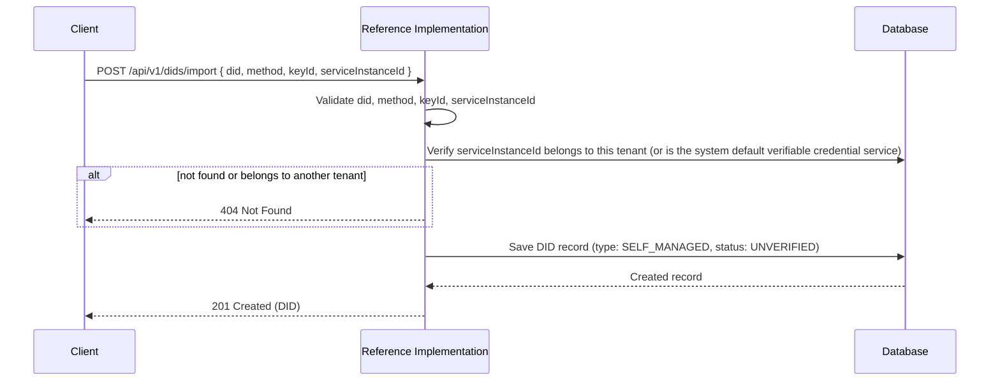

# DIDs API

The DIDs API manages **[Decentralised Identifiers (DIDs)](https://www.w3.org/TR/did-core/)**, the cryptographic identities that the Reference Implementation uses to sign verifiable credentials. Every credential issued by the Reference Implementation is signed with a DID, either one the tenant has provisioned or the [system default DID](../system-architecture#system-tenant) available to all tenants.

For background on how DIDs relate to the verifiable credential service, see [Verifiable Credential Service](../services/verifiable-credential-service).

:::tip[Interactive API documentation]
The Reference Implementation includes a Swagger UI at [`/api-docs`](http://localhost:3003/api-docs) with full request/response schemas you can try directly from the browser. The endpoint descriptions below focus on behaviour and internal logic. Refer to Swagger for exact payload shapes. All endpoints require authentication; see [Authentication](../authentication#obtaining-a-token) for how to obtain a Bearer token.
:::

Optional request fields (`name`, `description`, `isDefault`, `serviceInstanceId`) are left unset by omitting them. Sending an explicit `null` for any of them is rejected with a 400.

## Concepts

### DID Types

Every DID has a **type** that determines how it was created, who manages its key material, and who hosts its DID document. The types represent an [adoption ramp](../overview#incremental-adoption): tenants can issue UNTP-compliant credentials from day one using the system default DID, and progressively take on more control as they become more technically sophisticated.

#### `DEFAULT`

A system DID created during [startup](../operations/startup#step-2-database-seed). It belongs to the [system tenant](../system-architecture#system-tenant) and is available to all tenants as a read-only default. The DID document and key material are hosted by the system's [verifiable credential service](../services/verifiable-credential-service). Default DIDs cannot be deleted or verified through the API. Initial status: `ACTIVE`.

#### `MANAGED`

The DID was created by the [verifiable credential service](../services/verifiable-credential-service) via `POST /api/v1/dids`. The VC service holds the cryptographic key material (public and private key), hosts the DID document, and performs all signing operations. The Reference Implementation stores a record of the DID, its status, and which service instance manages it. Initial status: `ACTIVE`.

This is the simplest path for tenants that want their own DID: they create one and the VC service handles everything. The `alias` is a short identifier that the VC service prefixes with its own endpoint to form the full DID (e.g., alias `my-company` might produce `did:web:vckit.example.com:my-company`).

#### `SELF_MANAGED`

A self-managed DID gives the tenant more control. There are two paths:

1. **Create via the API** (`POST /api/v1/dids`). The Reference Implementation calls the VC service to create the DID, so the VC service still holds the cryptographic key material and performs signing. However, the tenant is responsible for hosting the DID document at the location the DID identifier resolves to. The `alias` should be the full domain or path where the tenant will host the DID document (e.g., `example.com` for `did:web:example.com`). Initial status: `UNVERIFIED`.

2. **Import an existing DID** (`POST /api/v1/dids/import`). The tenant has provisioned their own verifiable credential service instance (registered via the [Services API](./services)), which already has a DID created in it. The tenant imports that DID into the Reference Implementation for tracking. The key material and DID document live entirely within the tenant's own infrastructure. The tenant must have added their VC service instance to their tenant before importing. When importing, the full DID identifier is provided via the `did` field (e.g., `did:web:example.com`). Initial status: `UNVERIFIED`.

In both cases, self-managed DIDs start as `UNVERIFIED` and should be confirmed via the [verify endpoint](#verify-a-did).

#### Hosting the DID Document (`did:web`)

For self-managed DIDs using the `did:web` method, the tenant must host the [DID Document](https://www.w3.org/TR/did-core/) at the URL that the DID identifier resolves to. The hosting location depends on the structure of the identifier:

| DID Identifier | Hosted At |
|----------------|-----------|
| `did:web:example.com` | `https://example.com/.well-known/did.json` |
| `did:web:example.com:department` | `https://example.com/department/did.json` |
| `did:web:example.com:org:unit` | `https://example.com/org/unit/did.json` |

The rule follows the [did:web specification](https://w3c-ccg.github.io/did-method-web/#read-resolve): colons after the domain are converted to path separators, and `did.json` is appended. When only the domain is used (no additional path segments), the document must be placed at `/.well-known/did.json`.

The DID document must be served over HTTPS with a valid TLS certificate.

When creating a self-managed DID via the API, the `alias` value determines the resulting DID identifier. Set it to the domain (e.g., `example.com`) or domain with path (e.g., `example.com:department`) where you will host the document.

### DID Methods

The `method` field identifies which [DID method](https://www.w3.org/TR/did-core/#methods) the identifier conforms to. The supported methods are aligned with the [UNTP Verifiable Credential profile](https://untp.unece.org/docs/specification/VerifiableCredentials).

| Method | Status | Description |
|--------|--------|-------------|
| `DID_WEB` | Supported | [did:web](https://w3c-ccg.github.io/did-method-web/), a DID method that uses web domains as the basis for the identifier |
| `DID_WEB_VH` | Planned | A variant of did:web with version history support, not yet implemented |

### DID Statuses

| Status | Description |
|--------|-------------|
| `ACTIVE` | The DID is ready to use for credential signing |
| `UNVERIFIED` | The DID has been registered but it has not yet been confirmed that the DID document can be resolved |
| `VERIFIED` | The DID document has been successfully resolved via the [verify endpoint](#verify-a-did) |
| `VERIFICATION_FAILED` | The verification check failed; the DID document could not be resolved |
| `INACTIVE` | Reserved for future use; deactivation of DIDs is not yet implemented |

### Verification Checks

The [verify endpoint](#verify-a-did) runs the following checks in order. All checks must pass for the DID to be marked as `VERIFIED`.

| Check | Description |
|-------|-------------|
| **Resolve** | Fetches the DID document from the URL the DID identifier resolves to (e.g., `https://example.com/.well-known/did.json` for `did:web:example.com`). Fails if the document cannot be retrieved or returns a non-success HTTP status. |
| **HTTPS** | Confirms the DID document was served over HTTPS. Checks the final URL after any redirects; if a redirect lands on an insecure connection, this check fails. |
| **Structure** | Validates the retrieved DID document against the [DID Document](https://www.w3.org/TR/did-core/) schema. Fails if required fields are missing or malformed. |
| **Identity match** | Confirms that the `id` field in the DID document matches the DID identifier. Fails if they differ (e.g., the document was served from the wrong location). |
| **Key material** | Fetches the key IDs from the VC service instance associated with the DID and confirms they correspond to the key IDs listed in the DID document's `verificationMethod` entries. This ensures the DID document points to the same keys that the VC service actually holds for signing. Fails if the VC service holds keys for this DID and none of them appear in the document. When the VC service reports no keys at all, there is nothing to compare and the check passes with the message "No provider keys to compare". |
| **JSON-LD validity** | Validates that the DID document is valid JSON-LD. Currently skipped; disabled to avoid SSRF risks from untrusted `@context` URLs in DID documents. |

### System DIDs vs Tenant DIDs

DIDs exist at two levels: the **system default DID** (created during [startup](../operations/startup#step-2-database-seed), owned by the [system tenant](../system-architecture#system-tenant), read-only and visible to all tenants) and **tenant DIDs** (created or imported by a tenant through this API, scoped exclusively to that tenant). When listing DIDs, tenants see both their own DIDs and the system default.

**Credential signing is restricted to these two pools.** When [issuing a credential](./credentials#stage-4-issuer-did-ownership-validation), the `issuer.id` in the credential payload must be a DID that belongs to the authenticated tenant or a system default DID, which is available to all tenants as part of the [incremental adoption ramp](../overview#incremental-adoption). A tenant cannot issue credentials using a DID that belongs to another tenant.

### Service Instance Association

When creating a DID, you can specify which [verifiable credential service instance](./services) to use via `serviceInstanceId`. If omitted, the service instance is resolved using the same [resolution chain](../services/service-architecture#system-services-vs-tenant-services) as other operations: the tenant's [primary](./services#primary-instances) VC service instance if one is set, otherwise the system default verifiable credential service.

The service instance is the upstream provider that holds the cryptographic key material and performs signing operations. In most cases a DID is bound to the verifiable credential service instance that holds its key material, a binding fixed when the DID is created or imported. That binding can be lost if the service instance is later [force-deleted](./services#delete-a-service-instance), which leaves the DID without an associated service instance.

### Default DID

Each tenant can designate one DID as its **default** (`isDefault: true`). The default DID is used when other operations (such as credential issuance) need a signing identity but none is explicitly specified.

## Endpoints

### Create a DID

```
POST /api/v1/dids
```

Calls the [verifiable credential service](../services/verifiable-credential-service) to create a new DID, then stores a record of it in the Reference Implementation.

For **managed** DIDs, the VC service generates a new key pair, creates the DID, and hosts the DID document. The Reference Implementation stores a record linking the DID to the tenant and service instance. The DID is immediately `ACTIVE` and ready for credential signing.

For **self-managed** DIDs created via this endpoint, the VC service still generates the key pair and creates the DID; the difference is that the tenant is responsible for hosting the DID document at the location the DID identifier resolves to (see [Self-Managed DID type](#self_managed) for details). The DID starts as `UNVERIFIED` and should be confirmed via the [verify endpoint](#verify-a-did) once the DID document is hosted.

| Required Field | Description |
|-----------------|-------------|
| `type` | `MANAGED` or `SELF_MANAGED`. `DEFAULT` is [system-managed and created during seeding](../operations/startup#step-2-database-seed), and cannot be created via this endpoint |
| `method` | `DID_WEB` (the supported method today; `DID_WEB_VH` is planned but not yet implemented and is rejected with a 400) |
| `alias` | Alias for the DID. For `did:web`, this is the domain (or domain and path) that will host the DID document, for example `example.com` to produce `did:web:example.com` |

| Optional Field | Description |
|-----------------|-------------|
| `name` | Human-readable name (must be non-empty if provided) |
| `description` | Description of the DID's purpose (must be non-empty if provided) |
| `isDefault` | Whether this DID becomes the tenant's default signing identity, used when a credential is issued without naming an explicit issuer DID |
| `serviceInstanceId` | Verifiable credential service instance to use for creation |

A tenant cannot claim the instance's own root DID. A self-managed `did:web` whose alias is exactly the hostname of the system VC service (with or without its port, so both `vckit.example.com` and `vckit.example.com:3332`) is rejected with a 403, because that DID identifies the VC service instance itself rather than anything the tenant owns. Only the alias on its own is reserved: a DID with a path under that host, such as `did:web:vckit.example.com:tenant-a`, is allowed.



---

### List DIDs

```
GET /api/v1/dids
```

Returns DIDs for the authenticated tenant with optional filtering. Results are paginated.

| Parameter | Type | Default | Description |
|-----------|------|---------|-------------|
| `type` | string | None | Filter by DID type (the full set, including `DEFAULT`) |
| `status` | string | None | Filter by DID status |
| `serviceInstanceId` | string | None | Filter by service instance ID |
| `limit` | integer | Defaults to 20, or the [configured maximum](../operations/api-pagination#maximum-page-size) when it is lower | A value above the maximum is rejected with a 400 that names the maximum |
| `offset` | integer | `0` | Number of results to skip |

---

### Get a DID

```
GET /api/v1/dids/{id}
```

Retrieves a specific DID by its database ID.

---

### Update a DID

```
PATCH /api/v1/dids/{id}
```

Updates the metadata of a DID. Only `name`, `description`, and `isDefault` can be changed; the DID identifier, type, method, and key material are immutable. At least one updatable field must be provided.

| Updatable Field | Description |
|-----------------|-------------|
| `name` | New name (must be non-empty if provided) |
| `description` | New description (must be non-empty if provided) |
| `isDefault` | Whether to set this DID as the tenant's default signing identity, used when a credential is issued without naming an explicit issuer DID. Cannot be changed on system default DIDs |

---

### Delete a DID

```
DELETE /api/v1/dids/{id}
```

Deletes a DID from the Reference Implementation database. If the DID still has an associated service instance (the association can be lost if the service instance was [force-deleted](./services#delete-a-service-instance)), the Reference Implementation also attempts to remove the DID from the upstream VC service on a best-effort basis; if the upstream deletion fails, the local record is still deleted and a warning is logged.

DIDs marked as `isDefault` cannot be deleted. Remove the default flag first via the [update endpoint](#update-a-did), then delete.



---

### Get DID Document

```
GET /api/v1/dids/{id}/document
```

Retrieves the [DID Document](https://www.w3.org/TR/did-core/) for a specific DID from the upstream verifiable credential service. The DID Document contains the public keys, authentication methods, and service endpoints associated with the DID; it is the publicly resolvable representation of the DID.



The VC service resolves the DID by fetching the DID document from wherever it is hosted. For managed DIDs, the VC service itself is the host. For self-managed DIDs, this is the location where the tenant has published their [DID document](#hosting-the-did-document-didweb).

---

### Verify a DID

```
POST /api/v1/dids/{id}/verify
```

Verifies that a DID can be resolved and that its DID document is valid. When verification runs to completion, the DID's status is updated based on the result: `VERIFIED` if all checks pass, `VERIFICATION_FAILED` otherwise. Some inputs fail before verification runs and return a 400 without changing the status: a system default DID (see below), a stored DID that does not parse as `did:method:identifier`, or a DID that uses an unsupported method.

This endpoint is used for **self-managed** DIDs, both those [created via the API](#create-a-did) and those [imported](#import-a-did), which start with status `UNVERIFIED`. It confirms that the DID document is publicly resolvable and structurally valid.

System default DIDs (`type: DEFAULT`) cannot be verified through this endpoint. See [Verification Checks](#verification-checks) for the full list of checks performed.



---

### Import a DID

```
POST /api/v1/dids/import
```

Registers an existing, externally managed DID in the Reference Implementation without calling the upstream VC service's create method. The DID is stored as `SELF_MANAGED` with status `UNVERIFIED`.

Use this endpoint when you have a DID that was created outside the Reference Implementation (e.g., in a separate verifiable credential service instance) and you want to use it for credential signing within the Reference Implementation. After importing, use the [verify endpoint](#verify-a-did) to confirm that the DID document is resolvable.

Before importing, the tenant must have registered the verifiable credential service instance that holds the DID via the [Services API](./services#create-a-service-instance). The `serviceInstanceId` is required; this is how the Reference Implementation knows which VC service to use when signing credentials with this DID. It is verified to belong to the authenticated tenant (or be the system default verifiable credential service) before the record is saved; a nonexistent id, or one belonging to another tenant, is rejected with a 404.

Note that unlike the [create endpoint](#create-a-did), the import endpoint does **not** call the upstream VC service. It only verifies the service instance and creates a local database record.

Importing a `did:webvh` identifier is rejected because `method` is restricted to `DID_WEB` until did:webvh support lands.

| Required Field | Description |
|-----------------|-------------|
| `did` | The DID identifier to import (e.g. `did:web:example.com`). Must be a well-formed DID of the form `did:<method>:<identifier>` with a recognised method; a malformed DID is rejected with a 400 |
| `method` | `DID_WEB` (the supported method today; `DID_WEB_VH` is planned but not yet implemented and is rejected with a 400) |
| `keyId` | The identifier of the specific key to use for signing with this DID. A DID can control more than one key, so the key is named explicitly rather than inferred |
| `serviceInstanceId` | Verifiable credential service instance that holds the key material for this DID. Must belong to the authenticated tenant or be the system default verifiable credential service; otherwise rejected with a 404 |

| Optional Field | Description |
|-----------------|-------------|
| `name` | Human-readable name (must be non-empty if provided) |
| `description` | Description of the DID's purpose (must be non-empty if provided) |


