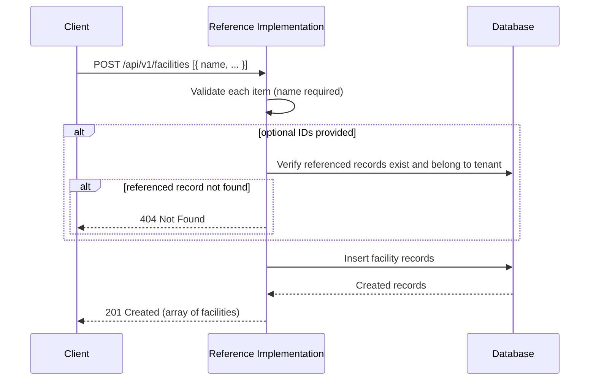
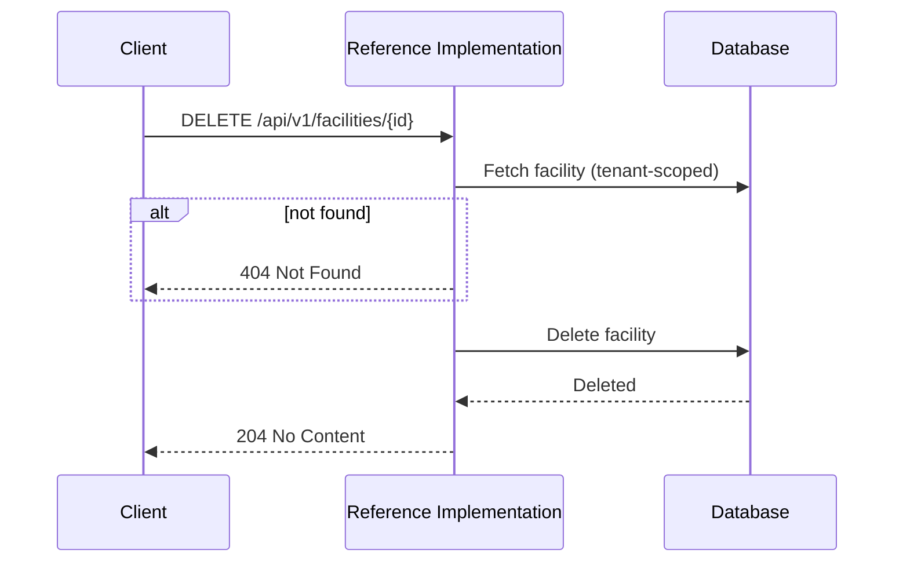

# Facilities API

The Facilities API manages **facilities** — the physical locations (factories, warehouses, farms, processing plants) where products are manufactured, stored, or processed. Facilities are one of the core [master data](../master-data/) entities referenced when issuing UNTP credentials.

:::tip[Interactive API documentation]
The Reference Implementation includes a Swagger UI at [`/api-docs`](http://localhost:3003/api-docs) with full request/response schemas you can try directly from the browser. The endpoint descriptions below focus on behaviour and internal logic — refer to Swagger for exact payload shapes. All endpoints require authentication — see [Authentication](../authentication#obtaining-a-token) for how to obtain a Bearer token.
:::

## Concepts

### What is a facility?

A facility represents a physical site involved in the production or handling of goods. In the context of UNTP, facilities can be referenced by multiple credential types. The Reference Implementation stores facility records as tenant-scoped master data that can be linked to products and credentials.

### Operating Organisation

Each facility can optionally be linked to an **operating organisation** via `operatingOrganisationId`. This references an [organisation](./organisations) record that represents the business entity responsible for running the facility. The operating organisation must belong to the same tenant.

### Identifiers

Facilities support the same identifier model as [organisations](./organisations#identifiers):

- **Primary identifier** — a single main identifier for the facility. Set via `primaryIdentifierId`.
- **Secondary identifiers** — additional identifiers. Set via `secondaryIdentifierIds`.

Identifiers are managed through the [Identifiers API](./identifiers) and linked to facilities by their database IDs. The primary identifier cannot also appear in the secondary identifiers list.

### Location

The optional `location` field stores a structured JSON object describing the geographical position of the facility. See [Location](../master-data/#location) for the field structure.

### Tenant Scoping

Facilities are scoped to the authenticated tenant. Each tenant manages its own set of facilities independently.

## Endpoints

### Create facilities

```
POST /api/v1/facilities
```

Creates one or more facilities in bulk. The request body must be a non-empty array of facility objects — each must include a non-empty `name`. Optional fields include `description` (non-empty if provided), `location`, `operatingOrganisationId`, `primaryIdentifierId`, and `secondaryIdentifierIds` (rejected with a 400 if provided but not an array). Unrecognised fields on each item are ignored.

**Optional fields must be omitted to skip them — do not send them as a JSON `null`.** There is no clear-on-create semantics (nothing yet exists to clear), so an explicit `null` on any optional field is now rejected with a 400 for the whole request, the same as any other malformed value. This is a real behaviour change for `location`: it was previously accepted silently, with no different effect than omitting the field (the write skipped the column either way, leaving it unset) — that silent equivalence is gone, and `location: null` is now a 400.



---

### List facilities

```
GET /api/v1/facilities
```

Returns facilities for the authenticated tenant with optional filtering. Results are paginated.

| Parameter | Type | Default | Description |
|-----------|------|---------|-------------|
| `search` | string | — | Search by facility name or identifier value |
| `organisationId` | string | — | Filter by operating organisation ID |
| `limit` | integer | Defaults to 20, or the configured maximum when it is lower | A value above the maximum is rejected with a 400 that names the maximum |
| `offset` | integer | `0` | Number of results to skip |

---

### Get a facility

```
GET /api/v1/facilities/{id}
```

Retrieves a specific facility by its database ID. The response includes the full primary identifier (with scheme and registrar details), secondary identifiers, and the operating organisation.

---

### Update a facility

```
PATCH /api/v1/facilities/{id}
```

Updates one or more fields of an existing facility. At least one recognised field is required — a body with none of the fields below (or only unrecognised keys) is rejected with a 400; unrecognised keys are otherwise ignored.

| Updatable Field | Description |
|-----------------|-------------|
| `name` | Facility name (non-empty if provided) |
| `description` | Free-text description (non-empty if provided; set to `null` to clear) |
| `location` | UNTP location object. Rejected with a 400 if provided as `null` — there is no clear mechanism for this field yet |
| `operatingOrganisationId` | ID of the operating organisation (non-empty if provided; set to `null` to clear) |
| `primaryIdentifierId` | ID of the primary identifier (non-empty if provided; set to `null` to clear) |
| `secondaryIdentifierIds` | Array of secondary identifier IDs, each non-empty — an empty array clears them, otherwise replaces the existing set. Rejected with a 400 if provided but not an array |

---

### Delete a facility

```
DELETE /api/v1/facilities/{id}
```

Permanently deletes a facility. If the facility is referenced as the manufacturing facility for any products, or as the facility on any credentials, those references are cleared (set to `null`) — the product and credential records are not deleted.


