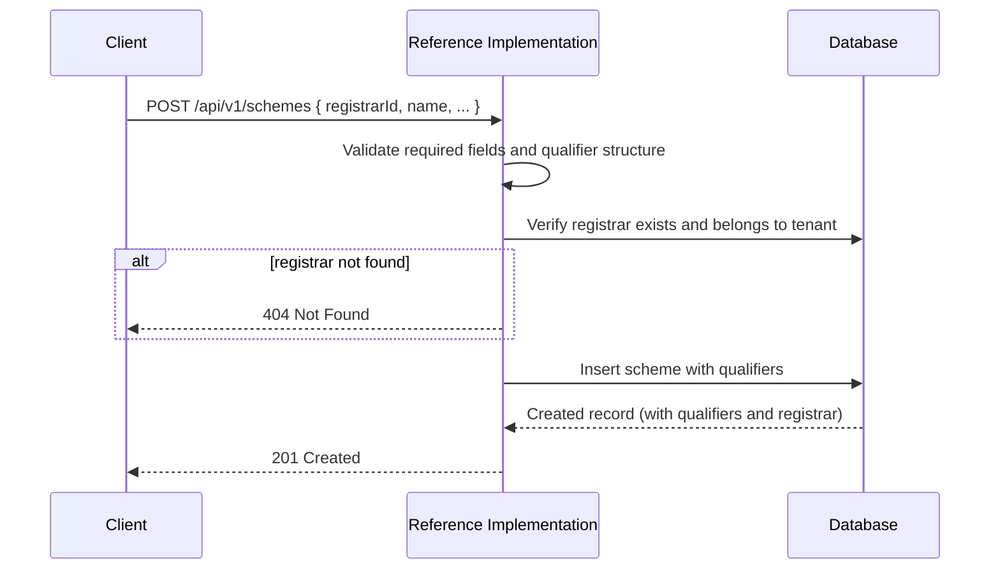
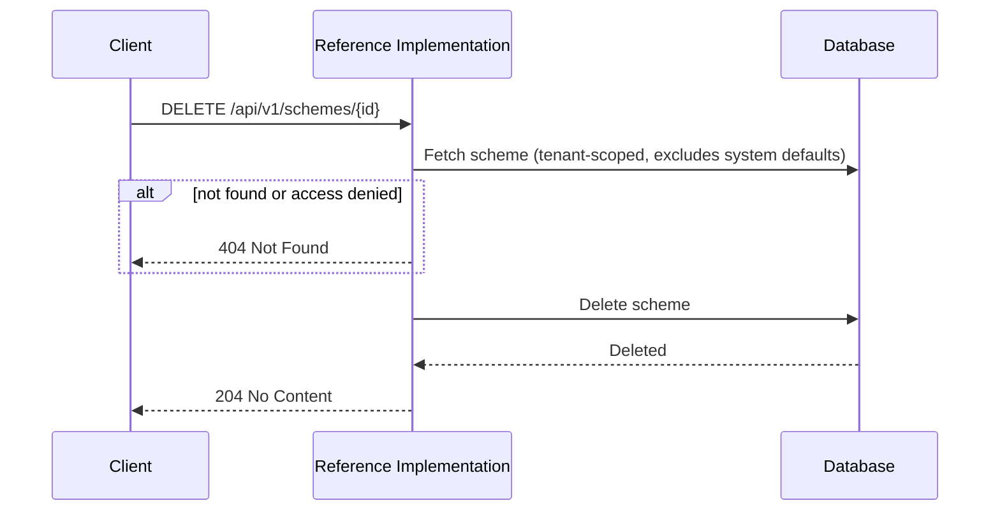
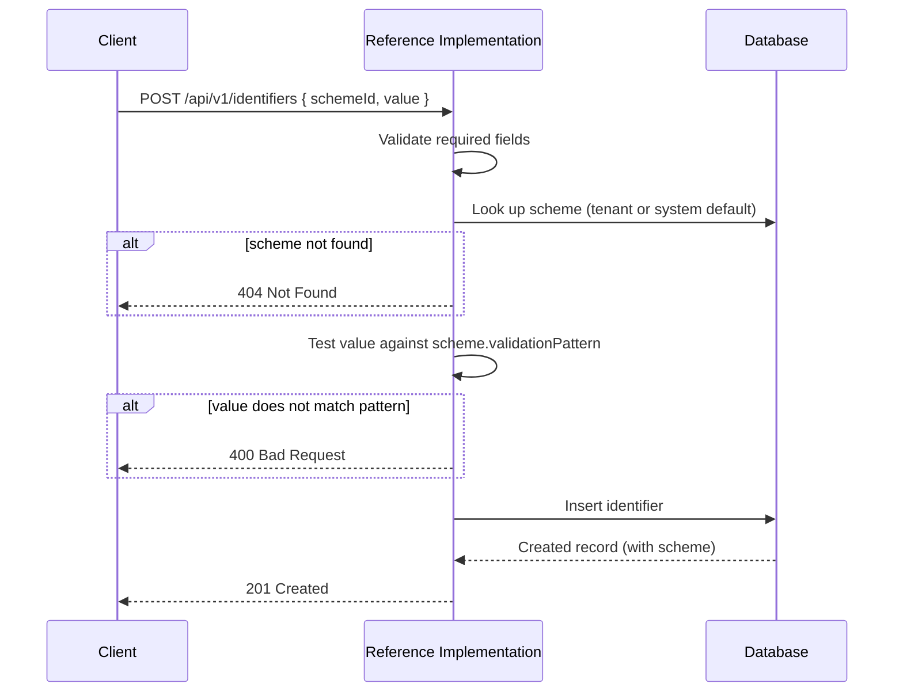
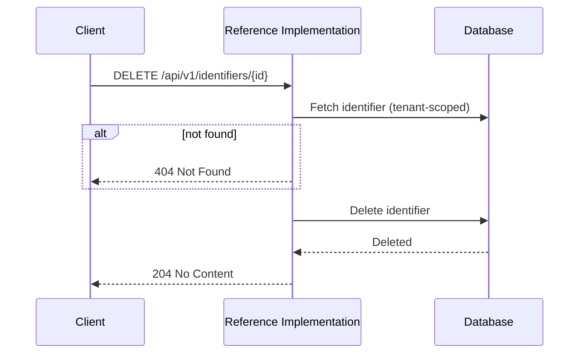
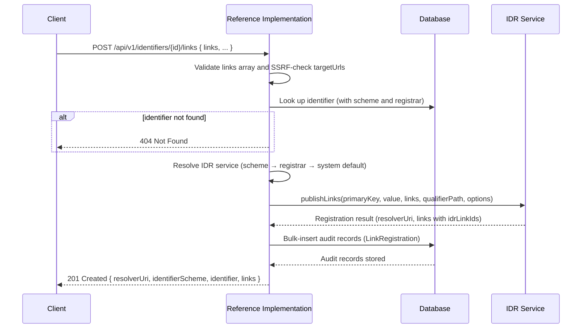
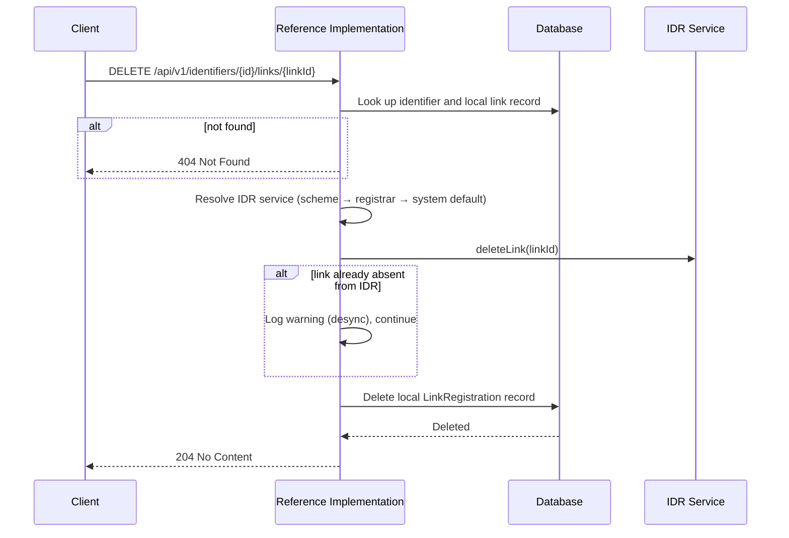

# Identifiers API

The Identifiers API manages **identifier schemes**, **identifiers**, and **links** — the building blocks that connect physical or logical entities (products, facilities, organisations) to their digital credentials via an Identity Resolver (IDR). Identifier schemes define the rules for a class of identifiers (e.g. GTIN, ABN), identifiers are specific values under those schemes, and links are published references from an identifier to credential resources on an upstream IDR service.

:::tip[Interactive API documentation]
The Reference Implementation includes a Swagger UI at [`/api-docs`](http://localhost:3003/api-docs) with full request/response schemas you can try directly from the browser. The endpoint descriptions below focus on behaviour and internal logic — refer to Swagger for exact payload shapes. All endpoints require authentication — see [Authentication](../authentication#obtaining-a-token) for how to obtain a Bearer token.
:::

## Concepts

### What is an identifier scheme?

An identifier scheme is a **type definition** for a class of identifiers — for example, GTIN (Global Trade Item Number), ABN (Australian Business Number), or SSCC (Serial Shipping Container Code). A scheme defines:

- **`name`** — a human-readable label (e.g. "GTIN-14").
- **`primaryKey`** — the key used in URI construction (e.g. `"gtin"`, `"abn"`).
- **`validationPattern`** — a regular expression that every identifier value under this scheme must match.
- **`linkTemplate`** — an ISO 18975 template for constructing resolver URIs (e.g. `"/{primaryKey}/{value}"`).

Schemes are scoped to a tenant, but system-default schemes (created by the platform) are visible to all tenants.

### Registrars

Every scheme belongs to a **registrar** — the authority that manages identifiers of that type (e.g. GS1 for GTINs). The `registrarId` is required when creating a scheme. See the [Registrars API](./registrars) for managing registrar records.

### Qualifiers

A scheme can optionally define **qualifiers** — sub-identifier dimensions that further refine an identifier. Common examples include batch number and serial number under a GTIN scheme. Each qualifier has:

| Field | Description |
|-------|-------------|
| `key` | Machine-readable key (e.g. `"lot"`, `"ser"`) |
| `description` | Human-readable label |
| `validationPattern` | Regex for validating qualifier values |
| `order` | Optional sort order for display |

When updating a scheme's qualifiers, the entire qualifier set is replaced — existing qualifiers are deleted and the new list is created in their place.

### IDR service instance linkage

A scheme can optionally override which IDR service instance is used for link resolution via `idrServiceInstanceId`. If not set, resolution falls back to the registrar's IDR instance, then to the tenant's system default. See [Link resolution chain](#idr-resolution-chain) for the full precedence order.

### What is an identifier?

An identifier is a **specific value** under a scheme — for example, `"09506000134352"` under a GTIN scheme, or `"51824753556"` under an ABN scheme. When creating an identifier, its `value` is validated against the scheme's `validationPattern`; if the value does not match, the request is rejected with a `400` error.

Identifiers are strictly tenant-scoped — unlike schemes, they are not shared across tenants.

### Relationship to master data entities

Identifiers can be linked to [organisations](./organisations), [facilities](./facilities), and [products](./products) as either a **primary identifier** or one of several **secondary identifiers**. These relationships are managed on the entity side (e.g. `primaryIdentifierId` and `secondaryIdentifierIds` on a facility record), not on the identifier itself.

### What are links?

Links are **published references** from an identifier to credential resources hosted on an upstream IDR service. When you publish a link, the Reference Implementation:

1. Resolves the appropriate IDR service instance.
2. Calls the upstream IDR to register the link.
3. Stores a local **audit record** (a `LinkRegistration`) capturing what was published.

Each link includes a `linkType` (the relationship type), a `targetUrl` (the credential resource URL), and a `mimeType`.

### IDR resolution chain

When publishing, retrieving, updating, or deleting links, the system must determine which IDR service instance to use. The resolution follows a three-tier precedence chain:

1. **Scheme-level** — `IdentifierScheme.idrServiceInstanceId` (highest priority)
2. **Registrar-level** — `Registrar.idrServiceInstanceId`
3. **System default** — the tenant's primary IDR service instance, or the system-wide default

The first non-null value in this chain is used.

### Desynchronisation handling

Because links exist on both the local database (as audit records) and the upstream IDR, the two can fall out of sync — for example, if a link is removed directly on the IDR outside of the Reference Implementation. The API handles this gracefully:

- **GET a link** — if the link exists locally but is missing upstream, the response includes `desync: true` and a `warning` message, with the `link` field set to `null`.
- **PATCH a link** — if the upstream link no longer exists, returns `409 Conflict` with `desync: true` and an error message advising deletion of the local record.
- **DELETE a link** — if the upstream link is already absent, the local record is still cleaned up (no error is raised).

## Identifier Scheme Endpoints

### Create an identifier scheme

```
POST /api/v1/schemes
```

Creates a new identifier scheme with optional nested qualifiers. The scheme is associated with a registrar and scoped to the authenticated tenant.

| Required Field | Description |
|----------------|-------------|
| `registrarId` | ID of the parent registrar |
| `name` | Human-readable scheme name |
| `primaryKey` | Key identifier used in URI construction (e.g. `"gtin"`) |
| `validationPattern` | Regex for validating identifier values |
| `linkTemplate` | ISO 18975 link template for URI construction |

| Optional Field | Description |
|----------------|-------------|
| `idrServiceInstanceId` | Override IDR service instance for this scheme |
| `qualifiers` | Array of qualifier definitions (each requires `key`, `description`, `validationPattern`) |



---

### List identifier schemes

```
GET /api/v1/schemes
```

Returns identifier schemes for the authenticated tenant (including system defaults) with optional filtering. Results are paginated.

| Parameter | Type | Default | Description |
|-----------|------|---------|-------------|
| `registrarId` | string | — | Filter by registrar ID |
| `limit` | integer | `20` | Maximum results per page (clamped to 100) |
| `offset` | integer | `0` | Number of results to skip |

---

### Get an identifier scheme

```
GET /api/v1/schemes/{id}
```

Retrieves a specific identifier scheme by its database ID. The response includes the full qualifier list and the parent registrar. Returns schemes owned by the authenticated tenant or system defaults.

---

### Update an identifier scheme

```
PATCH /api/v1/schemes/{id}
```

Updates one or more fields of an existing identifier scheme. At least one updatable field must be provided. System-default schemes cannot be updated — only schemes owned by the authenticated tenant.

| Updatable Field | Description |
|-----------------|-------------|
| `name` | Scheme name (must be non-empty if provided) |
| `primaryKey` | Primary key identifier |
| `validationPattern` | Regex validation pattern |
| `linkTemplate` | ISO 18975 link template |
| `idrServiceInstanceId` | IDR service instance ID (set to `null` to clear) |
| `qualifiers` | Replacement qualifier array (replaces all existing qualifiers) |

---

### Delete an identifier scheme

```
DELETE /api/v1/schemes/{id}
```

Permanently deletes an identifier scheme. Only schemes owned by the authenticated tenant can be deleted — system defaults are protected.



## Identifier Endpoints

### Create an identifier

```
POST /api/v1/identifiers
```

Creates a new identifier after validating its value against the scheme's `validationPattern`. The scheme must exist and be accessible to the authenticated tenant (either tenant-owned or a system default).

| Required Field | Description |
|----------------|-------------|
| `schemeId` | ID of the identifier scheme |
| `value` | The identifier value (validated against scheme pattern) |



---

### List identifiers

```
GET /api/v1/identifiers
```

Returns identifiers for the authenticated tenant with optional filtering. Results are paginated.

| Parameter | Type | Default | Description |
|-----------|------|---------|-------------|
| `schemeId` | string | — | Filter by identifier scheme ID |
| `limit` | integer | `20` | Maximum results per page. A value above the maximum is rejected with a 400 that names the maximum |
| `offset` | integer | `0` | Number of results to skip |

---

### Get an identifier

```
GET /api/v1/identifiers/{id}
```

Retrieves a specific identifier by its database ID. The response includes the full scheme with its registrar and qualifiers.

---

### Update an identifier

```
PATCH /api/v1/identifiers/{id}
```

Updates the value of an existing identifier. The new value is re-validated against the scheme's `validationPattern`.

| Updatable Field | Description |
|-----------------|-------------|
| `value` | New identifier value (re-validated against scheme pattern) |

---

### Delete an identifier

```
DELETE /api/v1/identifiers/{id}
```

Permanently deletes an identifier. Only identifiers owned by the authenticated tenant can be deleted.



## Link Endpoints

### Publish links

```
POST /api/v1/identifiers/{id}/links
```

Publishes one or more links for an identifier to the upstream IDR service. Each link is registered on the IDR and a local audit record is stored. Target URLs are validated for SSRF protection.

| Required Field | Description |
|----------------|-------------|
| `links` | Non-empty array of link objects (each requires `linkType`, `targetUrl`, `mimeType`; optional `title`) |

| Optional Field | Description |
|----------------|-------------|
| `qualifierPath` | Qualifier path appended to the IDR link |
| `description` | Description of the item being identified |



---

### List link registrations

```
GET /api/v1/identifiers/{id}/links
```

Returns link registration audit records for a specific identifier. The identifier must exist and belong to the authenticated tenant. Results are paginated.

| Parameter | Type | Default | Description |
|-----------|------|---------|-------------|
| `limit` | integer | `20` | Maximum results per page (clamped to 100) |
| `offset` | integer | `0` | Number of results to skip |

---

### Get a link

```
GET /api/v1/identifiers/{id}/links/{linkId}
```

Retrieves a link by its IDR link ID. The response combines the **live link data** fetched from the upstream IDR with the **local audit record**. If the link exists locally but is missing from the upstream IDR, the response includes a desynchronisation warning.

| Response Field | Description |
|----------------|-------------|
| `link` | Live link data from the upstream IDR (or `null` if desynced) |
| `localRecord` | The local `LinkRegistration` audit record |
| `desync` | `true` if the link is missing upstream (only present when desynced) |
| `warning` | Human-readable desync explanation (only present when desynced) |

---

### Update a link

```
PATCH /api/v1/identifiers/{id}/links/{linkId}
```

Updates a link on the upstream IDR and syncs the local audit record. The `href` field is SSRF-validated if provided. If the upstream link no longer exists, returns `409 Conflict` with a desynchronisation error.

| Updatable Field | Description |
|-----------------|-------------|
| `href` | New target URL (SSRF-validated) |
| `rel` | New link relationship type |
| `type` | New MIME type |

---

### Delete a link

```
DELETE /api/v1/identifiers/{id}/links/{linkId}
```

Deletes a link from both the upstream IDR and the local audit record. If the link has already been removed from the upstream IDR (out-of-band), the local record is still cleaned up — no error is raised.


