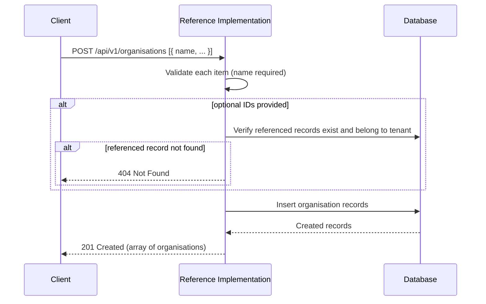
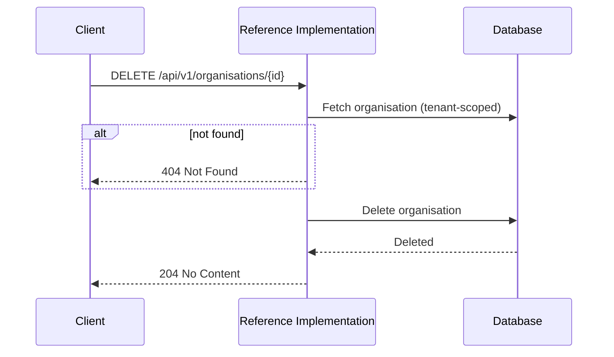

# Organisations API

The Organisations API manages **organisations** — the business entities that produce products and operate facilities within the Reference Implementation. Organisations are one of the core [master data](../master-data/) entities referenced across all UNTP credential types.

:::tip[Interactive API documentation]
The Reference Implementation includes a Swagger UI at [`/api-docs`](http://localhost:3003/api-docs) with full request/response schemas you can try directly from the browser. The endpoint descriptions below focus on behaviour and internal logic — refer to Swagger for exact payload shapes. All endpoints require authentication — see [Authentication](../authentication#obtaining-a-token) for how to obtain a Bearer token.
:::

## Concepts

### What is an organisation?

An organisation represents a legal entity or business that participates in the supply chain. In the context of UNTP, organisations are referenced by credentials as the product brand owner, the operating entity, or the party being assessed for conformity. The Reference Implementation stores organisation records as tenant-scoped master data that can be linked to credentials.

### Identifiers

Organisations can be associated with **identifiers** — structured values that follow an [identifier scheme](./identifiers). Each organisation supports:

- **Primary identifier** — a single identifier that serves as the main business identifier for the organisation. Set via `primaryIdentifierId`.
- **Secondary identifiers** — additional identifiers. Set via `secondaryIdentifierIds`.

Identifiers are managed through the [Identifiers API](./identifiers) and linked to organisations by their database IDs. The primary identifier cannot also appear in the secondary identifiers list.

### Location

The optional `location` field stores a structured JSON object describing the geographical location of the organisation. See [Location](../master-data/#location) for the field structure.

### Tenant Scoping

Organisations are scoped to the authenticated tenant. Each tenant manages its own set of organisations — they cannot see or modify organisations belonging to other tenants.

## Endpoints

### Create organisations

```
POST /api/v1/organisations
```

Creates one or more organisations in bulk. The request body is an array of organisation objects — each must include a `name`. Optional fields include `description`, `location`, `primaryIdentifierId`, and `secondaryIdentifierIds`.



---

### List organisations

```
GET /api/v1/organisations
```

Returns organisations for the authenticated tenant with optional filtering. Results are paginated.

| Parameter | Type | Default | Description |
|-----------|------|---------|-------------|
| `search` | string | — | Search by organisation name or identifier value |
| `limit` | integer | `20` | Maximum results per page (clamped to 100) |
| `offset` | integer | `0` | Number of results to skip |

---

### Get an organisation

```
GET /api/v1/organisations/{id}
```

Retrieves a specific organisation by its database ID. The response includes the full primary identifier (with scheme and registrar details) and secondary identifiers.

---

### Update an organisation

```
PATCH /api/v1/organisations/{id}
```

Updates one or more fields of an existing organisation. At least one updatable field must be provided.

| Updatable Field | Description |
|-----------------|-------------|
| `name` | Organisation name (must be non-empty if provided) |
| `description` | Free-text description |
| `location` | UNTP location object (set to `null` to clear) |
| `primaryIdentifierId` | ID of the primary identifier (set to `null` to clear) |
| `secondaryIdentifierIds` | Array of secondary identifier IDs (replaces existing) |

---

### Delete an organisation

```
DELETE /api/v1/organisations/{id}
```

Permanently deletes an organisation. If the organisation is referenced by products or facilities, those references are cleared (set to `null`) — the related records are not deleted.


