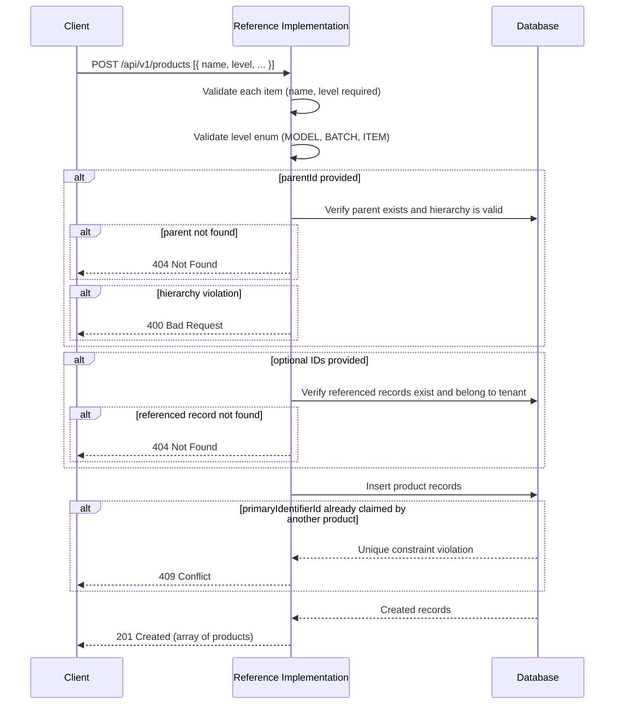
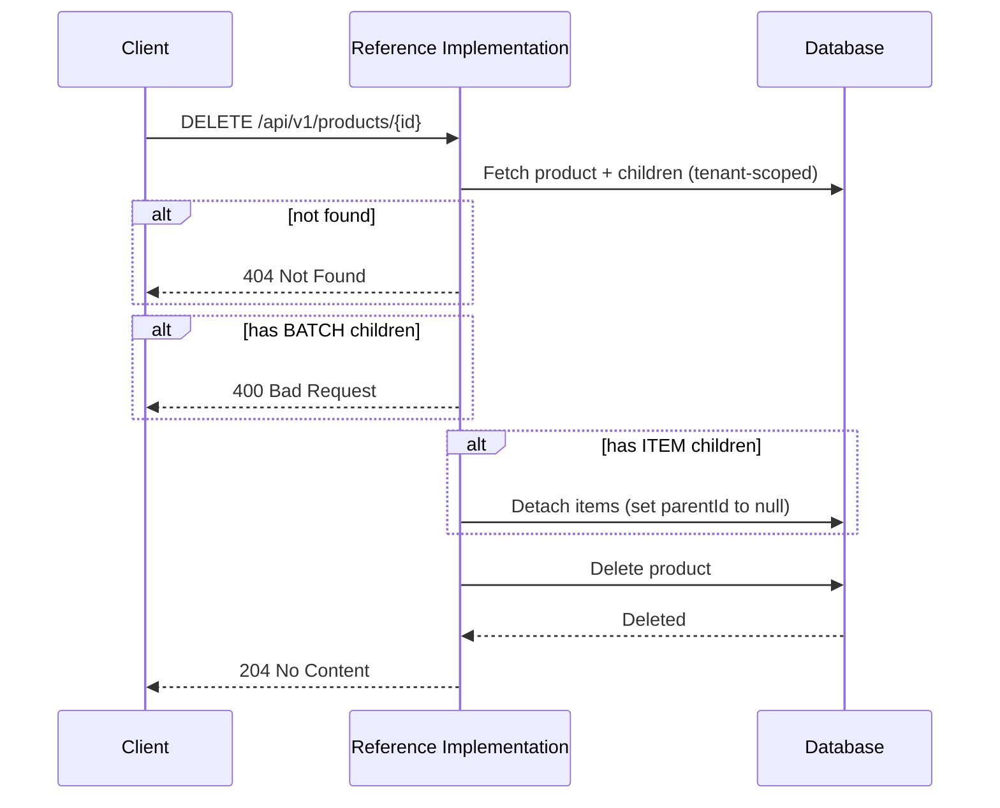

# Products API

The Products API manages **products** — the goods, materials, and items that move through the supply chain. The Reference Implementation stores product records as tenant-scoped [master data](../master-data/) that can be referenced by UNTP credentials.

:::tip[Interactive API documentation]
The Reference Implementation includes a Swagger UI at [`/api-docs`](http://localhost:3003/api-docs) with full request/response schemas you can try directly from the browser. The endpoint descriptions below focus on behaviour and internal logic — refer to Swagger for exact payload shapes. All endpoints require authentication — see [Authentication](../authentication#obtaining-a-token) for how to obtain a Bearer token.
:::

## Concepts

### Product Levels

Every product has a **level** that represents its position in the product hierarchy. The level is set at creation and is immutable — it cannot be changed after the product is created.

| Level | Description | Parent Requirement |
|-------|-------------|-------------------|
| `MODEL` | A product definition or SKU — the abstract design of a product | Must not have a parent |
| `BATCH` | A specific production run of a model — a group of items manufactured together | Must have a `MODEL` parent |
| `ITEM` | An individual serialised unit from a batch or standalone | May optionally have a `BATCH` parent |

This three-tier hierarchy mirrors how products are identified in supply chains: a model defines *what* a product is, a batch identifies *when and where* a group was produced, and an item identifies a *specific unit*.

### Product Hierarchy

Products form a tree structure through `parentId` references:

```
MODEL (e.g., "Organic Coffee Beans 1kg")
├── BATCH (e.g., "Batch 2024-Q1-001")
│   ├── ITEM (e.g., "Serial #A001")
│   └── ITEM (e.g., "Serial #A002")
└── BATCH (e.g., "Batch 2024-Q2-001")
    └── ITEM (e.g., "Serial #B001")
```

**Hierarchy rules:**
- A `MODEL` cannot have a parent
- A `BATCH` must reference a `MODEL` as its parent
- An `ITEM` may optionally reference a `BATCH` as its parent (standalone items are permitted)
- Hierarchy depth is limited to three levels — nesting beyond MODEL → BATCH → ITEM is not permitted

These constraints are enforced during creation and update.

### Organisation and Facility Links

Each product can optionally be linked to:

- **Producing organisation** (`producedByOrganisationId`) — the [organisation](./organisations) that brands or produces the product
- **Manufacturing facility** (`manufacturingFacilityId`) — the [facility](./facilities) where the product is manufactured

These links connect the product to other master data entities and are used during [extraction](../data-models/index.md#extraction) to link credentials back to the relevant organisation and facility records.

### Identifiers

Products support the same identifier model as [organisations](./organisations#identifiers) and [facilities](./facilities#identifiers):

- **Primary identifier** — a single main identifier for the product. Set via `primaryIdentifierId`.
- **Secondary identifiers** — additional identifiers. Set via `secondaryIdentifierIds`.

Identifiers are managed through the [Identifiers API](./identifiers) and linked to products by their database IDs. The primary identifier cannot also appear in the secondary identifiers list.

### Deletion Behaviour

Deleting a product has cascading effects that depend on the product's level and its children:

| Scenario | Behaviour |
|----------|-----------|
| `MODEL` with `BATCH` children | **Blocked** — the batches must be deleted first |
| `BATCH` with `ITEM` children | **Permitted** — item children are detached (their `parentId` is set to `null`) |
| Product with no children | **Permitted** |

### Tenant Scoping

Products are scoped to the authenticated tenant. Each tenant manages its own product catalogue independently.

## Endpoints

### Create products

```
POST /api/v1/products
```

Creates one or more products in bulk. The request body is an array of product objects — each must include a `name` and a `level`. Optional fields include `description`, `parentId`, `producedByOrganisationId`, `manufacturingFacilityId`, `primaryIdentifierId`, and `secondaryIdentifierIds` (each entry must be a non-empty identifier ID, and the array must not contain duplicates).

The [hierarchy rules](#product-hierarchy) are enforced for each item. If any item violates the rules, the entire request is rejected.

Omit an optional field to skip it rather than sending it as `null`. There is nothing to clear on a product that does not exist yet, so an explicit `null` on create is rejected with a 400.

A `primaryIdentifierId` that is already the primary identifier of another product is rejected with 409 Conflict.



---

### List products

```
GET /api/v1/products
```

Returns products for the authenticated tenant with optional filtering. Results are paginated.

| Parameter | Type | Default | Description |
|-----------|------|---------|-------------|
| `search` | string | — | Search by product name or identifier value |
| `level` | string | — | Filter by product level (`MODEL`, `BATCH`, or `ITEM`) |
| `parentId` | string | — | Filter by parent product ID |
| `organisationId` | string | — | Filter by producing organisation ID |
| `facilityId` | string | — | Filter by manufacturing facility ID |
| `limit` | integer | Defaults to 20, or the [configured maximum](../operations/api-pagination#maximum-page-size) when it is lower | A value above the maximum is rejected with a 400 that names the maximum |
| `offset` | integer | `0` | Number of results to skip |

---

### Get a product

```
GET /api/v1/products/{id}
```

Retrieves a specific product by its database ID. The response includes the full primary identifier (with scheme and registrar details), secondary identifiers, the producing organisation, the manufacturing facility, and the parent product (if any).

---

### Update a product

```
PATCH /api/v1/products/{id}
```

Updates one or more fields of an existing product. The product `level` is **immutable** — if provided in the request body, it is silently stripped. At least one updatable field must be provided.

A `primaryIdentifierId` that is already the primary identifier of another product is rejected with 409 Conflict.

| Updatable Field | Description |
|-----------------|-------------|
| `name` | Product name (must be non-empty if provided) |
| `description` | Free-text description (non-empty if provided; set to `null` to clear) |
| `parentId` | Parent product ID (subject to [hierarchy rules](#product-hierarchy); non-empty if provided; set to `null` to clear) |
| `producedByOrganisationId` | ID of the producing organisation (non-empty if provided; set to `null` to clear) |
| `manufacturingFacilityId` | ID of the manufacturing facility (non-empty if provided; set to `null` to clear) |
| `primaryIdentifierId` | ID of the primary identifier (non-empty if provided; set to `null` to clear) |
| `secondaryIdentifierIds` | Array of secondary identifier IDs (replaces existing; each entry must be non-empty and unique within the array; send an empty array to clear them all, or omit the field to leave them unchanged) |

---

### Delete a product

```
DELETE /api/v1/products/{id}
```

Deletes a product from the database. See [deletion behaviour](#deletion-behaviour) for how children are handled.


