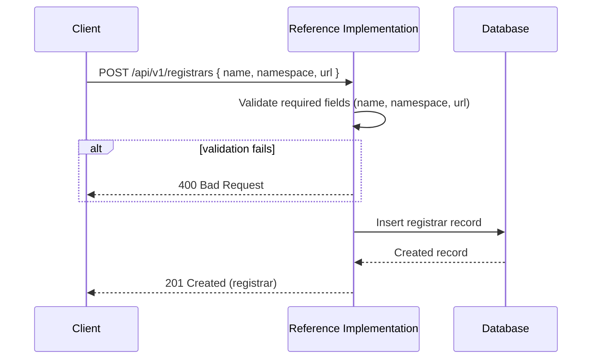
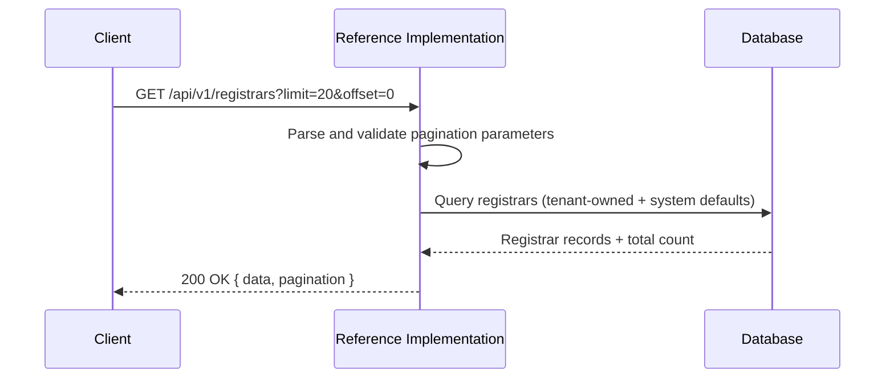
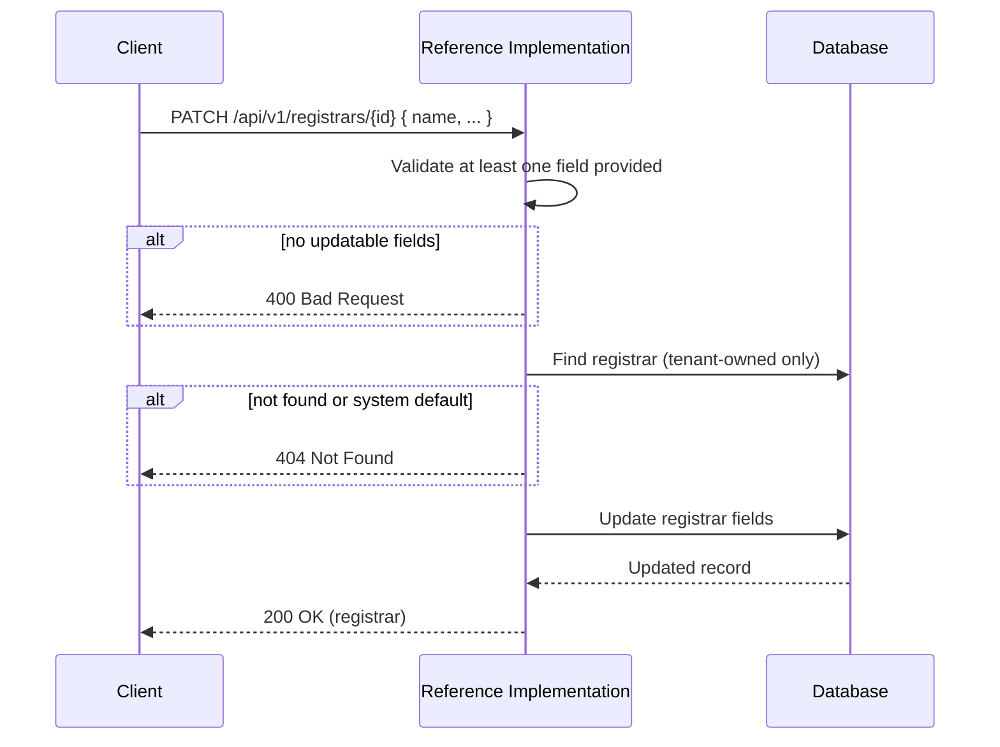
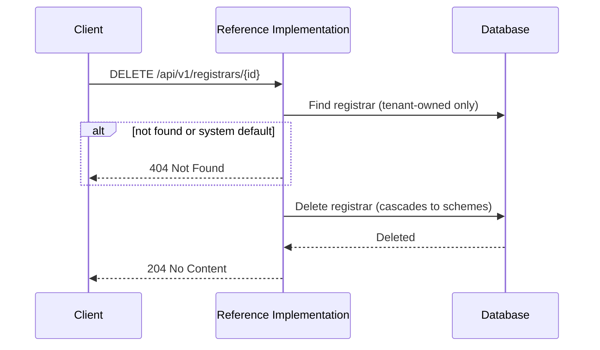

# Registrars API

The Registrars API manages **registrars** — the organisations that maintain identifier schemes (e.g. GS1 for GTIN barcodes, the ATO for Australian Business Numbers). Registrars are one of the foundational configuration entities that underpin [identifier schemes](./identifiers) and, by extension, the identifiers assigned to products, facilities, and organisations.

:::tip[Interactive API documentation]
The Reference Implementation includes a Swagger UI at [`/api-docs`](http://localhost:3003/api-docs) with full request/response schemas you can try directly from the browser. The endpoint descriptions below focus on behaviour and internal logic — refer to Swagger for exact payload shapes. All endpoints require authentication — see [Authentication](../authentication#obtaining-a-token) for how to obtain a Bearer token.
:::

## Concepts

### What is a registrar?

A registrar represents a real-world organisation that defines and governs one or more identifier schemes. For example:

- **GS1** is the registrar for schemes such as GTIN (Global Trade Item Number) and GLN (Global Location Number).
- **Australian Taxation Office (ATO)** is the registrar for the ABN (Australian Business Number) scheme.

In the Reference Implementation, a registrar record groups related identifier schemes together and provides the metadata needed when publishing those schemes to an Identity Resolver (IDR) service.

### Relationship to identifier schemes

A registrar has a one-to-many relationship with [identifier schemes](./identifiers). Each scheme belongs to exactly one registrar. When you create a scheme, you reference its parent registrar by ID. Deleting a registrar will cascade-delete all of its schemes (and their qualifier definitions).

### Namespace

The `namespace` field is the grouping key used when publishing identifier schemes to an IDR service. It typically matches the registrar's well-known abbreviation (e.g. `gs1`, `ato`). All schemes under a registrar share this namespace in the IDR.

### IDR service instance linkage

A registrar can optionally be linked to an **IDR service instance** via `idrServiceInstanceId`. This determines which configured IDR service is responsible for resolving identifiers issued under the registrar's schemes. The linkage is optional — set it to `null` to clear the association. If the linked service instance is deleted, the reference is automatically cleared (`onDelete: SetNull`).

### Tenant scoping

Registrars are scoped to a tenant (organisation). Each tenant manages its own registrars independently. However, **system default registrars** (those belonging to the system tenant) are visible to all tenants. This means the list endpoint returns both the tenant's own registrars and any system-wide defaults.

System default registrars cannot be updated or deleted by regular tenants — only tenant-owned registrars may be modified.

## Endpoints

### Create a registrar

```
POST /api/v1/registrars
```

Creates a new registrar for the authenticated tenant. The request body must include `name`, `namespace`, and `url`. Optionally, an `idrServiceInstanceId` can be provided to link the registrar to an IDR service instance.

| Field | Type | Required | Description |
|-------|------|----------|-------------|
| `name` | string | Yes | Human-readable name (e.g. "GS1") |
| `namespace` | string | Yes | Grouping key for IDR publishing (e.g. "gs1") |
| `url` | string | Yes | URL of the registrar's website |
| `idrServiceInstanceId` | string | No | ID of an IDR service instance to link |



---

### List registrars

```
GET /api/v1/registrars
```

Returns registrars for the authenticated tenant, **including system defaults**. Results are paginated and ordered by creation date (newest first).

| Parameter | Type | Default | Description |
|-----------|------|---------|-------------|
| `limit` | integer | `20` | Maximum results per page (clamped to 100) |
| `offset` | integer | `0` | Number of results to skip |



---

### Get a registrar

```
GET /api/v1/registrars/{id}
```

Retrieves a specific registrar by its database ID. The registrar must belong to the authenticated tenant or be a system default. The response includes nested **schemes** and their **qualifier definitions**.

---

### Update a registrar

```
PATCH /api/v1/registrars/{id}
```

Updates one or more fields of an existing registrar. At least one updatable field must be provided. Only tenant-owned registrars can be updated — system defaults are read-only.

| Updatable Field | Description |
|-----------------|-------------|
| `name` | Registrar name (must be non-empty if provided) |
| `namespace` | Namespace grouping key (must be non-empty if provided) |
| `url` | Registrar URL (must be non-empty if provided) |
| `idrServiceInstanceId` | IDR service instance ID (set to `null` to clear the linkage) |



---

### Delete a registrar

```
DELETE /api/v1/registrars/{id}
```

Permanently deletes a registrar and all of its associated identifier schemes and qualifier definitions (cascade). Only tenant-owned registrars can be deleted — system defaults are protected.


