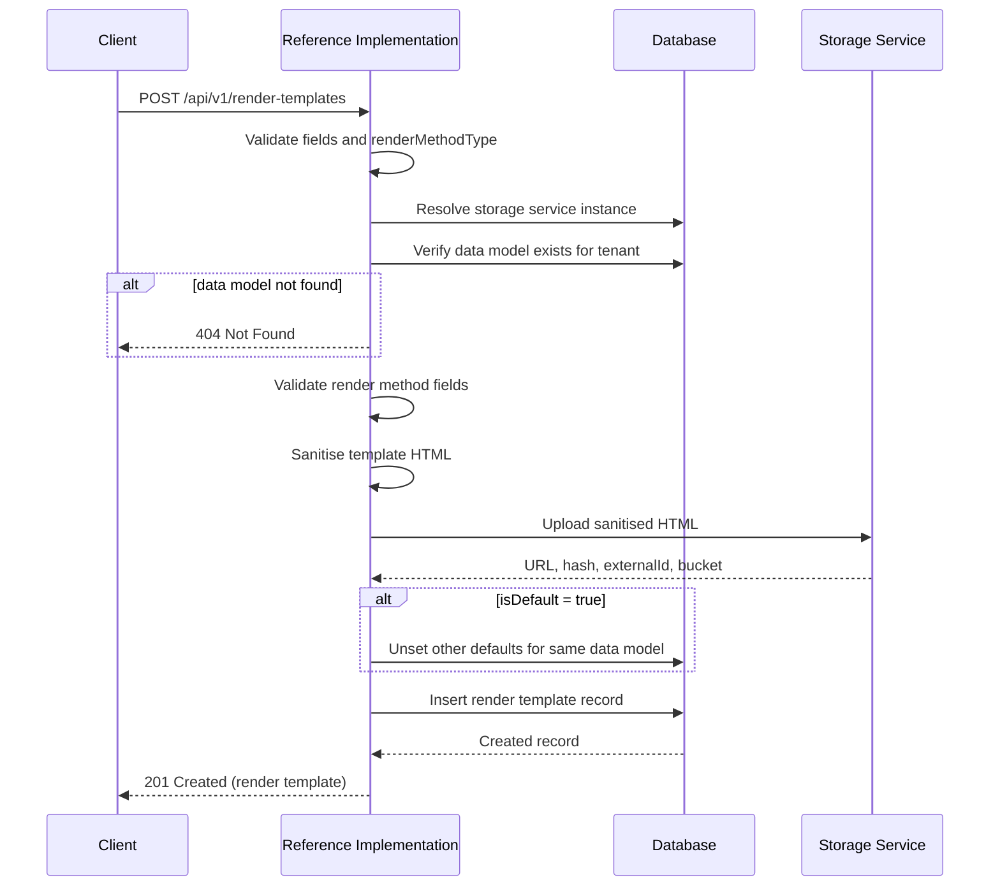
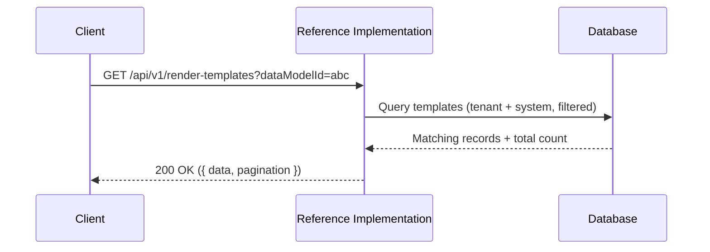
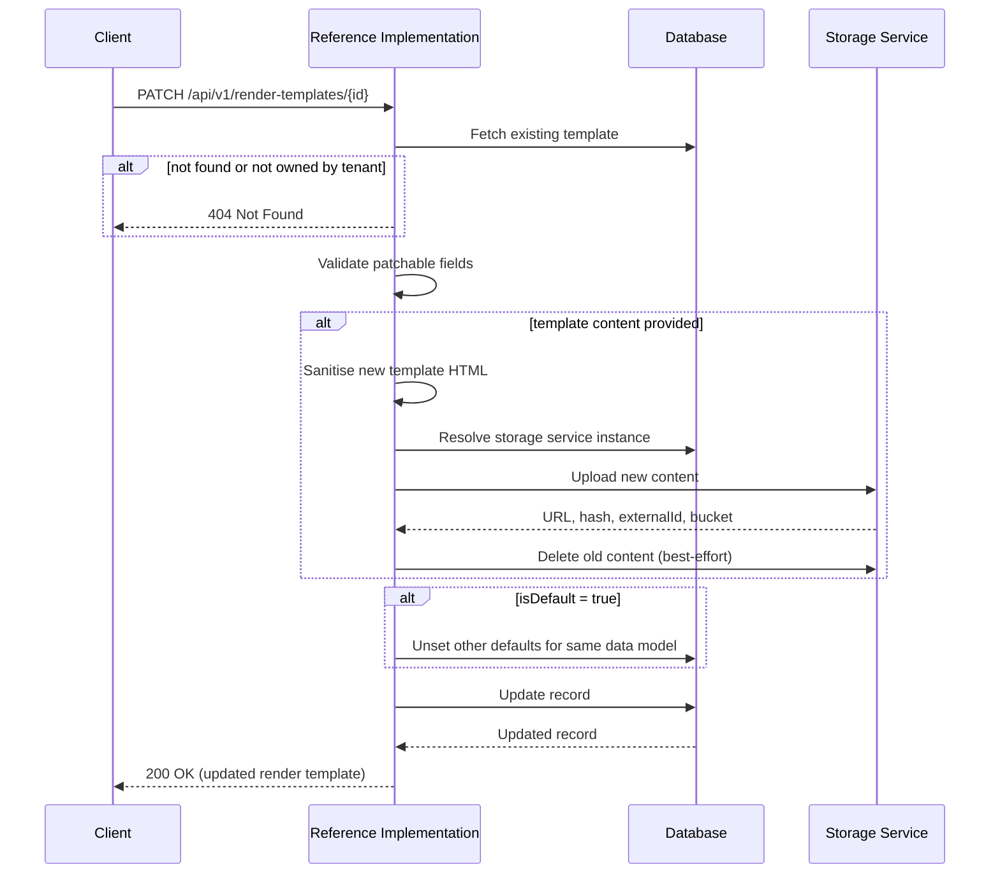
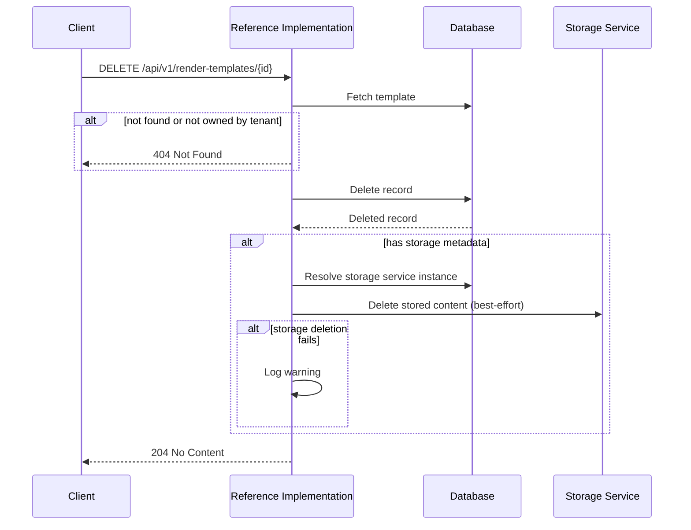

# Render Templates API

The render templates API manages **render templates** — the HTML templates that control how UNTP verifiable credentials are visually presented. Every credential issued by the Reference Implementation can include a render template that defines how the credential should be displayed to a human viewer.

This API provides CRUD operations for managing render templates, but the Reference Implementation's credential issuance endpoint does not inject render templates into credentials directly. The orchestration of fetching the appropriate render template, constructing the render method object, and attaching it to the credential payload is handled by the frontend (the web UI). This keeps the API stateless and allows the frontend to manage template selection as part of the credential issuance workflow.

For background on how render templates are stored, see [Storage Service](../services/storage-service).

:::tip[Interactive API documentation]
The Reference Implementation includes a Swagger UI at [`/api-docs`](http://localhost:3003/api-docs) with full request/response schemas you can try directly from the browser. The endpoint descriptions below focus on behaviour and internal logic — refer to Swagger for exact payload shapes. All endpoints require authentication — see [Authentication](../authentication#obtaining-a-token) for how to obtain a Bearer token.
:::

## Concepts

### Render Method Types

Every render template has a **render method type** that determines which specification it conforms to and which optional fields are available.

| Type | Status | Description |
|------|--------|-------------|
| `RenderTemplate2024` | **Recommended** | The current render method for credential rendering. Supports `inline`, `mediaType`, and `mediaQuery` fields for fine-grained control over how the template is delivered and displayed. All new templates should use this type. `RenderTemplate2024` is being added to the [W3C VC Rendering Methods](https://w3c-ccg.github.io/vc-render-method/) specification. |
| `WebRenderingTemplate2022` | Deprecated | The earlier render method. Included only for backwards compatibility with existing render templates. Does not support `inline`, `mediaType`, or `mediaQuery` — these fields are rejected if provided. `WebRenderingTemplate2022` is not part of the W3C specification. Will be removed in a future release. |

`RenderTemplate2024` is the render method type that should be used going forward. `WebRenderingTemplate2022` is retained solely to support existing templates that were created under the earlier specification — new templates should always use `RenderTemplate2024`.

The render method type is set at creation and **cannot be changed** after a template is created.

### Data Model Association

Every render template is associated with a [**data model**](./data-models) — the schema that defines the structure of the credential the template will render. Because a data model is pinned to a specific credential type *and version* (e.g., Digital Product Passport at version `0.6.0`), render templates are version-specific: a template designed for one version of a credential type may not be compatible with another, since the credential payload structure can change between versions. Templates are filtered and selected based on this association.

A data model can have multiple render templates (e.g., different layouts for different contexts), and one can be set as the [default](#default-templates) for that data model.

### Default Templates

Each tenant can designate one render template per data model as the **default** (`isDefault: true`). The default template is used when credential issuance needs a render template but none is explicitly specified.

When a render template is created or updated with `isDefault: true`, any existing default for the same data model within the tenant is automatically demoted to `isDefault: false`.

### System Templates vs Tenant Templates

Render templates exist at two levels — **system templates** and **tenant templates**.

**System templates** are bundled with the Reference Implementation and created during [startup](../operations/startup#step-2-database-seed). Each data model in the system has an associated render template that is authored and maintained by the data model's maintainers — for UNTP core credential types (Digital Product Passport, Digital Conformity Credential, etc.), these are provided by the UNTP community; for extensions, the extension authors provide them. System templates are owned by the [system tenant](../system-architecture#system-tenant), are read-only, and are visible to all tenants.

**Tenant templates** are created through this API and scoped exclusively to the creating tenant. Tenants can use the system templates as-is — they work out of the box and display the specific content for a given credential type and version. Alternatively, tenants can use the system templates as a starting point: retrieve the system template's content, modify it to suit their branding and requirements, and upload their customised version as a new tenant template. The tenant's custom template then takes precedence when set as the [default](#default-templates) for that data model.

Tenants can only update or delete their own templates. System templates are read-only.

### Template Content and Sanitisation

Template content is HTML that uses [Handlebars](https://handlebarsjs.com/) as its templating engine. Templates may include inline CSS (`<style>` tags), inline SVG elements, and Handlebars placeholders (`{{fieldName}}`) to reference credential fields. Handlebars is currently the only supported templating engine. When a template is created or updated, the HTML content is **sanitised** to remove potentially dangerous elements (such as `<script>` tags) while preserving the features render templates require.

The sanitiser allows:
- Standard HTML elements and attributes
- Inline SVG elements (`<svg>`, `<path>`, `<circle>`, `<rect>`, `<g>`, `<defs>`, `<clippath>`, `<text>`)
- CSS via `<style>` tags
- External stylesheets via `<link>` tags
- Images with `http`, `https`, and `data` URL schemes
- Accessibility and data attributes (`aria-*`, `data-*`)
- Handlebars syntax (passed through as text, not stripped)

Script content is removed. If the sanitiser strips any content, a warning is logged.

### Storage Integration

Render template HTML content is not stored in the database — it is uploaded to the [storage service](../services/storage-service) and the resulting URL, hash, and storage metadata are recorded in the database. When a template is updated with new content, the old content is deleted from storage (best-effort) and the new content is uploaded.

The storage service instance can be specified explicitly via `storageOptions.serviceInstanceId`, or the tenant's primary storage service is used by default.

### RenderTemplate2024 Fields

Templates using the `RenderTemplate2024` type support three additional fields that control how the template is delivered and applied:

| Field | Type | Default | Description |
|-------|------|---------|-------------|
| `inline` | boolean | `false` | Whether the template content should be embedded directly in the credential rather than referenced by URL |
| `mediaType` | string | `text/html` | The MIME type of the template content |
| `mediaQuery` | string | `null` | An optional [CSS media query](https://developer.mozilla.org/en-US/docs/Web/CSS/CSS_media_queries) that specifies when this template should be used (e.g., `print`, `screen and (max-width: 600px)`) |

These fields are **not available** for `WebRenderingTemplate2022` templates — providing them for that type results in a validation error.

## Endpoints

### Create a render template

```
POST /api/v1/render-templates
```

Creates a new render template for the authenticated tenant. The template HTML content is sanitised, uploaded to the storage service, and the metadata is stored in the database.

The `dataModelId` must reference a data model that is visible to the tenant — either a system-provisioned data model or one owned by the tenant. The `renderMethodType` determines which optional fields are available — see [Render Method Types](#render-method-types) and [RenderTemplate2024 Fields](#rendertemplate2024-fields).



---

### List render templates

```
GET /api/v1/render-templates
```

Returns render templates for the authenticated tenant, including system defaults. Results are paginated and can be filtered by data model.

| Parameter | Type | Default | Description |
|-----------|------|---------|-------------|
| `dataModelId` | string | — | Filter templates by associated data model |
| `limit` | integer | `20` | Maximum results per page (clamped to 100) |
| `offset` | integer | `0` | Number of results to skip (must be non-negative) |




---

### Get a render template

```
GET /api/v1/render-templates/{id}
```

Retrieves a specific render template by its database ID. The tenant can access templates they own and system defaults.

---

### Update a render template

```
PATCH /api/v1/render-templates/{id}
```

Updates one or more fields of a render template owned by the tenant. System templates cannot be updated.

Only the following fields can be updated: `name`, `template`, `isDefault`, `inline`, `mediaType`, `mediaQuery`. The `renderMethodType` is immutable — it cannot be changed after creation. The `storageUrl` and `hash` fields are server-managed and cannot be set directly.

When `template` is provided, the new content is sanitised and uploaded to the storage service. The old content is deleted from storage on a best-effort basis (a warning is logged if the deletion fails, but the update proceeds).

When `isDefault` is set to `true`, any existing default for the same data model within the tenant is automatically demoted.



---

### Delete a render template

```
DELETE /api/v1/render-templates/{id}
```

Permanently deletes a render template owned by the tenant. System templates cannot be deleted.

After the database record is removed, the stored template content is deleted from the storage service on a best-effort basis — if the storage deletion fails, the database record is still deleted and a warning is logged.


