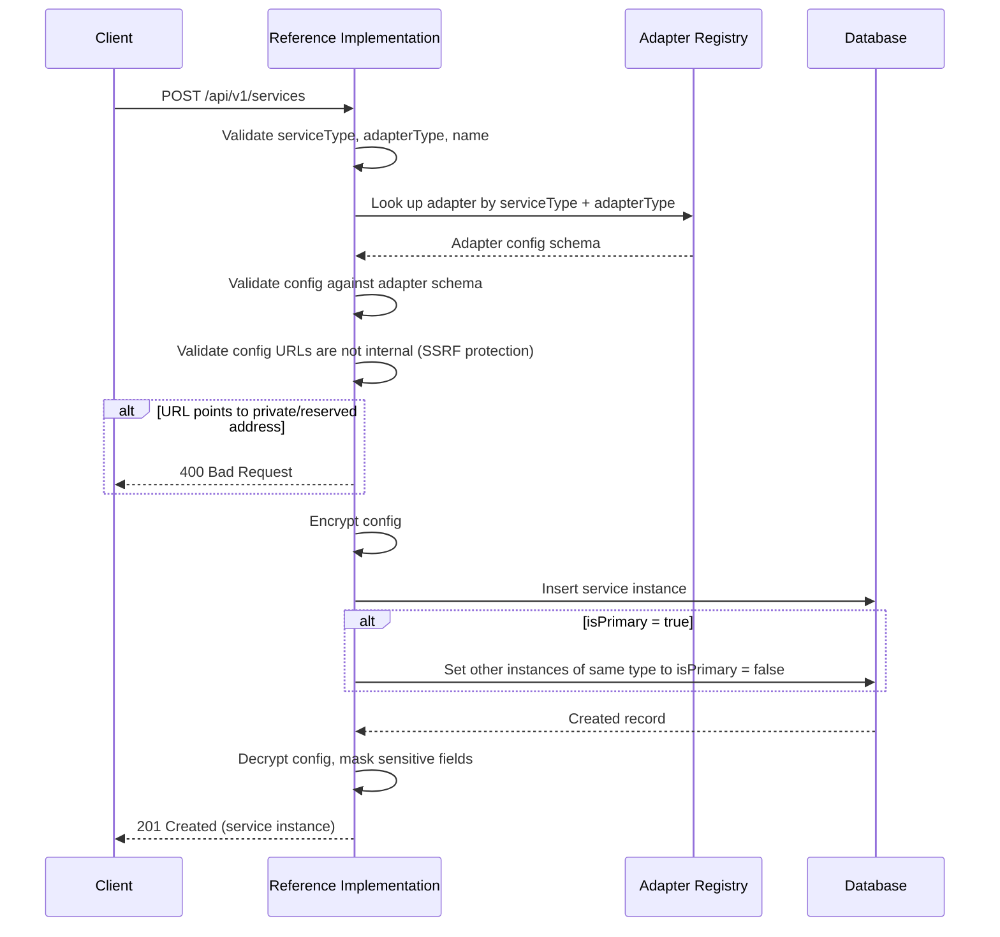
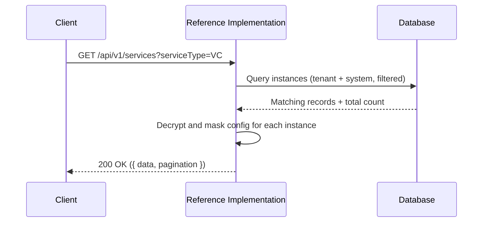
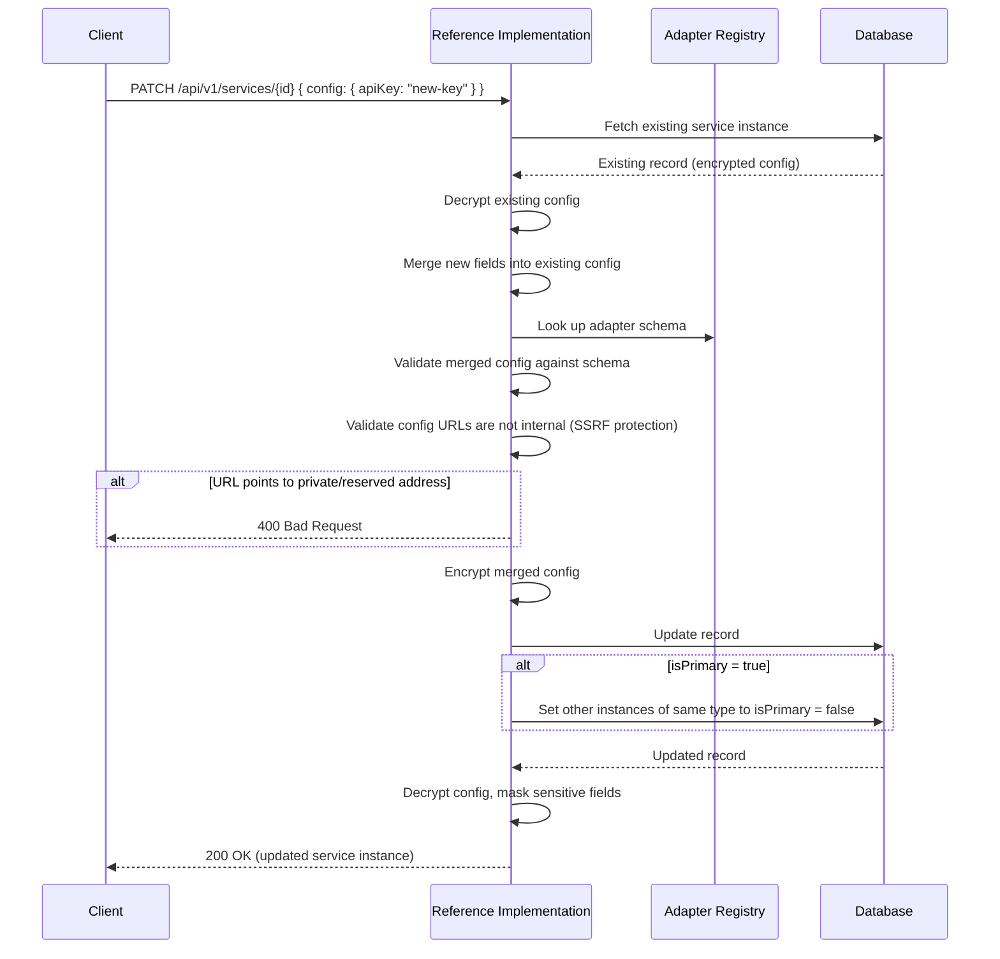
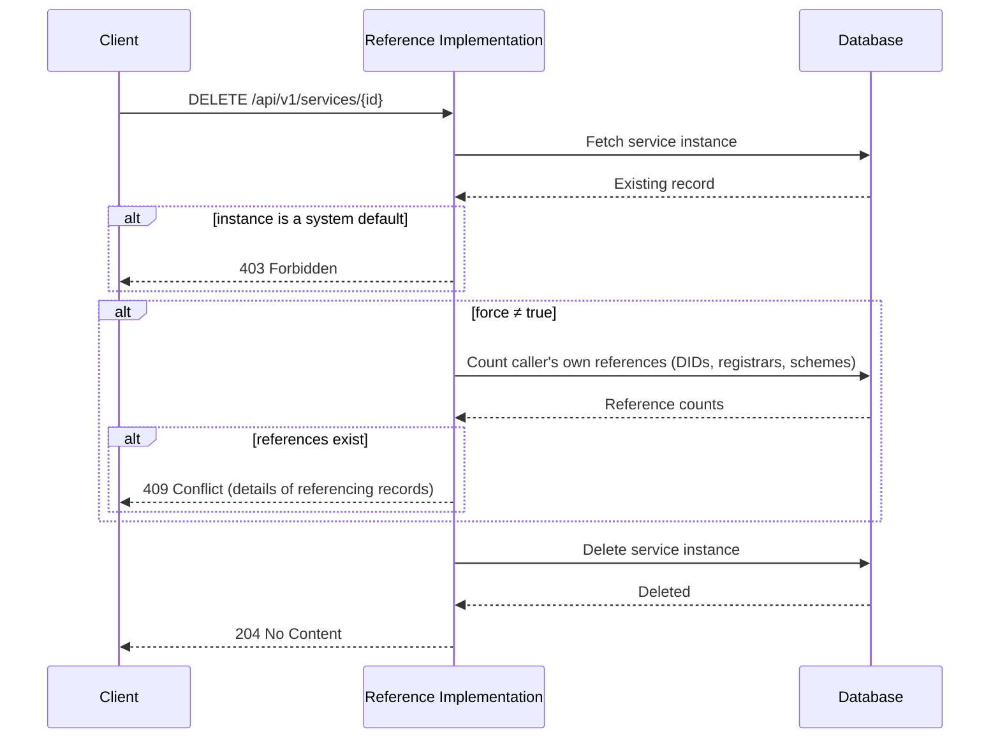

# Services API

The services API manages **service instances** — the configurations that connect the Reference Implementation to its [dependent services](../services/service-architecture#service-types) (verifiable credential services, storage services, and identity resolver services).

Each service instance records which adapter to use, the connection details (base URL, API key, etc.), and whether the instance is the primary for its service type. The configuration is [encrypted at rest](../services/service-architecture#encryption-at-rest) and sensitive fields (such as API keys) are [masked](../services/service-architecture#sensitive-field-handling) in API responses.

For background on how services fit into the architecture, see [Service Architecture](../services/service-architecture).

:::tip[Interactive API documentation]
The Reference Implementation includes a Swagger UI at [`/api-docs`](http://localhost:3003/api-docs) with full request/response schemas you can try directly from the browser. The endpoint descriptions below focus on behaviour and internal logic — refer to Swagger for exact payload shapes. All endpoints require authentication — see [Authentication](../authentication#obtaining-a-token) for how to obtain a Bearer token.
:::

## Concepts

### Service Types and Adapter Types

Every service instance has a **service type** (what category of service it provides) and an **adapter type** (which specific implementation it uses). The supported service types and their available adapters are documented on the [Service Architecture](../services/service-architecture#service-types) page.

Each adapter type has its own configuration schema. When creating or updating a service instance, the `config` object is validated against the adapter's schema before being encrypted and stored. See the adapter pages within each service for the configuration fields each adapter requires:

- [Verifiable Credential Service](../services/verifiable-credential-service#supported-adapters)
- [Storage Service](../services/storage-service#supported-adapters)
- [Identity Resolver Service](../services/identity-resolver-service#supported-adapters)

### System Services vs Tenant Services

Service instances exist at two levels — **system services** (created during [startup](../operations/startup#step-3-database-seed), owned by the [system tenant](../system-architecture#system-tenant), read-only defaults visible to all tenants) and **tenant services** (created through this API, scoped exclusively to the creating tenant). See [System Services vs Tenant Services](../services/service-architecture#system-services-vs-tenant-services) for details.

### Primary Instances

Each tenant can designate one service instance per service type as the **primary**. The primary instance is used by default when other operations (such as DID creation or credential issuance) need a service of that type but no specific instance is specified.

When a service instance is created or updated with `isPrimary: true`, any existing primary for the same service type within the tenant is automatically demoted to `isPrimary: false`.

### Configuration Encryption

Service configurations contain sensitive data (API keys, credentials). The `config` object is [encrypted at rest](../services/service-architecture#encryption-at-rest) and sensitive fields are [masked](../services/service-architecture#sensitive-field-handling) in API responses.

## Endpoints

### Create a service instance

```
POST /api/v1/services
```

Registers a new service instance for the authenticated tenant. The `config` object is validated against the adapter's schema (see [Service Types and Adapter Types](#service-types-and-adapter-types) above), encrypted, and stored.

`serviceType`, `adapterType`, `name` and `config` are required. `name` and `description` cannot be empty or contain only whitespace, and `description` is omitted rather than sent as null. `config` must be an object.



---

### List service instances

```
GET /api/v1/services
```

Returns service instances for the authenticated tenant, including system defaults. Results are paginated and can be filtered by service type and adapter type.

| Parameter     | Type    | Default                                                                                                      | Description                                                                                                   |
| ------------- | ------- | ------------------------------------------------------------------------------------------------------------ | ------------------------------------------------------------------------------------------------------------- |
| `serviceType` | string  | All types                                                                                                    | Filter by service type. One of `IDR`, `STORAGE`, `VC`; any other value is rejected with a 400                 |
| `adapterType` | string  | All adapters                                                                                                 | Filter by adapter type. One of `VCKIT`, `PYX_IDR`, `UNCEFACT_STORAGE`; any other value is rejected with a 400 |
| `limit`       | integer | Defaults to 20, or the [configured maximum](../operations/api-pagination#maximum-page-size) when it is lower | A value above the maximum is rejected with a 400 that names the maximum                                       |
| `offset`      | integer | `0`                                                                                                          | Number of results to skip                                                                                     |



---

### Get a service instance

```
GET /api/v1/services/{id}
```

Retrieves a specific service instance by its database ID. The tenant can access instances they own and system defaults.

---

### Update a service instance

```
PATCH /api/v1/services/{id}
```

Updates one or more fields of a service instance owned by the tenant. System defaults cannot be updated.

At least one of `name`, `description`, `config`, or `isPrimary` must be provided. A body with none of them, including one whose only keys are unrecognised, is rejected with a 400 rather than applied as a no-op. Sending `description: null` clears the description. Neither `name` nor `description` may be empty or contain only whitespace, and `name` cannot be cleared.

When `config` is provided, the new fields are **merged** with the existing configuration (shallow merge), the merged result is validated against the adapter's schema, and then encrypted before storage. This means you can update individual config fields without re-sending the entire config object.



---

### Delete a service instance

```
DELETE /api/v1/services/{id}
```

Permanently deletes a service instance owned by the tenant. A system default is visible to the tenant (see [Get a service instance](#get-a-service-instance)), but deleting one is rejected with a `403 Forbidden`, before any reference check runs.

If the caller's own DIDs, registrars, or identifier schemes reference the instance, the request is rejected with a `409 Conflict` unless `force=true` is set. The counts in the response cover only the caller's own referencing records. When forced, the foreign keys on referencing records are set to `null`.

| Parameter | Type   | Default | Description                                                                                                                       |
| --------- | ------ | ------- | --------------------------------------------------------------------------------------------------------------------------------- |
| `force`   | string | `false` | Accepts exactly `true` or `false`. Any other value is rejected with a 400 naming the parameter, rather than being read as `false` |


