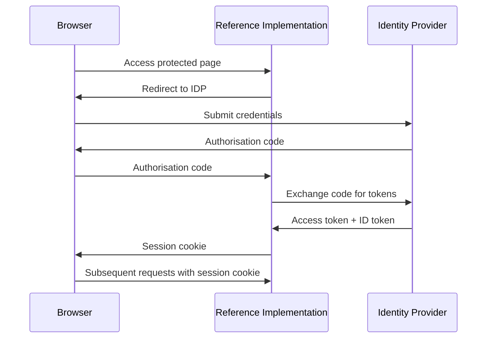
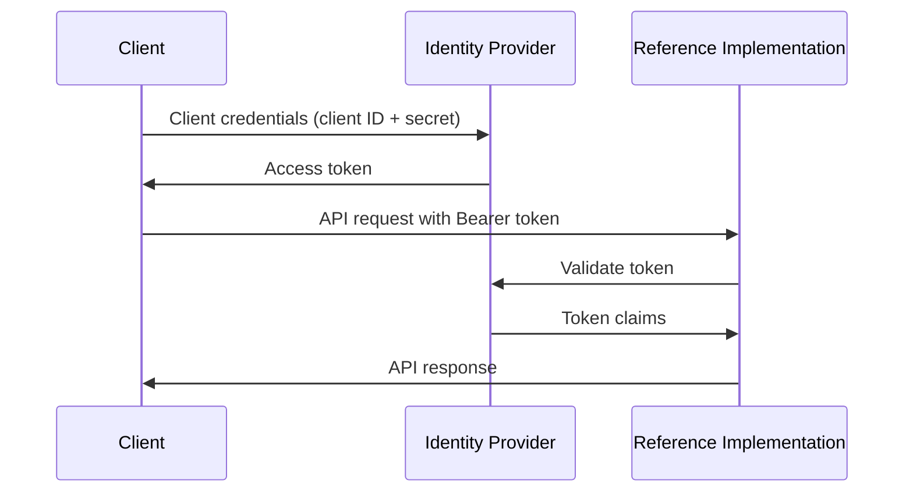

# Authentication

The Reference Implementation delegates authentication to a federated identity provider (IDP) and supports two methods of access: browser sessions and service accounts. Both methods use the same IDP to verify identity and resolve the user's [tenant](./tenant-modes).

## Browser Sessions

Browser-based users authenticate through the standard OAuth2/OIDC redirect flow:



The Reference Implementation establishes a session and issues a session cookie. Subsequent requests use this cookie for authentication without requiring further IDP interaction (until the session expires or the token needs refreshing).

In [closed mode](./tenant-modes#closed-mode), the Reference Implementation periodically refreshes the access token to keep the group claim up to date. This ensures that if a user's group membership changes in the IDP, the Reference Implementation picks up the change within a few minutes.

## Service Accounts

Service accounts authenticate using Bearer tokens in the `Authorization` header. This is the integration path for systems consuming the REST API programmatically.



The service account obtains a token from the IDP via the OAuth2 client credentials flow, then includes it as a Bearer token in each request. The Reference Implementation validates the token and resolves the user and tenant using the same [tenant mode](./tenant-modes) logic as browser sessions.

### Obtaining a token

Using the Docker Compose configuration, a pre-configured service account (`ri-service-account`) is available:

```bash
curl -X POST http://localhost:8080/realms/ri-local/protocol/openid-connect/token \
  -d "grant_type=client_credentials" \
  -d "client_id=ri-service-account" \
  -d "client_secret=changeme"
```

Use the returned `access_token` as a Bearer token in API requests:

```bash
curl http://localhost:3003/api/v1/dids \
  -H "Authorization: Bearer <access_token>"
```

In [open mode](./tenant-modes#open-mode), a service account that has not previously authenticated is automatically provisioned with a new tenant. In [closed mode](./tenant-modes#closed-mode), the Bearer token must contain the group claim — without it, the request is rejected with a 403.

## Public Routes

Not all routes require authentication. The following are publicly accessible without a session or token:

- **Health check** (`/api/v1/health`) — used by load balancers and monitoring tools to confirm the application is running
- **Credential verification API** (`/api/v1/credentials/verify`) — accepts a credential URL and returns the verification result
- **Verify page** (`/verify`) — a web UI for verifying credentials, intended for end users and specification readers following links to example credentials. See [Verify Page](../verify-page) for details.

## IDP Configuration

See [IDP Requirements](./idp-requirements) for supported providers and their configuration.
