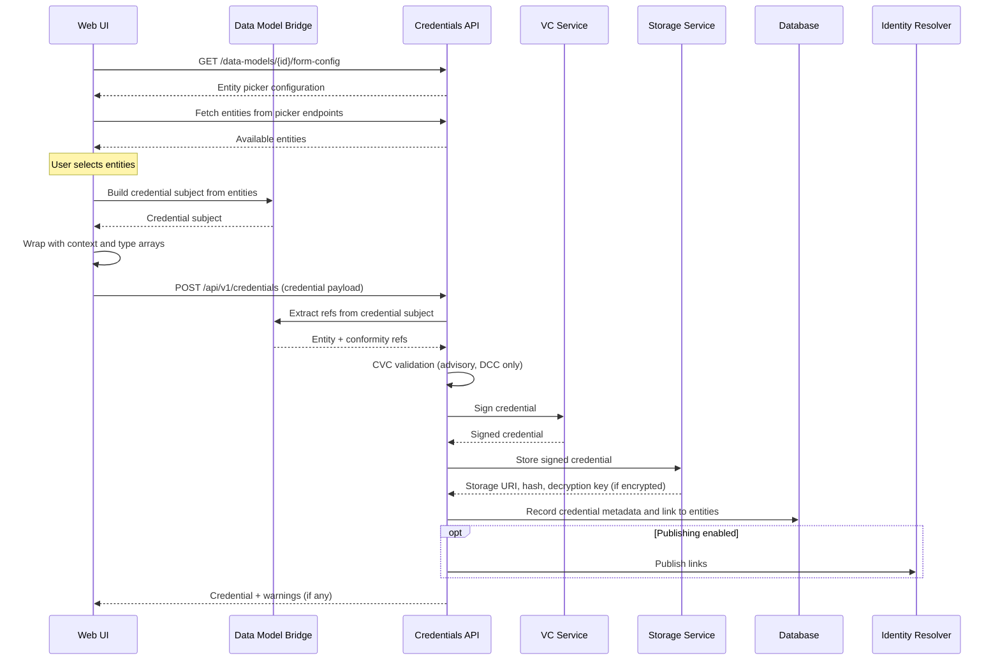

# Bridge Architecture

The [overview](./index.md) describes what data model bridges do — map between stable entity records and evolving credential structures. This page explains how that mapping is implemented, how versions are managed, and how bridges are resolved at runtime.

## Design Philosophy

The Reference Implementation never constructs or reads credential subjects directly. Instead, it goes through a **bridge** — a pair of functions that know how to build and extract data for a specific UNTP data model type and version. Each bridge encapsulates the structural knowledge of where entities sit within that version's credential subject.

Because the UNTP specification evolves, the same credential type can have different structures across versions. Rather than maintaining separate, complete implementations for each version, bridges use a **delta pattern** — each version only carries what changed from its predecessor. When nothing changed, a version is a single-line re-export. When a field moved or a new structure was introduced, only the affected function is overridden.

This means adding support for a new UNTP version is proportional to what actually changed — not a full copy of the previous version's code.

## How Bridges Are Composed

Each bridge is composed from two standalone functions — a **builder** and an **extractor** — that are paired together:

- The **builder** receives entity data (organisation, facility, product, conformity selections) and returns a credential subject in the correct structure for that type and version.
- The **extractor** receives a credential subject and returns the entity identifiers and conformity references it contains.

These two functions are co-located in a version directory within the [services package](https://github.com/uncefact/tests-untp/tree/next/packages/services) (`@uncefact/untp-ri-services`). For example, the Digital Product Passport bridge for version `0.6.0` lives in `data-model-bridges/data-models/dpp/versions/v060/` and contains a builder, an extractor, and an index file that pairs them.

## The Delta Pattern

When a new UNTP version is released, the credential structure might be identical to the previous version — or it might have changes. The delta pattern handles both cases:

**Identical version** — the new version's directory contains a single file that re-exports the previous version. No duplication, no new logic.

**Changed version** — the new version imports the previous builder or extractor and overrides only what changed. If the builder changed but the extractor didn't, only the builder is replaced. Both functions can be overridden independently.

This keeps each version lightweight. A version that only restructures how facility data is nested replaces just the builder — the extractor, if the output shape didn't change, is reused directly from the previous version.

See [Adding a Bridge](./adding-a-bridge) for practical examples of both cases.

## The Bridge Registry

Bridges are registered in a central registry that maps credential type and version to a bridge instance. The consumer calls the registry with a type (e.g., `DigitalProductPassport`) and version (e.g., `0.6.0`) and receives the corresponding bridge — or nothing if no bridge exists for that combination.

Version matching is strict — `0.6.0` and `0.6.1` are treated as distinct entries. There is no version range matching, normalisation, or fallback. If a bridge is not registered for the exact type and version requested, the consumer must handle that case.

## Context and Type Handling

Bridges produce the credential subject only — they do not handle the `@context` or credential `type` arrays that form the outer envelope of a verifiable credential. A separate `buildContextAndTypes` utility in the [services package](https://github.com/uncefact/tests-untp/tree/next/packages/services) handles this, taking a data model configuration (core context and type, plus optional extension context and type) and returning the arrays to wrap around the subject.

This separation keeps bridges focused on entity mapping. The context and type logic is shared across all credential types without duplication, and extensions that add their own context and type values are handled transparently.

## How Bridges Fit into Credential Issuance

The following diagram shows where bridges are involved in the credential issuance process:

## What Each Bridge Handles

| Bridge | Builds | Entity Extraction | Conformity Extraction |
|--------|--------|-------------------|----------------------|
| DPP | Product passport with the product, the facility that manufactured it, and the organisation that produced it | Product identifier (with batch/serial qualifiers), manufacturing facility identifier, and producing organisation identifier | Standards, regulations, and criteria |
| DCC | Conformity attestation with scope and assessments | Organisation (with fallback from the issued-to party to the assessed organisation), facility, and product | Scheme, standards, regulations, and criteria |
| DFR | Facility record with the facility and the organisation that operates it | Facility identifier and operating organisation identifier | Standards, regulations, and criteria |
| DIA | Registered identity anchoring any entity type | Entity identifier, routed by the credential's register type | None |
| DTE | Single traceability event — supports all five event types (object, transformation, aggregation, transaction, association) | Product identifiers from item lists; organisation identifiers from transaction parties | None |

:::tip[DTE limitation]
The UNTP schema allows the DTE credential subject to be an array of multiple events, but the current bridge builds and extracts a single event only. All five event types are supported individually. The multi-event limitation is being discussed with the UNTP working group.
:::

## Shared Primitives

Several building blocks are shared across all bridges — functions that construct common structures like party objects, identifier schemes, locations, and addresses. These live in a shared `primitives/` directory within the [services package](https://github.com/uncefact/tests-untp/tree/next/packages/services/src/data-model-bridges/primitives) and are imported by individual bridge builders as needed.

This avoids duplicating the same party-building or location-building logic across every credential type and version.

