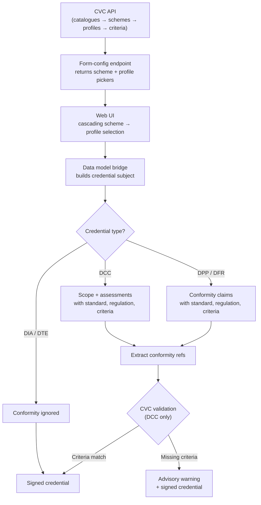

# Conformity Handling

Several UNTP credential types carry conformity data — references to standards, regulations, and assessment criteria that describe what a product, facility, or organisation has been assessed against. This page explains how conformity data flows through the system, how different credential types represent it, and how the Reference Implementation validates conformity content.

## The conformity vocabulary hierarchy

The Reference Implementation maintains a conformity vocabulary catalogue (CVC) with a structured hierarchy:

| Level | Description | Example |
|-------|-------------|---------|
| **Catalogue** | Top-level grouping of related schemes | "Australian Agriculture Standards" |
| **Scheme** | A conformity assessment programme or standard family | "Organic Certification Scheme" |
| **Profile** | A specific assessment profile within a scheme | "Organic Crop Production v2.1" |
| **Criteria** | Individual assessment requirements within a profile | "No synthetic pesticides used" |

Conformity vocabulary data can be system-provisioned (available to all tenants) or tenant-imported (scoped to a specific tenant). Tenants manage their vocabulary through the CVC API endpoints (`/api/v1/cvc/catalogues`, `/api/v1/cvc/schemes`, `/api/v1/cvc/profiles`). When issuing credentials, the conformity data selected by the user is routed into the credential structure by the [data model bridge](./index.md).

## Conformity representation by credential type

Different credential types represent conformity data in structurally different ways, reflecting their different purposes in the UNTP specification.

### Digital Conformity Credential (DCC)

The DCC is the primary vehicle for conformity attestation. It uses two structural levels:

- **Scope** — a top-level conformity assessment scheme identifying what is being attested to. This is unique to the DCC; no other credential type has a scope field.
- **Assessments** — an array of individual assessments, each of which can reference a standard, a regulation, and a set of assessment criteria. Each assessment can also reference the assessed product, facility, and organisation.

### Digital Product Passport (DPP) and Digital Facility Record (DFR)

Both DPP and DFR use the same approach — an array of conformity claims at the top level of the credential subject. Each claim can reference a standard, a regulation, and assessment criteria. There is no separate scope; all conformity data sits within the claims.

The conformity claim structure is identical between DPP and DFR.

### Digital Identity Anchor (DIA) and Digital Traceability Event (DTE)

Neither DIA nor DTE carries conformity data. The bridge silently ignores any conformity input provided for these types.

## How conformity data is routed

The bridge receives conformity data as an array of inputs. Each input can contain a scheme, a standard, a regulation, and criteria — all optional. The bridge routes each field to the correct location within the credential subject based on the credential type:

| Input | DCC | DPP / DFR | DIA / DTE |
|-------|-----|-----------|-----------|
| Scheme | Top-level scope | Not applicable | Ignored |
| Standard | Assessment's reference standard | Claim's reference standard | Ignored |
| Regulation | Assessment's reference regulation | Claim's reference regulation | Ignored |
| Criteria | Assessment's assessment criteria | Claim's assessment criteria | Ignored |

Within a single assessment or claim, a standard and a regulation can coexist — they are not mutually exclusive.

## Form configuration {#form-configuration}

The [form-config endpoint](../api/data-models#get-form-configuration) returns conformity pickers for credential types that support conformity (DPP, DCC, DFR). The configuration includes two optional sections:

1. **Conformity Scheme picker** — lists available schemes from the CVC API
2. **Conformity Profile picker** — lists profiles filtered by the selected scheme

The profile picker uses a `dependsOn` field referencing the scheme picker, indicating that it is only active when a scheme has been selected. The frontend uses this to render a cascading selection: the user first picks a scheme, then picks a profile within that scheme.

DIA and DTE form configurations do not include conformity pickers.

:::tip[Frontend not yet built]
The cascading conformity picker UI is not yet implemented. The form-config endpoint provides the metadata, but the frontend that renders the pickers is planned for a future iteration.
:::

## Conformity data flow

## CVC validation

After extraction, the conformity references can be validated against the available conformity vocabulary profiles (system-provisioned or tenant-imported). This validation checks whether the credential's attestations cover all the criteria defined by a given profile.

Currently, CVC validation is implemented for **Digital Conformity Credentials only**. The extracted criteria are compared against the criteria defined in the matching profile — if any required criteria are missing from the credential, an advisory warning is produced. These warnings are informational; they never prevent the credential from being issued.

For DPP and DFR credentials, conformity data is extracted but not yet validated against CVC profiles. This is planned for future work — the extraction infrastructure is already in place, so validation can be added without changes to the bridge layer.
