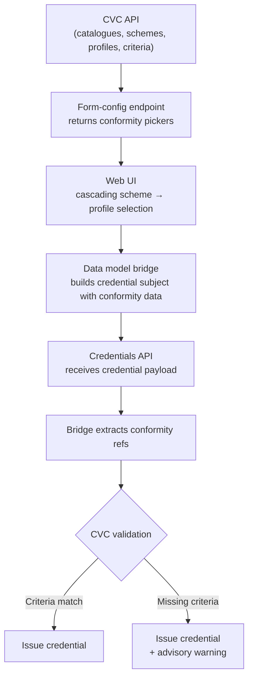

# Conformity Handling

Several UNTP credential types carry conformity data — references to standards, regulations, and assessment criteria that describe what a product, facility, or organisation has been assessed against. This page explains how conformity data flows through the system, how different credential types represent it, and how the Reference Implementation validates conformity content.

## The conformity vocabulary hierarchy

The Reference Implementation maintains a conformity vocabulary catalogue (CVC) with a structured hierarchy:

| Level | Description | Example |
|-------|-------------|---------|
| **Catalogue** | Top-level grouping of related schemes, standards, and regulations | "Australian Agriculture Standards" |
| **Scheme / Standard / Regulation** | A conformity assessment programme, standard, or regulation | "Organic Certification Scheme", "ISO 14001", "EU Deforestation Regulation" |
| **Profile** | A specific assessment profile within a scheme, standard, or regulation | "Organic Crop Production v2.1" |
| **Criteria** | Individual assessment requirements within a profile | "No synthetic pesticides used" |

Conformity vocabulary data can be system-provisioned (available to all tenants) or tenant-imported (scoped to a specific tenant). Tenants manage their vocabulary through the CVC API endpoints (`/api/v1/cvc/catalogues`, `/api/v1/cvc/schemes`, `/api/v1/cvc/profiles`).

## Supported credential types

Conformity data is supported for Digital Conformity Credentials, Digital Product Passports, and Digital Facility Records. Digital Identity Anchors and Digital Traceability Events do not carry conformity data.

The [bridge architecture](./bridge-architecture) page describes what each bridge builds and extracts, including conformity handling.

## Form configuration {#form-configuration}

The [form-config endpoint](../api/data-models#get-form-configuration) returns conformity pickers for credential types that support conformity (DPP, DCC, DFR). The configuration includes two optional sections:

1. **Conformity Scheme picker** — lists available schemes from the CVC API
2. **Conformity Profile picker** — lists profiles filtered by the selected scheme

The profile picker uses a `dependsOn` field referencing the scheme picker, indicating that it is only active when a scheme has been selected. The frontend uses this to render a cascading selection: the user first picks a scheme, then picks a profile within that scheme.

Conformity pickers are included for [supported credential types](#supported-credential-types) only.

:::tip[Frontend not yet built]
The cascading conformity picker UI is not yet implemented. The form-config endpoint provides the metadata, but the frontend that renders the pickers is planned for a future iteration.
:::

## CVC validation

After extraction, the conformity references can be validated against the available conformity vocabulary profiles (system-provisioned or tenant-imported). This validation checks whether the credential's attestations cover all the criteria defined by a given profile.

Currently, CVC validation is implemented for **Digital Conformity Credentials only**. The extracted criteria are compared against the criteria defined in the matching profile — if any required criteria are missing from the credential, an advisory warning is produced. These warnings are informational; they never prevent the credential from being issued.

For DPP and DFR credentials, conformity data is extracted but not yet validated against CVC profiles. This is planned for future work — the extraction infrastructure is already in place, so validation can be added without changes to the bridge layer.

## Conformity data flow

