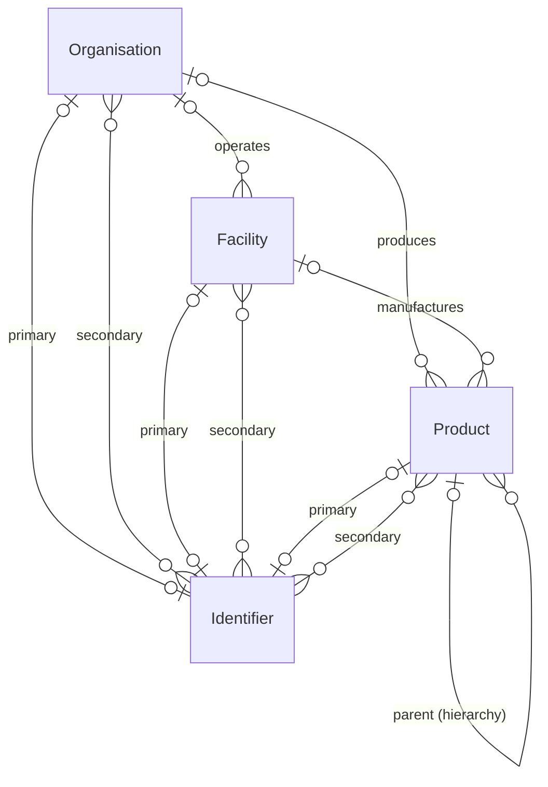
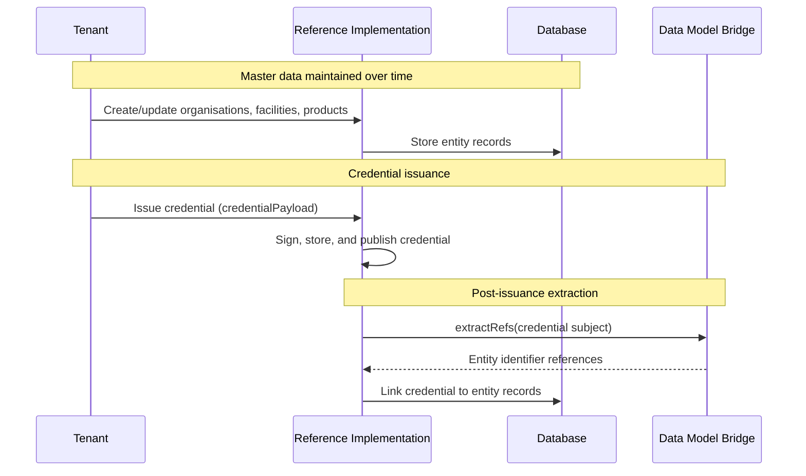

# Master Data

The Reference Implementation stores **master data** — the stable records that describe the real-world things credentials are issued about. UNTP credentials reference organisations, facilities, and products — these are not created fresh for each credential but maintained as persistent, reusable records that predate and outlive any individual credential.

Master data serves two purposes in the Reference Implementation:

1. **Credential population** — the [data model bridge](../data-models/index.md#population) can read entity records and map their data into the correct positions within the credential subject, so tenants define their entity data once rather than re-entering it for each credential. Population is UI-driven — see the [bridge documentation](../data-models/index.md#population) for the current status.

2. **Credential linking** — after a credential is issued, the [extraction](../data-models/index.md#extraction) process pulls entity identifiers out of the credential subject and links the credential record back to the entities it describes. This enables querying credentials by the entities they reference.

## Entity Types

The Reference Implementation defines three master data entity types. Together they model the core supply chain relationships that UNTP credentials describe.

### Organisations

An organisation represents a legal entity or business — the brand owner, producer, or any party that the tenant needs to reference when issuing credentials. Organisations can be linked to facilities they operate and products they produce.

See the [Organisations API](../api/organisations) for endpoint documentation.

### Facilities

A facility represents a physical location — a factory, warehouse, farm, or processing plant. Each facility can optionally be linked to the organisation that operates it. Facilities can be referenced by multiple UNTP credential types.

See the [Facilities API](../api/facilities) for endpoint documentation.

### Products

A product represents a good, material, or item in the supply chain. Products have a three-tier hierarchy that mirrors how goods are identified in practice:

| Level | Description | Example |
|-------|-------------|---------|
| `MODEL` | A product definition or SKU | "Organic Coffee Beans 1kg" |
| `BATCH` | A production run of a model | "Batch 2024-Q1-001" |
| `ITEM` | An individual serialised unit | "Serial #A001" |

Each product can be linked to the organisation that produces it and the facility where it is manufactured.

See the [Products API](../api/products) for endpoint documentation.

## Identifiers

All three entity types support **identifiers** — structured values that follow an [identifier scheme](../api/identifiers) registered with a [registrar](../api/registrars). Identifiers connect master data records to the identification systems used in the tenant's industry or jurisdiction.

Each entity supports:

- **Primary identifier** — a single main identifier that serves as the entity's principal business identifier
- **Secondary identifiers** — additional identifiers that provide supplementary identification. These can be from any scheme, including the same scheme as the primary identifier — the only constraint is that the same identifier record cannot appear as both primary and secondary

Identifiers are optional — entities can be created without them and have identifiers assigned later via the update endpoint. This supports a progressive setup workflow where tenants build their master data incrementally, adding the [registrar → scheme → identifier](../api/identifiers) chain when ready.

However, identifiers are central to how credentials reference entities. After a credential is issued, the [extraction](../data-models/index.md#extraction) process uses entity identifiers to match the credential back to entity records in the database. **Entities without identifiers will not be linked to credentials during extraction.** Assigning identifiers before issuing credentials that reference the entity is recommended.

## Location

Organisations and facilities support an optional `location` field — a structured JSON object matching the [UNTP core vocabulary](https://untp.unece.org/) location model. All fields are optional.

| Field | Type | Description |
|-------|------|-------------|
| `address.streetAddress` | string | Street address |
| `address.postalCode` | string | Postal or ZIP code |
| `address.addressLocality` | string | City or town |
| `address.addressRegion` | string | State, province, or region |
| `address.addressCountry` | string | Country (ISO 3166 alpha-2) |
| `plusCode` | string | [Plus Code](https://maps.google.com/pluscodes/) (Open Location Code) |
| `geoLocation` | GeoJSON Point | `{ "type": "Point", "coordinates": [longitude, latitude] }` |
| `geoBoundary` | GeoJSON Polygon | `{ "type": "Polygon", "coordinates": [[[lon, lat], ...]] }` |

A location can contain any combination of these fields. For entities with only a free-text address, use `address.streetAddress`.

## How Master Data Connects to Credentials

Master data entities are linked to credentials through the [extraction](../data-models/index.md#extraction) process that runs automatically during credential issuance. After a credential is signed and stored, the data model bridge extracts entity identifier references from the credential subject and uses them to create links between the credential record and the entities it describes.

The [population](../data-models/index.md#population) direction — where entity data is mapped into a credential subject before issuance — is UI-driven and planned for a future iteration of the web interface. See the [bridge documentation](../data-models/index.md#population) for details.

## Tenant Scoping

All master data is scoped to the authenticated tenant. Each tenant maintains its own set of organisations, facilities, and products — they cannot see or modify entities belonging to other tenants. Unlike [data models](../data-models/index.md#untp-core-data-models-and-extensions) and [service instances](../services/service-architecture#system-services-vs-tenant-services), there are no system-level master data records — every entity is tenant-owned.

## Further Reading

- [Organisations API](../api/organisations) — create, list, update, and delete organisations
- [Facilities API](../api/facilities) — create, list, update, and delete facilities
- [Products API](../api/products) — create, list, update, and delete products
- [Data Model Bridges](../data-models/index.md) — how bridges map entity data into credential structures
- [Identifiers API](../api/identifiers) — manage identifiers and their schemes
