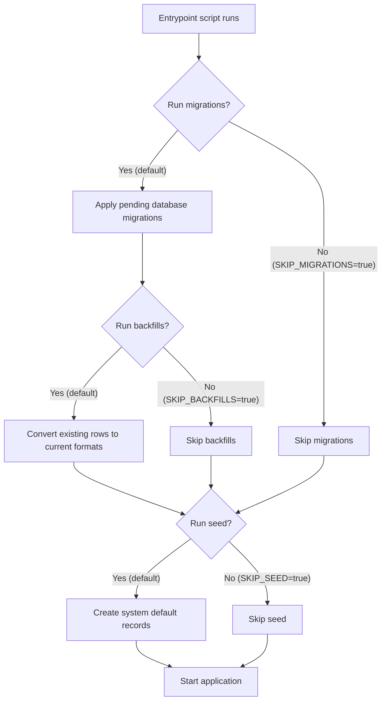

# Startup

Before the Reference Implementation begins accepting requests, its database schema must be up to date, and a set of default records must exist for the system to function, such as data models, default service instances, and render templates.

Rather than requiring operators to run these steps manually, the Docker container's [entrypoint script](https://github.com/uncefact/tests-untp/blob/main/packages/reference-implementation/docker-entrypoint.sh) handles them automatically. The entrypoint script applies database migrations, converts existing rows to the formats the current version writes, and seeds default records before starting the application. A database that is already up to date needs no migrations applied and no rows converted, but the conversion step still scans the credential and render template tables on every start, so the time that takes grows with both tables.

How this is triggered depends on how you run the Reference Implementation:

- **Docker** — The container's entrypoint script runs migrations, data backfills, and seeding automatically before starting the application. This applies whether you are using the Docker Compose configuration from the [repository](https://github.com/uncefact/tests-untp) or the standalone [Docker image](https://github.com/orgs/uncefact/packages/container/package/tests-untp%2Freference-implementation).
- **Local development** does not go through the entrypoint, so none of these steps happen on their own. See the [repository README](https://github.com/uncefact/tests-untp) for setup instructions. Where an existing database still needs the digest conversion, run it by hand with the command in the [digest multibase backfill reference](./backfills/digest-multibase).

This page walks through what happens during startup, what gets created, and how to control the process.

## What Happens on Startup

The entrypoint script runs three steps in order before the application begins accepting requests:

All three steps are **idempotent** — they can run repeatedly without duplicating data or causing errors. Migrations that have already been applied are skipped. Backfills leave rows they have already converted alone. Seed records that already exist are updated if the environment variables have changed (upsert), so you can modify configuration values and restart the container to apply them.

Note the path the diagram takes when migrations are skipped. `SKIP_MIGRATIONS=true` skips the backfills as well, because they sit inside the same `SKIP_MIGRATIONS` guard as `migrate deploy`.

## Step 1: Database Migrations

Each version of the Reference Implementation may include changes to the database schema — new tables, new columns, or modified constraints. Migrations apply these changes so that the database matches the version of the application being started.

If the database is already up to date, this step completes immediately.

| Variable          | Description                                | Default |
| ----------------- | ------------------------------------------ | ------- |
| `SKIP_MIGRATIONS` | Set to `true` to skip automatic migrations | `false` |

Set `SKIP_MIGRATIONS=true` if your deployment process applies migrations separately, for example in a CI/CD pipeline. This also skips the backfills in step 2, so a deployment that applies migrations out of band runs the backfills out of band too. The [digest multibase backfill reference](./backfills/digest-multibase) gives the command for the one that runs there today.

## Step 2: Data Backfills

A migration changes the shape of the tables. It does not always bring the rows that already exist into line with what the new version writes. Backfills do that second part, so an upgraded database matches the current version's expectations rather than only its schema.

They run immediately after `migrate deploy`, under the same `SKIP_MIGRATIONS` guard, so the columns they write have already been renamed or added by the time they execute. One backfill is wired up. It converts credential and render template digests from the legacy hexadecimal form to the multibase encoding the application now writes, and is documented in full under [Backfills](./backfills/digest-multibase). A value it does not recognise is left alone and warned about, and a value it has already converted is skipped, so repeated container starts converge rather than rewriting.

| Variable         | Description                               | Default |
| ---------------- | ----------------------------------------- | ------- |
| `SKIP_BACKFILLS` | Set to `true` to skip automatic backfills | `false` |

Skipping them leaves the old values in place. The application still starts, and rows that were never converted keep whatever format they held.

A backfill that fails is a different matter. The entrypoint stops at the first failing step, so the seed does not run and the application does not start, while any rows converted before the failure stay converted. A restart scans again from the beginning and skips the rows already converted.

Conversions that cannot be undone are deliberately kept out of this step and ship as [commands an operator runs](./backfills) when they choose, which is why encrypting existing credential decryption keys is not something a container start does.

## Step 3: Database Seed

After migrations and backfills, the entrypoint script runs the [seed script](https://github.com/uncefact/tests-untp/blob/main/packages/reference-implementation/prisma/seed-cli.ts) to create a set of system default records that the Reference Implementation needs to function. These are the baseline records that every instance requires — the data that makes the system usable out of the box.

| Variable             | Description                                                                                                                             | Default |
| -------------------- | --------------------------------------------------------------------------------------------------------------------------------------- | ------- |
| `SKIP_SEED`          | Set to `true` to skip automatic seeding                                                                                                 | `false` |
| `SEED_ALLOW_PARTIAL` | Set to `true` to seed whichever categories below are configured and skip the rest with a warning, instead of failing (see next section) | `false` |

### What gets seeded

The seed creates the defaults listed below. Some categories need their own environment variables (service instances, the default DID, render templates). The system tenant and data models need none and always seed.

Registrars and identifier schemes are different. They are not part of the core seed at all. They come from a seed manifest mounted at `/app/seed/custom`, which the [custom seed](./custom-seed) applies. A deployment that mounts nothing there, which is every deployment that does not supply its own manifest, gets no registrars and no identifier schemes, and cannot create an identifier until it supplies some. The entries in the table below name what a manifest of this kind provides, not what ships by default.

**By default, a category whose required environment variables are missing fails the whole seed before it writes anything**, and the container does not start. This surfaces a misconfigured deployment at deploy time, naming every missing variable in one boot cycle, rather than as a downstream failure once someone tries to issue or resolve a credential. Set `SEED_ALLOW_PARTIAL=true` to restore the previous behaviour instead: eligible categories seed, and categories with missing variables are skipped with a warning while the rest still proceed. This suits a deployment that is intentionally brought up with only some services configured, with the rest added later through the application.

| What               | Description                                                                                                                                                                                                                                                                            | Additional Environment Variables Required                        |
| ------------------ | -------------------------------------------------------------------------------------------------------------------------------------------------------------------------------------------------------------------------------------------------------------------------------------- | ---------------------------------------------------------------- |
| System tenant      | An internal tenant that owns all system default records                                                                                                                                                                                                                                | None                                                             |
| Registrars         | Identifier registrars, for example GS1. From the mounted seed manifest, not the core seed                                                                                                                                                                                              | A manifest mounted at `/app/seed/custom`                         |
| Identifier schemes | Identifier types, for example GTIN, with validation patterns and qualifiers. From the mounted seed manifest, not the core seed                                                                                                                                                         | A manifest mounted at `/app/seed/custom`                         |
| Data models        | UNTP credential types (DPP, DCC, DFR, DIA, DTE) for each supported spec version, with their schema and context URLs                                                                                                                                                                    | None                                                             |
| Service instances  | Default [verifiable credential](../services/verifiable-credential-service), [storage](../services/storage-service), and [identity resolver](../services/identity-resolver-service) service instances — see each service's page for the required environment variables and what they do | `DATA_ENCRYPTION_KEY` and each service's `SYSTEM_*` variables    |
| Default DID        | A system Decentralised Identifier (DID) created via the verifiable credential service                                                                                                                                                                                                  | `SYSTEM_DID` and `SYSTEM_VC_*` variables                         |
| Render templates   | Default HTML render templates for each data model, uploaded to the storage service                                                                                                                                                                                                     | `SYSTEM_STORAGE_*` variables (storage service must be reachable) |

For example, with `SEED_ALLOW_PARTIAL=true` and `DATA_ENCRYPTION_KEY` not set, the service instances, default DID, and render templates are all skipped — but the system tenant and data models are still created (registrars and identifier schemes are not a category this setting governs; they come from the mounted seed manifest). The skipped items must be configured before the system can issue, store, or resolve credentials.

Every seed run, whichever mode it ran in, ends with one structured summary naming the categories seeded, the categories skipped, and the variables responsible, so confirming a healthy deployment and diagnosing a misconfigured one both read the same record.

**Migrating from the previous default:** deployments that relied on the old skip-and-continue behaviour across restarts (for example, a deployment intentionally running with only some services configured) will fail to start after upgrading until `SEED_ALLOW_PARTIAL=true` is set. The documented startup paths — copying `.env.example` before starting Compose, and the E2E Compose stack — populate every variable and are unaffected.

When `DATA_ENCRYPTION_KEY` is set, the seed validates it against any existing encrypted data before it writes any service instance configuration (the system tenant and other non-encrypted records may already exist by that point): see [Encryption Key Validation](#encryption-key-validation) below for what this checks and how it fails.

### Customising seed data

The seed script is located at `packages/reference-implementation/prisma/seed-cli.ts` (which runs the logic in `prisma/seed.ts`) in the [repository](https://github.com/uncefact/tests-untp). Organisations that need additional seed data — custom registrars, identifier schemes, data models, render templates, or conformity schemes — supply it via a Docker volume mount, without modifying the source. See [Custom Seed](./custom-seed.md).

Render templates are loaded from `packages/reference-implementation/src/templates/` and uploaded to the storage service during seeding. To customise the default templates, replace the `.hbs` files in this directory before building the Docker image, or supply additional templates through the custom seed.

## Step 4: Application Start

Once migrations, backfills, and seeding are complete, the application starts and begins accepting requests on port 3003.

### Base URL Validation

Before the application accepts its first request, it validates `RI_APP_URL` (the deployment's public base URL, which backs the OIDC post-logout redirect and the [default human verification link](../api/credentials#stage-8-idr-publishing-optional) on published credentials). Startup fails with a message naming the variable when it is unset, is not a valid `http(s)` URL, or carries a username or password. See [Identity provider requirements](../authentication/idp-requirements) for how the value is used.

### Encryption Key Validation

Before the application accepts its first request, it validates the active `DATA_ENCRYPTION_KEY` by decrypting one existing encrypted value — a service instance configuration, or (when no service instance has a usable one, whether because none exists yet or because every existing configuration is corrupted) a protected credential decryption key. This runs once per process start, using the same check the [seed](#step-3-database-seed) already runs before it writes.

| Situation                                                                             | Result                                                                                                                                                                  |
| ------------------------------------------------------------------------------------- | ----------------------------------------------------------------------------------------------------------------------------------------------------------------------- |
| The key decrypts the sample value                                                     | Startup proceeds normally                                                                                                                                               |
| Nothing is encrypted yet (fresh deployment, `DATA_ENCRYPTION_KEY` not yet configured) | Startup proceeds normally — there is nothing to validate against                                                                                                        |
| The key cannot decrypt the sample value                                               | Startup fails with a named error identifying the row that failed to decrypt                                                                                             |
| `DATA_ENCRYPTION_KEY` is still the placeholder value from `.env.example`              | Startup fails outside local development (`DEPLOYMENT_ENVIRONMENT` unset or `local` is treated as local development); a warning is logged and startup proceeds within it |

Without this check, a `DATA_ENCRYPTION_KEY` that does not match the key data was encrypted under only surfaces once a real request tries to decrypt something — for example a `ConfigDecryptionError` when a service instance resolves. Validating at startup turns that into an immediate, loud failure instead of an intermittent one discovered by end users.

If startup fails this check, verify `DATA_ENCRYPTION_KEY` matches the key the application was previously running with, and restore the previous key. The backup pairing, retention, and recovery contract for this key lives in [Key Management and Recovery](./key-management). Moving data onto a new key is a deliberate offline procedure, never an in-place variable change; see [Encryption Key Rotation](./encryption-key-rotation).

### HTTP User-Agent Override Validation

Every outbound document fetch the application makes (remote JSON-LD `@context` documents and JSON Schemas during credential validation) sends a `User-Agent` header identifying the software. `RI_HTTP_USER_AGENT` overrides the built-in default; it is optional, and unset or blank means the default is used. When it is set, startup validates that the value can actually be sent as an HTTP header: it must be plain Latin-1 text with no control characters (no newlines or tabs, and no characters such as emoji). An invalid value fails startup with a message naming the variable, because it would otherwise break every outbound fetch at request time.

Remote `@context` documents fetched during credential issuance are cached in memory. `CONTEXT_CACHE_TTL_MS` controls how long a fetched context is reused (default one hour; `0` disables caching), matching `SCHEMA_CACHE_TTL_MS` for JSON Schemas. A change to a remote context document is therefore observed at most one TTL after it is published. Both caches also bound how many entries they retain: `CACHE_MAX_ENTRIES` (default 1000, applied to each cache) caps the entry count, evicting expired entries first and then the least recently used. When it is set, startup validates it is a positive integer and fails with a message naming the variable otherwise.

### Request Body Size Limit

`MAX_REQUEST_BODY_BYTES` caps how many request-body bytes the process will hold for every request body the API accepts (default 5242880, which is 5 MiB). A declared `Content-Length` over the cap is rejected before any bytes are read. Otherwise the body is read in chunks and rejected as soon as the accumulated length exceeds the cap, so a lying or absent `Content-Length` still cannot make the process hold more than one extra chunk. A body over the cap is answered `413` with code `REQUEST_BODY_TOO_LARGE`, and the message names the limit in bytes. When it is set, startup validates it is an integer of at least 1024 and fails with a message naming the variable otherwise.

### Redaction Path Validation

The first logger constructed during startup validates any paths supplied via `LOG_REDACT_PATHS`. An invalid path fails startup with a message naming the variable and the configured paths. See [Redaction](./logging#redaction) for the path syntax and what the built-in defaults already cover.

### Seeded Conformity Scheme Refresh Interval

Startup registers an in-process interval that periodically re-fetches seeded (`SYSTEM_SEED`) conformity schemes from their source URLs, so a seed-only deployment picks up publisher updates without a reboot. `CVC_REFRESH_INTERVAL_HOURS` sets the cadence in hours (default 24). When it is set, startup validates it is a positive number no greater than 500 and fails with a message naming the variable otherwise. See [Custom Seed: Periodic Refresh](./custom-seed#periodic-refresh) for what the interval does and how it interacts with the boot-time seed.
