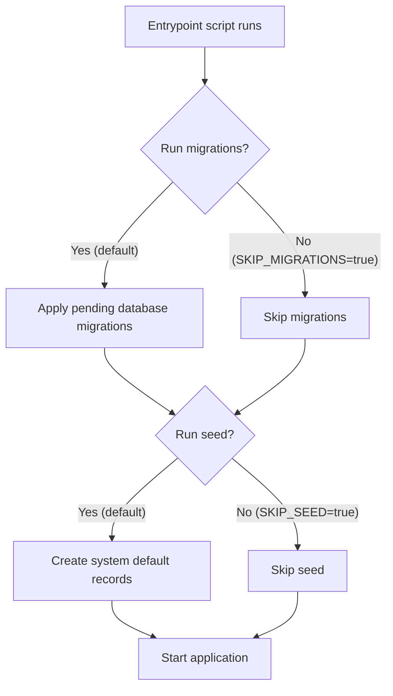

# Startup

Before the Reference Implementation begins accepting requests, its database schema must be up to date, and a set of default records must exist for the system to function — things like identifier schemes, data models, default service instances, and render templates.

Rather than requiring operators to run these steps manually, the Docker container's [entrypoint script](https://github.com/uncefact/tests-untp/blob/main/packages/reference-implementation/docker-entrypoint.sh) handles them automatically. The entrypoint script runs database migrations and seeds default records before starting the application. If the database is already up to date, the process completes in seconds.

How this is triggered depends on how you run the Reference Implementation:

- **Docker** — The container's entrypoint script runs migrations and seeding automatically before starting the application. This applies whether you are using the Docker Compose configuration from the [repository](https://github.com/uncefact/tests-untp) or the standalone [Docker image](https://github.com/orgs/uncefact/packages/container/package/tests-untp%2Freference-implementation).
- **Local development** — Migrations and seeding are run manually as part of the initial setup. See the [repository README](https://github.com/uncefact/tests-untp) for setup instructions.

This page walks through what happens during startup, what gets created, and how to control the process.

## What Happens on Startup

The entrypoint script runs two steps in order before the application begins accepting requests:

Both steps are **idempotent** — they can run repeatedly without duplicating data or causing errors. Migrations that have already been applied are skipped. Seed records that already exist are updated if the environment variables have changed (upsert), so you can modify configuration values and restart the container to apply them.

## Step 1: Database Migrations

Each version of the Reference Implementation may include changes to the database schema — new tables, new columns, or modified constraints. Migrations apply these changes so that the database matches the version of the application being started.

If the database is already up to date, this step completes immediately.

| Variable | Description | Default |
|----------|-------------|---------|
| `SKIP_MIGRATIONS` | Set to `true` to skip automatic migrations | `false` |

Set `SKIP_MIGRATIONS=true` if your deployment process applies migrations separately, for example in a CI/CD pipeline.

## Step 2: Database Seed

After migrations, the entrypoint script runs the [seed script](https://github.com/uncefact/tests-untp/blob/main/packages/reference-implementation/prisma/seed.ts) to create a set of system default records that the Reference Implementation needs to function. These are the baseline records that every instance requires — the data that makes the system usable out of the box.

| Variable | Description | Default |
|----------|-------------|---------|
| `SKIP_SEED` | Set to `true` to skip automatic seeding | `false` |

### What gets seeded

The seed creates the following defaults. Each category is independent — if a required environment variable is missing, that category is skipped with a warning and the rest still proceed.

| What | Description | Additional Environment Variables Required |
|------|-------------|------------------------------------------|
| System tenant | An internal tenant that owns all system default records | None |
| Registrars | Identifier registrars (GS1, Australian Business Register, ASIC) | None |
| Identifier schemes | Identifier types (GTIN, GLN, ABN, ACN) with validation patterns and qualifiers | None |
| Data models | UNTP credential types (DPP, DCC, DFR, DIA, DTE) for each supported spec version, with their schema and context URLs | None |
| Service instances | Default [verifiable credential](../services/verifiable-credential-service), [storage](../services/storage-service), and [identity resolver](../services/identity-resolver-service) service instances — see each service's page for the required environment variables and what they do | `DATA_ENCRYPTION_KEY` and each service's `SYSTEM_*` variables |
| Default DID | A system Decentralised Identifier (DID) created via the verifiable credential service | `SYSTEM_DID` and `SYSTEM_VC_*` variables |
| Render templates | Default HTML render templates for each data model, uploaded to the storage service | `SYSTEM_STORAGE_*` variables (storage service must be reachable) |

For example, if `DATA_ENCRYPTION_KEY` is not set, the service instances, default DID, and render templates are all skipped — but the system tenant, registrars, identifier schemes, and data models are still created. The skipped items must be configured before the system can issue, store, or resolve credentials — ensure all required environment variables are set.

When `DATA_ENCRYPTION_KEY` is set, the seed validates it against any existing encrypted data before it writes any service instance configuration (the system tenant and other non-encrypted records may already exist by that point): see [Encryption Key Validation](#encryption-key-validation) below for what this checks and how it fails.

### Customising seed data

The seed script is located at `packages/reference-implementation/prisma/seed.ts` in the [repository](https://github.com/uncefact/tests-untp). Organisations that need to modify what gets seeded — for example, adding custom identifier schemes or registrars — can edit this file directly.

Render templates are loaded from `packages/reference-implementation/src/templates/` and uploaded to the storage service during seeding. To customise the default templates, replace the `.hbs` files in this directory before building the Docker image.

:::note
A mechanism for supplying custom seed data (such as render templates) via Docker volumes — without modifying the source — is planned but not yet implemented.
:::

## Step 3: Application Start

Once migrations and seeding are complete, the application starts and begins accepting requests on port 3003.

### Base URL Validation

Before the application accepts its first request, it validates `RI_APP_URL` (the deployment's public base URL, which backs the OIDC post-logout redirect and the [default human verification link](../api/credentials#stage-8-idr-publishing-optional) on published credentials). Startup fails with a message naming the variable when it is unset, is not a valid `http(s)` URL, or carries a username or password. See [Identity provider requirements](../authentication/idp-requirements) for how the value is used.

### Encryption Key Validation

Before the application accepts its first request, it validates the active `DATA_ENCRYPTION_KEY` by decrypting one existing encrypted value — a service instance configuration, or (when no service instance has a usable one, whether because none exists yet or because every existing configuration is corrupted) a protected credential decryption key. This runs once per process start, using the same check the [seed](#step-2-database-seed) already runs before it writes.

| Situation | Result |
|-----------|--------|
| The key decrypts the sample value | Startup proceeds normally |
| Nothing is encrypted yet (fresh deployment, `DATA_ENCRYPTION_KEY` not yet configured) | Startup proceeds normally — there is nothing to validate against |
| The key cannot decrypt the sample value | Startup fails with a named error identifying the row that failed to decrypt |
| `DATA_ENCRYPTION_KEY` is still the placeholder value from `.env.example` | Startup fails outside local development (`DEPLOYMENT_ENVIRONMENT` unset or `local` is treated as local development); a warning is logged and startup proceeds within it |

Without this check, a `DATA_ENCRYPTION_KEY` that does not match the key data was encrypted under only surfaces once a real request tries to decrypt something — for example a `ConfigDecryptionError` when a service instance resolves. Validating at startup turns that into an immediate, loud failure instead of an intermittent one discovered by end users.

If startup fails this check, verify `DATA_ENCRYPTION_KEY` matches the key the application was previously running with. Key rotation is not supported (tracked in [#720](https://github.com/uncefact/tests-untp/issues/720)), so a changed key is not recoverable — restore the previous key rather than trying to move data onto a new one.

### HTTP User-Agent Override Validation

Every outbound document fetch the application makes (remote JSON-LD `@context` documents and JSON Schemas during credential validation) sends a `User-Agent` header identifying the software. `RI_HTTP_USER_AGENT` overrides the built-in default; it is optional, and unset or blank means the default is used. When it is set, startup validates that the value can actually be sent as an HTTP header: it must be plain Latin-1 text with no control characters (no newlines or tabs, and no characters such as emoji). An invalid value fails startup with a message naming the variable, because it would otherwise break every outbound fetch at request time.

Remote `@context` documents fetched during credential issuance are cached in memory. `CONTEXT_CACHE_TTL_MS` controls how long a fetched context is reused (default one hour; `0` disables caching), matching `SCHEMA_CACHE_TTL_MS` for JSON Schemas. A change to a remote context document is therefore observed at most one TTL after it is published. Both caches also bound how many entries they retain: `CACHE_MAX_ENTRIES` (default 1000, applied to each cache) caps the entry count, evicting expired entries first and then the least recently used. When it is set, startup validates it is a positive integer and fails with a message naming the variable otherwise.

### Redaction Path Validation

The first logger constructed during startup validates any paths supplied via `LOG_REDACT_PATHS`. An invalid path fails startup with a message naming the variable and the configured paths. See [Redaction](./logging#redaction) for the path syntax and what the built-in defaults already cover.
