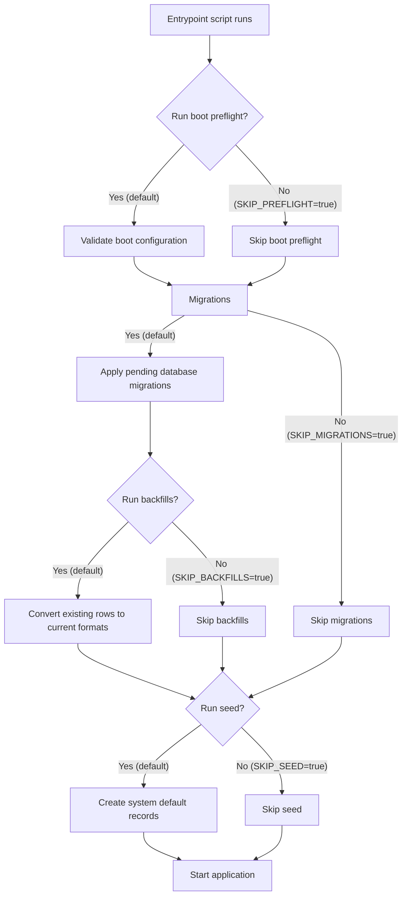

# Startup

Before the Reference Implementation begins accepting requests, its database schema must be up to date, and a set of default records must exist for the system to function, such as data models, default service instances, and render templates.

Rather than requiring operators to run these steps manually, the Docker container's [entrypoint script](https://github.com/uncefact/tests-untp/blob/main/packages/reference-implementation/docker-entrypoint.sh) handles them automatically. The entrypoint script validates the configuration, applies database migrations, converts existing rows to the formats the current version writes, and seeds default records before starting the application. A database that is already up to date needs no migrations applied and no rows converted, but the conversion step still scans the credential and render template tables on every start, so the time that takes grows with both tables.

How this is triggered depends on how you run the Reference Implementation:

- **Docker** — The container's entrypoint script runs the boot preflight, migrations, data backfills, and seeding automatically before starting the application. This applies whether you are using the Docker Compose configuration from the [repository](https://github.com/uncefact/tests-untp) or the standalone [Docker image](https://github.com/orgs/uncefact/packages/container/package/tests-untp%2Freference-implementation).
- **Local development** does not go through the entrypoint, so none of these steps happen on their own. See the [repository README](https://github.com/uncefact/tests-untp) for setup instructions. Where an existing database still needs the digest conversion, run it by hand with the command in the [digest multibase backfill reference](./backfills/digest-multibase).

This page walks through what happens during startup, what gets created, and how to control the process.

## What Happens on Startup

The entrypoint script runs four steps in order before the application begins accepting requests:

The migration, backfill and seed steps are **idempotent** — they can run repeatedly without duplicating data or causing errors. Migrations that have already been applied are skipped. Backfills leave rows they have already converted alone. Seed records that already exist are updated if the environment variables have changed (upsert), so you can modify configuration values and restart the container to apply them.

Note the path the diagram takes when migrations are skipped. `SKIP_MIGRATIONS=true` skips the backfills as well, because they sit inside the same `SKIP_MIGRATIONS` guard as `migrate deploy`.

## Step 0: Boot Preflight

Before it constructs `RI_DATABASE_URL` or runs migrations, the entrypoint validates the configuration that does not require database tables. It uses the same validators as the application boot hook, so a rejected setting stops the container before migrations, backfills or seed writes, exits non-zero, and leaves the database untouched.
For the web role, it validates `RI_APP_URL`, `RI_HTTP_USER_AGENT`, `CACHE_MAX_ENTRIES`, `BUNDLED_ARTEFACTS_FALLBACK`, `IDEMPOTENCY_STALE_CLAIM_MINUTES`, `MAX_REQUEST_BODY_BYTES`, `FETCH_ALLOW_PRIVATE_URLS`, `VERIFY_ALLOW_PRIVATE_URLS`, `FETCH_MAX_RESPONSE_SIZE`, `VERIFY_MAX_CREDENTIAL_SIZE`, `FETCH_TIMEOUT_MS`, `VERIFY_FETCH_TIMEOUT_MS`, `CVC_REFRESH_INTERVAL_HOURS`, and `WORKER_JOB_TIMEOUT_SECONDS`.
For the worker role, it validates `RI_HTTP_USER_AGENT`, `CACHE_MAX_ENTRIES`, `BUNDLED_ARTEFACTS_FALLBACK`, `WORKER_JOB_TIMEOUT_SECONDS`, `LIBRARY_RECONCILE_PENDING_RUNS_CRON`, `LIBRARY_RECONCILE_PENDING_RUNS_BATCH_SIZE`, and the required `DATA_ENCRYPTION_KEY`; it skips the web-only settings.
Both roles validate `DATA_ENCRYPTION_KEY` and `SERVICE_ENCRYPTION_KEY` naming and consistency, the encryption key format and placeholder policy using `DEPLOYMENT_ENVIRONMENT`, the OTLP gRPC exporter settings (`OTEL_EXPORTER_OTLP_ENDPOINT`, `OTEL_EXPORTER_OTLP_HEADERS` and `OTEL_EXPORTER_OTLP_TRACES_HEADERS` when set), and `LOG_REDACT_PATHS` while the preflight logger is constructed.
The entrypoint derives the role from its first argument marker, uses the web role when the marker is absent, and refuses any other marker value.
Recognised maintenance commands do not run this preflight; their own configuration checks apply, while `SKIP_MIGRATIONS=true` and `SKIP_SEED=true` still skip migrations and the seed.
A successful check prints `Preflight passed`. A rejected setting prints one stderr line beginning `Preflight failed:` in the web role or `Worker boot failed:` in the worker role, followed by the message and stable code where one exists, and the container exits 1.

| Variable         | Description                                               | Default |
| ---------------- | --------------------------------------------------------- | ------- |
| `SKIP_PREFLIGHT` | Set to exactly `true` to bypass boot configuration checks | `false` |

`SKIP_PREFLIGHT=true` is the only value that bypasses this step. The entrypoint warns that it skipped the boot preflight and that a configuration the application would refuse may reach database migrations. The application still performs its server-side checks when the web process starts, and the worker still performs its existing database-backed key check. A well-formed key that does not decrypt existing data remains checked after migrations because that check needs database tables.

## Step 1: Database Migrations

Each version of the Reference Implementation may include changes to the database schema — new tables, new columns, or modified constraints. Migrations apply these changes so that the database matches the version of the application being started.

If the database is already up to date, this step completes immediately.

| Variable          | Description                                | Default |
| ----------------- | ------------------------------------------ | ------- |
| `SKIP_MIGRATIONS` | Set to `true` to skip automatic migrations | `false` |

Set `SKIP_MIGRATIONS=true` if your deployment process applies migrations separately, for example in a CI/CD pipeline. This also skips the backfills in step 2, so a deployment that applies migrations out of band runs the backfills out of band too. The [digest multibase backfill reference](./backfills/digest-multibase) gives the command for the one that runs there today.

## Step 2: Data Backfills

A migration changes the shape of the tables. It does not always bring the rows that already exist into line with what the new version writes. Backfills do that second part, so an upgraded database matches the current version's expectations rather than only its schema.

They run immediately after `migrate deploy`, under the same `SKIP_MIGRATIONS` guard, so the columns they write have already been renamed or added by the time they execute. One backfill is wired up. It converts credential and render template digests from the legacy hexadecimal form to the multibase encoding the application now writes, and is documented in full under [Backfills](./backfills/digest-multibase). A value it does not recognise is left alone and warned about, and a value it has already converted is skipped, so repeated container starts converge rather than rewriting.

| Variable         | Description                               | Default |
| ---------------- | ----------------------------------------- | ------- |
| `SKIP_BACKFILLS` | Set to `true` to skip automatic backfills | `false` |

Skipping them leaves the old values in place. The application still starts, and rows that were never converted keep whatever format they held.

A backfill that fails is a different matter. The entrypoint stops at the first failing step, so the seed does not run and the application does not start, while any rows converted before the failure stay converted. A restart scans again from the beginning and skips the rows already converted.

Conversions that cannot be undone are deliberately kept out of this step and ship as [commands an operator runs](./backfills) when they choose, which is why encrypting existing credential decryption keys is not something a container start does.

## Step 3: Database Seed

After migrations and backfills, the entrypoint script runs the [seed script](https://github.com/uncefact/tests-untp/blob/main/packages/reference-implementation/prisma/seed-cli.ts) to create a set of system default records that the Reference Implementation needs to function. These are the baseline records that every instance requires — the data that makes the system usable out of the box.

| Variable             | Description                                                                                                                             | Default |
| -------------------- | --------------------------------------------------------------------------------------------------------------------------------------- | ------- |
| `SKIP_SEED`          | Set to `true` to skip automatic seeding                                                                                                 | `false` |
| `SEED_ALLOW_PARTIAL` | Set to `true` to seed whichever categories below are configured and skip the rest with a warning, instead of failing (see next section) | `false` |

### What gets seeded

The seed creates the defaults listed below. Some categories need their own environment variables (service instances, the default DID, render templates). The system tenant and data models need none and always seed.

Registrars and identifier schemes are different. They are not part of the core seed at all. They come from a seed manifest mounted at `/app/seed/custom`, which the [custom seed](./custom-seed) applies. A deployment that mounts nothing there, which is every deployment that does not supply its own manifest, gets no registrars and no identifier schemes, and cannot create an identifier until it supplies some. The entries in the table below name what a manifest of this kind provides, not what ships by default.

**By default, a category whose required environment variables are missing fails the whole seed before it writes anything**, and the container does not start. This surfaces a misconfigured deployment at deploy time, naming every missing variable in one boot cycle, rather than as a downstream failure once someone tries to issue or resolve a credential. Set `SEED_ALLOW_PARTIAL=true` to restore the previous behaviour instead: eligible categories seed, and categories with missing variables are skipped with a warning while the rest still proceed. This suits a deployment that is intentionally brought up with only some services configured, with the rest added later through the application.

| What               | Description                                                                                                                                                                                                                                                                            | Additional Environment Variables Required                        |
| ------------------ | -------------------------------------------------------------------------------------------------------------------------------------------------------------------------------------------------------------------------------------------------------------------------------------- | ---------------------------------------------------------------- |
| System tenant      | An internal tenant that owns all system default records                                                                                                                                                                                                                                | None                                                             |
| Registrars         | Identifier registrars, for example GS1. From the mounted seed manifest, not the core seed                                                                                                                                                                                              | A manifest mounted at `/app/seed/custom`                         |
| Identifier schemes | Identifier types, for example GTIN, with validation patterns and qualifiers. From the mounted seed manifest, not the core seed                                                                                                                                                         | A manifest mounted at `/app/seed/custom`                         |
| Data models        | UNTP credential types (DPP, DCC, DFR, DIA, DTE) for each supported spec version, with their schema and context URLs                                                                                                                                                                    | None                                                             |
| Service instances  | Default [verifiable credential](../services/verifiable-credential-service), [storage](../services/storage-service), and [identity resolver](../services/identity-resolver-service) service instances — see each service's page for the required environment variables and what they do | `DATA_ENCRYPTION_KEY` and each service's `SYSTEM_*` variables    |
| Default DID        | A system Decentralised Identifier (DID) created via the verifiable credential service                                                                                                                                                                                                  | `SYSTEM_DID` and `SYSTEM_VC_*` variables                         |
| Render templates   | Default HTML render templates for each data model, uploaded to the storage service                                                                                                                                                                                                     | `SYSTEM_STORAGE_*` variables (storage service must be reachable) |

For example, with `SEED_ALLOW_PARTIAL=true` and `DATA_ENCRYPTION_KEY` not set, the service instances, default DID, and render templates are all skipped — but the system tenant and data models are still created (registrars and identifier schemes are not a category this setting governs; they come from the mounted seed manifest). The skipped items must be configured before the system can issue, store, or resolve credentials.

Every seed run, whichever mode it ran in, ends with one structured summary naming the categories seeded, the categories skipped, and the variables responsible, so confirming a healthy deployment and diagnosing a misconfigured one both read the same record.

**Migrating from the previous default:** deployments that relied on the old skip-and-continue behaviour across restarts (for example, a deployment intentionally running with only some services configured) will fail to start after upgrading until `SEED_ALLOW_PARTIAL=true` is set. The documented startup paths — copying `.env.example` before starting Compose, and the E2E Compose stack — populate every variable and are unaffected.

When `DATA_ENCRYPTION_KEY` is set, the seed validates it against any existing encrypted data before it writes any service instance configuration (the system tenant and other non-encrypted records may already exist by that point): see [Encryption Key Validation](#encryption-key-validation) below for what this checks and how it fails.

### Customising seed data

The seed script is located at `packages/reference-implementation/prisma/seed-cli.ts` (which runs the logic in `prisma/seed.ts`) in the [repository](https://github.com/uncefact/tests-untp). Organisations that need additional seed data — custom registrars, identifier schemes, data models, render templates, or conformity schemes — supply it via a Docker volume mount, without modifying the source. See [Custom Seed](./custom-seed.md).

Render templates are loaded from `packages/reference-implementation/src/templates/` and uploaded to the storage service during seeding. To customise the default templates, replace the `.hbs` files in this directory before building the Docker image, or supply additional templates through the custom seed.

## Step 4: Application Start

Once migrations, backfills, and seeding are complete, the application starts and begins accepting requests on port 3003. A refused server start exits 1. The web preflight reports `Preflight failed: <message>`, and a worker refusal reports `Worker boot failed: <message> [<code>]` when a stable code is present, so a refused process is not left serving 500 responses.

### Base URL Validation

Before the application accepts its first request, it validates `RI_APP_URL` (the deployment's public base URL, which backs the OIDC post-logout redirect and the [default human verification link](../api/credentials#stage-8-idr-publishing-optional) on published credentials). Startup fails with a message naming the variable when it is unset, is not a valid `http(s)` URL, or carries a username or password. See [Identity provider requirements](../authentication/idp-requirements) for how the value is used.

### Encryption Key Validation

Before the application accepts its first request, it validates the active `DATA_ENCRYPTION_KEY` by decrypting one existing encrypted value, a service instance configuration, or (when no service instance has a usable one, whether because none exists yet or because every existing configuration is corrupted) a protected credential decryption key, or (when no credential has one either) the protected key of a credential registered from a third party. Stored response bodies for idempotent retries are never sampled: one may predate a key rotation, so it proves nothing. This runs once per process start, using the same check the [seed](#step-3-database-seed) already runs before it writes.

| Situation                                                                             | Result                                                                                                                                                                  |
| ------------------------------------------------------------------------------------- | ----------------------------------------------------------------------------------------------------------------------------------------------------------------------- |
| The key decrypts the sample value                                                     | Startup proceeds normally                                                                                                                                               |
| Nothing is encrypted yet (fresh deployment, `DATA_ENCRYPTION_KEY` not yet configured) | Startup proceeds normally — there is nothing to validate against                                                                                                        |
| The key cannot decrypt the sample value                                               | Startup fails with a named error identifying the row that failed to decrypt                                                                                             |
| `DATA_ENCRYPTION_KEY` is still the placeholder value from `.env.example`              | Startup fails outside local development (`DEPLOYMENT_ENVIRONMENT` unset or `local` is treated as local development); a warning is logged and startup proceeds within it |
| Only `SERVICE_ENCRYPTION_KEY` is set (the v0.4 name, no longer read)                  | Startup fails with an instruction to rename it to `DATA_ENCRYPTION_KEY`; see the [v0.5 migration guide](../../migration-guides/ri-v0.5)                                 |
| `SERVICE_ENCRYPTION_KEY` and `DATA_ENCRYPTION_KEY` are both set with different values | Startup fails, naming both remediations, because only `DATA_ENCRYPTION_KEY` is a key and the process will not choose between the two values for you                     |

Without this check, a `DATA_ENCRYPTION_KEY` that does not match the key data was encrypted under only surfaces once a real request tries to decrypt something — for example a `ConfigDecryptionError` when a service instance resolves. Validating at startup turns that into an immediate, loud failure instead of an intermittent one discovered by end users.

If startup fails because the key cannot decrypt the sample value, verify `DATA_ENCRYPTION_KEY` matches the key the application was previously running with, and restore the previous key. The two `SERVICE_ENCRYPTION_KEY` rows above have their own remedies, stated in the failure message: rename the variable, or decide which of the two values is the real key and remove the old name; a leftover old value after a completed rotation is not a reason to restore that value. The backup pairing, retention, and recovery contract for this key lives in [Key Management and Recovery](./key-management). Moving data onto a new key is a deliberate offline procedure, never an in-place variable change; see [Encryption Key Rotation](./encryption-key-rotation).

### HTTP User-Agent Override Validation

Every outbound document fetch the application makes (remote JSON-LD `@context` documents and JSON Schemas during credential validation) sends a `User-Agent` header identifying the software. `RI_HTTP_USER_AGENT` overrides the built-in default; it is optional, and unset or blank means the default is used. When it is set, startup validates that the value can actually be sent as an HTTP header: it must be plain Latin-1 text with no control characters (no newlines or tabs, and no characters such as emoji). An invalid value fails startup with a message naming the variable, because it would otherwise break every outbound fetch at request time.

Remote `@context` documents fetched during credential issuance are cached in memory. `CONTEXT_CACHE_TTL_MS` controls how long a fetched context is reused (default one hour; `0` disables caching), matching `SCHEMA_CACHE_TTL_MS` for JSON Schemas. A change to a remote context document is therefore observed at most one TTL after it is published. Both caches also bound how many entries they retain: `CACHE_MAX_ENTRIES` (default 1000, applied to each cache) caps the entry count, evicting expired entries first and then the least recently used. When it is set, startup validates it is a positive integer and fails with a message naming the variable otherwise.

### Bundled Artefact Fallback Validation

The UNTP schemas and contexts for every release from 0.6.0 onwards, and the Verifiable Credentials Data Model v2 context, are bundled with the service and stand in when their publishing host cannot deliver them. `BUNDLED_ARTEFACTS_FALLBACK=false` turns that off; any other value than `true` or `false` fails startup with a message naming the variable. See [Bundled UNTP Artefacts](./bundled-untp-artefacts.md).

### Idempotency Claim Window Validation

`IDEMPOTENCY_STALE_CLAIM_MINUTES` is how long a claimed Idempotency-Key may sit unfinished before another request may take that key (default 10). The value has to outlast the slowest irreversible work this deployment sees. On credential issuance, `POST /api/v1/credentials` accepts an optional `Idempotency-Key` and claims it before the credential is signed, so a retry returns the original rather than issuing a second one. That work is the signing and storage round trip. Set the window too low and a request that is merely slow has its key taken, which is how a duplicate credential gets issued. Set it too high and a key belonging to a crashed request stays unusable for longer, with retries answered `409` until it expires. When it is set, startup validates it is an integer of at least 1 and fails with a message naming the variable otherwise.

### Request Body Size Limit

`MAX_REQUEST_BODY_BYTES` caps how many request-body bytes the process will hold for every request body the API accepts (default 5242880, which is 5 MiB). A declared `Content-Length` over the cap is rejected before any bytes are read. Otherwise the body is read in chunks and rejected as soon as the accumulated length exceeds the cap, so a lying or absent `Content-Length` still cannot make the process hold more than one extra chunk. A body over the cap is answered `413` with code `REQUEST_BODY_TOO_LARGE`, and the message names the limit in bytes. When it is set, startup validates it is an integer of at least 1024 and fails with a message naming the variable otherwise.

### Credential Fetch Settings

The web process validates the shared credential-fetch settings after the request-body limit and before encryption validation or queue startup. They apply to verification, external registration and the supplier-source check used by re-verification. `FETCH_ALLOW_PRIVATE_URLS` also controls the existing stored-address URL checks on registrar, identifier-link, data-model, service and credential publishing routes.

| Situation                                                                          | Result                                                                                                                                                                                                                                                                    |
| ---------------------------------------------------------------------------------- | ------------------------------------------------------------------------------------------------------------------------------------------------------------------------------------------------------------------------------------------------------------------------- |
| Neither name in a pair is set; empty or whitespace-only values count as unset      | That setting uses its existing default. No deprecation warning.                                                                                                                                                                                                           |
| Only the new name is set with a value accepted by its existing parser              | Startup proceeds with that value, or with the existing lenient size fallback. No deprecation warning.                                                                                                                                                                     |
| Only `VERIFY_ALLOW_PRIVATE_URLS` is set                                            | Existing boolean behaviour; one warning naming `FETCH_ALLOW_PRIVATE_URLS`.                                                                                                                                                                                                |
| Only `VERIFY_MAX_CREDENTIAL_SIZE` is set                                           | Existing size parsing and fallback; one warning naming `FETCH_MAX_RESPONSE_SIZE`.                                                                                                                                                                                         |
| Only valid `VERIFY_FETCH_TIMEOUT_MS` is set                                        | Existing timeout budget; one warning naming `FETCH_TIMEOUT_MS`.                                                                                                                                                                                                           |
| Both boolean names are set, even equally                                           | Startup fails with `VERIFY_ALLOW_PRIVATE_URLS and FETCH_ALLOW_PRIVATE_URLS are both set. VERIFY_ALLOW_PRIVATE_URLS was renamed to FETCH_ALLOW_PRIVATE_URLS in v0.5. Set FETCH_ALLOW_PRIVATE_URLS to the value you intend, remove VERIFY_ALLOW_PRIVATE_URLS, and restart.` |
| Both size names are set, even equally                                              | Startup fails with `VERIFY_MAX_CREDENTIAL_SIZE and FETCH_MAX_RESPONSE_SIZE are both set. VERIFY_MAX_CREDENTIAL_SIZE was renamed to FETCH_MAX_RESPONSE_SIZE in v0.5. Set FETCH_MAX_RESPONSE_SIZE to the value you intend, remove VERIFY_MAX_CREDENTIAL_SIZE, and restart.` |
| Both timeout names are set, even equally                                           | Startup fails with `VERIFY_FETCH_TIMEOUT_MS and FETCH_TIMEOUT_MS are both set. VERIFY_FETCH_TIMEOUT_MS was renamed to FETCH_TIMEOUT_MS in v0.5. Set FETCH_TIMEOUT_MS to the value you intend, remove VERIFY_FETCH_TIMEOUT_MS, and restart.`                               |
| Only `FETCH_TIMEOUT_MS` is set but is not an integer in the supported range        | Startup fails naming `FETCH_TIMEOUT_MS`, the ceiling and the default. Fix or unset it.                                                                                                                                                                                    |
| Only `VERIFY_FETCH_TIMEOUT_MS` is set but is not an integer in the supported range | Startup fails naming the old input. Correct the value and rename it, or unset it.                                                                                                                                                                                         |
| Only a size name is set to an unparseable or non-positive value                    | Existing default is retained. Old-only input receives its rename warning after the other fetch settings validate; this rename adds no size-validity warning or failure.                                                                                                   |
| Only a boolean name is set to a nonblank value other than exact lowercase `true`   | Private-address checks remain enabled. Old-only input receives its rename warning after the other fetch settings validate.                                                                                                                                                |

Checks stop at the first error, and warnings are emitted after all fetch settings validate. Warnings follow the normal logging level configuration. See the [v0.5 migration guide](../../migration-guides/ri-v0.5#credential-fetch-settings-have-new-names).

These checks run at startup, but the readers are not cached, so a conflict introduced after startup is caught on the next read rather than at boot. Every route that reads the setting then answers `500`, including the unauthenticated verify route, and the `error` field names the two conflicting variables and no values. A running process cannot be repaired by editing its environment: set the pair to a single name and restart the process, recreating the container where one is in use.

### Redaction Path Validation

The first logger constructed during startup validates any paths supplied via `LOG_REDACT_PATHS`. An invalid path fails startup with a message naming the variable and the configured paths. See [Redaction](./logging#redaction) for the path syntax and what the built-in defaults already cover.

### Seeded Conformity Scheme Refresh Interval

Startup registers an in-process interval that periodically re-fetches seeded (`SYSTEM_SEED`) conformity schemes from their source URLs, so a seed-only deployment picks up publisher updates without a reboot. `CVC_REFRESH_INTERVAL_HOURS` sets the cadence in hours (default 24). When it is set, startup validates it is a positive number no greater than 500 and fails with a message naming the variable otherwise. See [Custom Seed: Periodic Refresh](./custom-seed#periodic-refresh) for what the interval does and how it interacts with the boot-time seed.

### Job Queue Start

Startup connects the job queue (a set of tables in the application database, managed by pg-boss) and creates the queue that credential registration sends its verification job to. Creating it here rather than on the first registration keeps that registration's job insert to a single row written in the same database transaction as the credential record, so a record is never acknowledged without the job that will settle it, and a job never runs for a record that rolled back. The web process only sends; the worker process runs the handlers. Startup fails if the database the queue needs cannot be reached.

### Pending Verification Reconciliation

The worker registers `library.reconcile-pending-runs` before it starts the queue, then schedules it after `queue.start()` on the cadence in `LIBRARY_RECONCILE_PENDING_RUNS_CRON`, a cron expression that defaults to every ten minutes (`*/10 * * * *`). The worker parses that variable before it builds the queue, with the same parser the queue uses to record a schedule, and fails its boot with `worker.configuration-invalid`, naming the variable and the parser's reason, when the value is not a schedule the queue can record. The cadence only bounds how long a lost generation waits once it is eligible; the cutoff that decides eligibility comes from the verify job's retry ladder, described below, and is not affected by it. Scheduling comes after the start because pg-boss records a cron row against a live queue. A schedule that cannot be recorded fails the boot with `worker.reconciliation-schedule-failed`, because a worker that ran without it would leave lost generations pending for ever.

The job finds `PENDING` verification generations whose `lastEnqueuedAt` is older than the complete verification retry ladder, and generations with no `lastEnqueuedAt` at all whose own `requestedAt` is older than that same cutoff. With the default `WORKER_JOB_TIMEOUT_SECONDS` of 300, the cutoff is rounded up to 60 minutes. Changing the setting changes this cutoff too, so lower it only when no verification is in flight or accept that those generations may settle as `VERIFICATION_UNAVAILABLE` and be re-verified. It settles each matching generation as `FAILED` with `VERIFICATION_UNAVAILABLE` and `retryable: true`, with a message telling the caller to re-verify. It does not re-enqueue the original job. One tick takes at most `LIBRARY_RECONCILE_PENDING_RUNS_BATCH_SIZE` generations (default 500, maximum 10000), oldest first, so a large backlog is worked down over successive ticks rather than inside one job attempt. If a large batch cannot finish inside the job budget, raise `WORKER_JOB_TIMEOUT_SECONDS` or lower the batch size; the next tick resumes the backlog. The worker validates `LIBRARY_RECONCILE_PENDING_RUNS_BATCH_SIZE` at boot the same way as the cadence.

The settlement is state-guarded in both directions. A job that finishes after the sweep cannot overwrite the failure, and a later bodyless re-verification creates the next generation. The sweep's own settling write also re-tests the abandonment condition it selected on, so a generation that settled, or was freshly enqueued, between selection and that write is left alone and counted as unchanged for the tick. The web process never schedules or consumes this queue. Each cron tick becomes one job that one worker fetches, so replicas do not each run the same reconciliation tick.

### Worker Boot

The worker is a second container from the same image (`ri-worker` in Docker Compose; `pnpm start:worker` in a checkout) with its own entrypoint and no port.

The shared entrypoint derives the role from its first argument: `--process-role=worker` is the worker role, no marker is the web role, and any other marker is refused. The worker preflight does not require `RI_APP_URL`, `MAX_REQUEST_BODY_BYTES`, `IDEMPOTENCY_STALE_CLAIM_MINUTES` or the caller-supplied fetch settings, but it does require `DATA_ENCRYPTION_KEY` and checks the worker timeout and reconciliation settings. An invalid `RI_HTTP_USER_AGENT`, `CACHE_MAX_ENTRIES` or `BUNDLED_ARTEFACTS_FALLBACK` refuses worker boot, because all three govern work the worker itself does. The worker also applies the environment-only encryption format and placeholder checks and validates the OTLP gRPC exporter settings when set. The database-backed key check remains in step 4 below.

After the worker process starts OpenTelemetry under its own service name (`OTEL_SERVICE_NAME`, default `reference-implementation-worker`), its boot checks run in this order, and each step fails the boot with a message naming what is wrong:

1. The shared boot preflight runs first in the container entrypoint, in its worker role, and the worker bootstrap repeats it before the image and database checks. It requires `DATA_ENCRYPTION_KEY` and checks the worker timeout and reconciliation cadence and batch-size settings before those checks.
2. The migrations this build ships are listed from the image (a build with none, or an unreadable directory, fails here, before any network), then the database target is resolved the same way the web process resolves it (`RI_DATABASE_URL`, or the `RI_POSTGRES_*` parts).
3. Every migration this build ships must already be applied. The worker never runs migrations, backfills or the seed; the web container owns them. A database that is ahead of the worker's build passes, so an older worker beside a newer web process during a rolling deploy starts normally. A database missing one of the build's migrations does not, and the message names the migration: start the web container first.
4. `DATA_ENCRYPTION_KEY` is checked against existing data the same way the web process checks it. The web process may run without a key when nothing is encrypted yet; the worker may not, because every job it runs needs the key, and a worker without one would record real work as failed.
5. The settings returned by the preflight are used for the reconciliation cadence (`LIBRARY_RECONCILE_PENDING_RUNS_CRON`), the per-tick cap (`LIBRARY_RECONCILE_PENDING_RUNS_BATCH_SIZE`) and `WORKER_JOB_TIMEOUT_SECONDS` (default 300 seconds, range 30 seconds to 24 hours). The last setting is the expiry and working budget for every job the queue sends or schedules. The web process reads the same setting twice: when it constructs its queue, and inside the key-bearing recovery on `POST /api/v1/library/{id}/verify`, which bounds its read of the record's own durable copy by the same number of seconds. Both services must therefore carry the same value, and raising it for a slow worker also raises what a caller can wait on that route.
6. The job handlers are registered, the shutdown handlers are installed, the queue is started, the reconciliation sweep above is scheduled, and the heartbeat below begins.

The worker does not require the settings only the web process reads (`RI_APP_URL` among them); an environment that omits them still starts a worker. A refused worker preflight is one line on stderr beginning `Worker boot failed:`, with the stable code in brackets when one exists, and exit code 1. Later worker boot failures use the same framing. An invalid `LOG_REDACT_PATHS` fails the same way with the logger's own message naming the path.

**Stopping.** Three numbers govern a stop, each with its own job. On `SIGTERM` or `SIGINT` the worker stops taking jobs and gives a running one **30 seconds** to finish (the drain); a job still running then is failed by the queue and retried later. The whole shutdown (drain, queue release, database disconnect, telemetry flush with 5 seconds to reach the collector) must finish inside a **45-second** process deadline, after which the worker exits non-zero. The container's grace period, **60 seconds**, sits above that deadline so the runtime never kills the process before it has exited on its own terms: `stop_grace_period: 60s` in Compose (already set on `ri-worker`), `terminationGracePeriodSeconds: 60` in Kubernetes, `docker stop -t 60` by hand. So a job that needs 40 seconds is interrupted by the drain even though it fits the container's grace period. The worker exits non-zero if the queue release or the database disconnect fails or the deadline passes; a second signal exits at once; a telemetry flush that fails, which is the normal case when no collector is running, is logged and does not change the exit code. After an abrupt kill the interrupted job is not handed over at once: it stays claimed until its `WORKER_JOB_TIMEOUT_SECONDS` attempt expiry, five minutes by default, and the queue's maintenance sweep notices, then waits out the retry backoff (30 seconds as the base, growing and randomised on later attempts), so the next attempt comes minutes later on the same job id, provided the job has attempts left (four retries). A job that exhausts them settles its generation as a retryable failure on that final attempt, and a job that never reports at all is settled by the reconciliation sweep above. Either way the caller re-verifies the record to run the check again.

**Health.** The worker serves no HTTP, so it proves itself instead. Every 10 seconds it runs a probe through the job queue's own connection pool and checks that a consumer has fetched within the last 30 seconds or is inside a job it started within `WORKER_JOB_TIMEOUT_SECONDS + 60 seconds` (360 seconds by default; the queue keeps a consumer's job count after a settlement that threw, so an older count is not work); when that holds it publishes `/tmp/worker-heartbeat` (atomically, so a failed write never leaves an empty but fresh file). The container health check (`docker-worker-healthcheck.sh`, wired in the compose files) reads that file's age and reports unhealthy when it is missing, older than 30 seconds, or stamped in the future. That catches a wedged event loop, a queue pool that is down or exhausted, and a consumer that has stopped fetching, while an idle worker stays healthy. The worker does not exit on a failed probe: both of its database pools recover a lost connection on their own, and exiting would restart every worker on a shared outage without repairing it. Unhealthy is the signal. An orchestrator's liveness probe restarts on it; under Compose it is what `docker compose ps` shows, and `restart: always` still replaces a worker that exits. From the last successful beat, Compose reports unhealthy after roughly 50 to 60 seconds (the age limit plus three failed checks); count that, plus the 45-second shutdown deadline, into any orchestrator's timings. During a stop the last proof stays in place rather than being removed, so the health check keeps passing for as long as that proof is inside its age limit and then needs three consecutive failures before the container is unhealthy. With the numbers above that is usually enough to cover the 30-second drain, though not by a wide margin, and it depends on how old the proof was when the signal arrived and where the check's schedule falls; an orchestrator that restarts on liveness should carry the 60-second termination grace so a drain in progress is left to finish. Nothing yet raises an alert on a growing backlog; the queue tables hold that and the health check does not read them.

**Running it elsewhere.** The container must replace the image's entrypoint with `/app/docker-worker-entrypoint.sh` (it sets the flags that skip schema convergence before the shared entrypoint reads them), replace the image's HTTP health check with `/app/docker-worker-healthcheck.sh`, and carry a restart policy. Bare Docker: `docker run --entrypoint /app/docker-worker-entrypoint.sh --health-cmd /app/docker-worker-healthcheck.sh --health-interval 10s --health-timeout 5s --health-retries 3 --health-start-period 40s --restart always --stop-timeout 60 <image>`. Kubernetes: `command: ["/app/docker-worker-entrypoint.sh"]`, a `livenessProbe` that `exec`s `/app/docker-worker-healthcheck.sh` (period 10 s, failure threshold 3, initial delay 40 s), `terminationGracePeriodSeconds: 60`, no Service. The heartbeat file lives under `/tmp`, which the image's `nextjs` user can write; a read-only root filesystem needs a writable mount there, and `WORKER_HEARTBEAT_PATH` moves the file for both the worker and the check. `WORKER_HEARTBEAT_MAX_AGE_SECONDS` raises the check's 30-second age limit for a deployment whose probe schedule needs more room. The worker's own 10-second beat is not configurable, so a limit set below three beats will report a healthy worker unhealthy.
