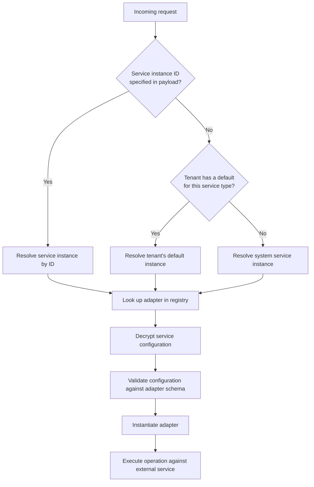

# Service Architecture

The Reference Implementation relies on three external services — a verifiable credential service, a storage service, and an identity resolver service. Rather than being tightly coupled to specific implementations, it uses an [adapter pattern](https://en.wikipedia.org/wiki/Adapter_pattern) that allows each service to be swapped independently. This page explains how that works, how service instances are resolved, and how new adapters can be contributed.

## Design Philosophy

The [Overview](../overview) describes how the Reference Implementation enables incremental adoption — each service can be independently progressed from the bundled default, to a self-provisioned instance, to a completely different implementation. The service architecture is the mechanism that makes this possible.

The Reference Implementation never communicates with external services directly. Instead, it goes through an **adapter** — a layer that knows how to talk to a specific external service. The adapter translates the Reference Implementation's operations into the API calls that the particular service understands. Different services have different APIs, so each needs its own adapter.

The collection of available adapters is maintained in a **registry** — a catalogue that the Reference Implementation consults to find the right adapter for a given service. This is implemented in the [services package](https://github.com/uncefact/tests-untp/tree/main/packages/services) (`@uncefact/untp-ri-services`).

Because the Reference Implementation only ever interacts with adapters — not with services directly — replacing a service is a matter of contributing a new adapter. The Reference Implementation itself does not change.

For example, an organisation might begin by using the bundled VCKit instance for credential signing. As they mature, they deploy their own VCKit instance on their own infrastructure — they register it as a service instance within their tenant, and the Reference Implementation starts using it for all their credential operations. Later, they might replace VCKit entirely with a different verifiable credential service by contributing a new adapter. At each stage, only the service configuration changes — the rest of the system remains the same.

The same extensibility principle applies to [data model bridges](../data-models/bridge-architecture) — where service adapters abstract external service integrations, data model bridges abstract the mapping between credential structures and internal entity models. Both use a registry pattern for type-safe lookup and support incremental adoption through pluggable implementations.

## System Services vs Tenant Services

Service instances exist at two levels:

**System services** are registered within the [system tenant](../system-architecture#system-tenant) during the [seeding process](../operations/startup#step-3-database-seed). These are the default service instances that every tenant has access to. System services are read-only and available to all tenants — a tenant can continue using the system defaults or optionally register their own. See the individual service pages ([Verifiable Credential](./verifiable-credential-service), [Storage](./storage-service), [Identity Resolver](./identity-resolver-service)) for the environment variables that configure each system service.

**Tenant services** are registered by a tenant through the API and are scoped exclusively to that tenant. No other tenant can see or use them. A tenant can register multiple service instances for a given service type and designate one as the default for that type.

When processing a request, the Reference Implementation resolves which service instance to use in the following order:

1. A specific service instance identified in the request payload
2. The tenant's default service instance for that service type (if one is set)
3. The system service instance

Once resolved, the Reference Implementation looks up the appropriate adapter in the registry, decrypts and validates the configuration against the adapter's schema, and instantiates the service adapter.

## Encryption at rest

When a tenant registers a service instance, the Reference Implementation encrypts the configuration and stores it in the database. Service configurations contain sensitive information such as API keys and authentication tokens; these are encrypted at rest using the `DATA_ENCRYPTION_KEY` (formerly `SERVICE_ENCRYPTION_KEY`, which is still read as a deprecated fallback) and only decrypted at runtime when the service adapter is instantiated. The same key also encrypts the decryption keys of encrypted credentials before they are persisted on the credential record. The key's operational contract (generation, backup pairing, retention, recovery) is documented in [Key Management and Recovery](../operations/key-management).

## Service Types

There are three service types, each with one default adapter:

| Service Type | Description | Default Adapter |
|-------------|-------------|----------------|
| Verifiable Credential | Credential operations (sign, verify) and Decentralised Identifier (DID) management | [`VCKIT`](./verifiable-credential-service/vckit-adapter) — VCKit |
| Storage | Credential storage (public and private) | [`UNCEFACT_STORAGE`](./storage-service/uncefact-storage-adapter) — UNCEFACT Storage Service |
| Identity Resolver | Registers links for identifier discovery | [`PYX_IDR`](./identity-resolver-service/pyx-idr-adapter) — Pyx Identity Resolver |

See the individual service pages for what each service does, supported adapters, and adoption paths:
- [Verifiable Credential Service](./verifiable-credential-service)
- [Storage Service](./storage-service)
- [Identity Resolver Service](./identity-resolver-service)

## How the Registry Works

When a service instance is registered (either during seeding or by a tenant through the API), the Reference Implementation:

1. Checks that the service type and adapter type combination exists in the registry
2. Validates the configuration against the adapter's expected format
3. Encrypts and stores the configuration in the database

When a request comes in and a service adapter needs to be instantiated:

1. The resolved service instance's configuration is decrypted
2. The registry entry for that adapter is looked up
3. The adapter is instantiated with the validated configuration

This means every adapter — whether it is the bundled default or a custom contribution — goes through the same validation and instantiation process. The Reference Implementation treats all adapters identically; the only difference is the configuration.

## Sensitive Field Handling

Service configurations often contain sensitive information such as API keys. When a service instance is returned through the API, sensitive fields are automatically masked (replaced with `***`) before the response is sent. This ensures credentials are never exposed through the API.

## Encryption adapter

The Reference Implementation also uses the adapter pattern for encrypting and decrypting credentials. The current implementation uses AES-256-GCM, but the adapter interface is designed so that alternative implementations — such as AWS KMS, Azure Key Vault, or other key management services — can be introduced without changing the rest of the application.

Unlike the three external service types above, encryption is not yet exposed as a configurable service type. It is managed internally at the system level. Allowing operators to select an alternative encryption adapter (such as AWS KMS or Azure Key Vault) is planned but not yet implemented.

## Contributing a New Adapter

To integrate a different external service — enabling organisations to use their own service at stage 3 of the [adoption ramp](../overview#incremental-adoption) — a new adapter must be contributed to the [services package](https://github.com/uncefact/tests-untp/tree/main/packages/services). The adapter must implement the relevant service interface and be registered in the adapter registry. Once registered, tenants can select the new adapter type when registering service instances through the API. See [Adding an Adapter](./adding-an-adapter) for a step-by-step guide.

See the [services package](https://github.com/uncefact/tests-untp/tree/main/packages/services) for implementation details and existing adapters as reference.
