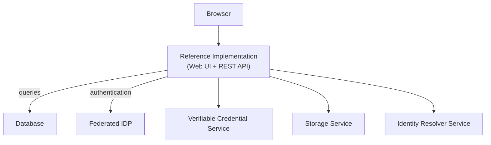

# System Architecture

The Reference Implementation is a single application — a set of REST APIs and a web UI (currently under active development). It requires a PostgreSQL database for persistent storage and a federated identity provider (IDP) for authentication. On its own, it does not sign credentials, store files, or resolve identifiers. These capabilities are provided by independent external services — a verifiable credential service, a storage service, and an identity resolver service — each running and provisioned separately.

Every component in this architecture runs independently and manages its own data. No component stores another component's data.

## Components

The diagram below shows all of the components and their relationships. See [Quick Start](./quick-start) for how to get these running.

### Database

The Reference Implementation uses a PostgreSQL database to store the information it needs to function — tenants, users, service registrations, identifier schemes, data models, render templates, and configuration. The database does not contain the data owned by external services (such as key material or credential content — those live within each service's own storage). Instead, it stores references and metadata returned from external services so that subsequent operations can find and act on them. For example, when a DID is created via the verifiable credential service, the Reference Implementation records that the DID exists, which service it was created through, and which tenant it belongs to — but the key material itself remains in the verifiable credential service.

All data in the database is scoped to a tenant; see [Multi-Tenancy](#multi-tenancy) for how isolation is enforced. See [Database](./operations/database) for provisioning and configuration.

On startup, the Reference Implementation automatically applies database migrations, converts existing rows to the formats the current version writes, and seeds system default records (tenants, service instances, data models, render templates, and more). All three steps are idempotent and can be disabled. The seed also applies any manifest mounted at `/app/seed/custom`, which is where registrars and identifier schemes come from. See [Startup](./operations/startup) for the full sequence and what gets seeded.

### Federated IDP (Identity Provider)

The Reference Implementation delegates authentication to a federated identity provider rather than managing credentials directly. The IDP handles user sign-in and issues tokens that the Reference Implementation validates on each request. See [Authentication](./authentication) for how authentication works, and [IDP Requirements](./authentication/idp-requirements) for supported providers and their configuration.

### External Services

The Reference Implementation requires three external services to operate. Each must be available for the system to issue, store, and resolve credentials:

| Service | What It Does |
|---------|-------------|
| [Verifiable Credential Service](./services/verifiable-credential-service) | Signs and verifies W3C Verifiable Credentials; manages DIDs and cryptographic key material |
| [Storage Service](./services/storage-service) | Stores credentials, render templates, and other binary data |
| [Identity Resolver Service](./services/identity-resolver-service) | Registers links for a given identifier so that related information, such as credentials, can be discovered |

Organisations can replace any service independently as they progress along the [adoption ramp](./overview#incremental-adoption). See [Service Architecture](./services/service-architecture) for how the service registry and adapter pattern enable this.

## Multi-Tenancy

The Reference Implementation is a multi-tenant system. Each organisation that operates within an instance of the Reference Implementation is represented as a tenant. A tenant is the isolation boundary. Everything a tenant creates or configures — credentials, DIDs, service registrations, render templates — is private to that tenant and invisible to all others.

Tenant isolation is enforced automatically — the authenticated user's identity is resolved from the IDP and mapped to a tenant, and every request is scoped to that tenant. Tenants cannot access each other's data. If a tenant does not yet exist for the authenticated user, it is created automatically. How this works depends on the tenant mode (open or closed) — see [Tenant Modes](./authentication/tenant-modes) for details.

In addition to tenant-specific data, every instance of the Reference Implementation has a [system tenant](#system-tenant) that provides a shared, read-only baseline of configuration — things like core UNTP data models and default service instances, plus the registrars and identifier schemes from a mounted seed manifest. All tenants can access these system defaults, but cannot modify them. This means a new tenant is productive immediately against whatever the instance was provisioned with, without configuring anything of its own.

### System Tenant

The system tenant is a special internal tenant that owns all system default records. It is created automatically during [startup](./operations/startup) via the [seeding process](./operations/startup#step-3-database-seed) and serves as the mechanism through which system-wide configuration propagates to all tenants.

Records owned by the system tenant — core UNTP data models, default service instances, and whichever registrars and identifier schemes the instance was provisioned with — are read-only and accessible to every tenant in the instance. So a tenant can issue credentials against the core UNTP data models (DPP, DCC, DFR, DIA, DTE) and use the default verifiable credential, storage, and identity resolver service instances without configuring anything of its own.

Registrars and identifier schemes are provisioned per instance rather than built in. They come from a seed manifest mounted at `/app/seed/custom`. An instance deployed without one has none, and cannot create an identifier until it supplies some. See [Custom Seed](./operations/custom-seed).

The system tenant cannot be modified by regular tenants. It exists purely to provide a shared baseline so that the system is usable out of the box. Tenants that need to customise their setup — for example, by registering their own service instances or creating their own DIDs — do so within their own tenant boundary. Tenant-level configuration — such as service instances, DIDs, and other resources — takes precedence over the system defaults when set as the active default for that tenant.

## Authentication

The Reference Implementation supports two authentication methods, both backed by the federated IDP: browser sessions (via OAuth2/OIDC redirect flow) and service account access (via Bearer tokens). Most routes require authentication, though some — such as credential verification — are publicly accessible. See [Authentication](./authentication) for full details.
