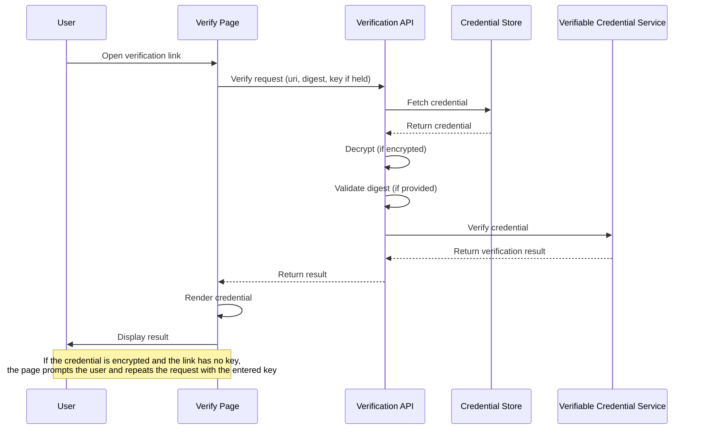

# Verify Page

The verify page (`/verify`) is a publicly accessible web page for verifying UNTP credentials. It does not require authentication — anyone with a [verification link](#verify-link) can use it. This is the primary entry point for credential recipients, specification readers following links to example credentials, and supply chain partners verifying credentials they have received.

## How It Works

When a user navigates to the verify page via a [verification link](#verify-link), the page sends the link's parameters to the reference implementation's verification API, which:

1. Fetches the credential from the URL provided in the verification link
2. Decrypts the credential, if it is encrypted, using the decryption key from the link or, for a keyless link, the key the user enters at the [prompt](#decryption)
3. Validates the credential's integrity against the digest, if one is included in the URL
4. Sends the credential to the verifiable credential service for verification. This checks that the credential was issued by the entity claiming to have issued it, that it has not been tampered with, that it is temporally valid (issued in the past and not expired), and that it has not been revoked
5. Returns the result, which the page renders for the user

Fetching and decryption happen on the server, so an entered decryption key travels to the backend in the request body. Production deployments must serve the reference implementation over HTTPS so the key is protected in transit.



The verified credential is displayed with its type, issuer, and validity start date. The `Valid from` date is rendered as the credential's UTC calendar date in ISO 8601 (`YYYY-MM-DD`); the row is omitted when the credential carries no parseable `validFrom`. The credential itself contains a `renderMethod` property that specifies the template used to render it for human review. Users can switch between the rendered template and the raw JSON data, and download the credential.

## Verification Link Format

The verify page supports two URL formats for passing credential parameters.

### Direct Query Parameters {#verify-link}

The preferred format passes parameters directly as query parameters:

```
/verify?uri=<credential-url>&digestMultibase=<multibase-digest>&decryptionKey=<hex-key>
```

| Parameter | Required | Description |
|-----------|----------|-------------|
| `uri` | Yes | The URL of the stored credential |
| `digestMultibase` | No | A multibase-encoded digest of the credential for integrity validation |
| `hash` | No | A legacy SHA-256 hex hash, accepted for backwards compatibility with links created before [the digest migration](../migration-guides/v0.7.0#dependent-service-updates). Prefer `digestMultibase`. |
| `decryptionKey` | No | The decryption key for encrypted credentials |

**Example:**
```
https://example.com/verify?uri=https://storage.example.com/credentials/dpp-1234.json&digestMultibase=zQmcyxhmhvRbUZHSZyi1EDf6v4ZAVmaT3skUuwisxFRFp9v&decryptionKey=a1b2c3d4e5f6...
```

### Legacy JSON Envelope

:::warning[Deprecated]
This format is supported for backwards compatibility and will be removed in a future release. Use direct query parameters instead.
:::

The legacy format encodes parameters as a JSON object in a single `q` query parameter:

```
/verify?q={"payload":{"uri":"...","digestMultibase":"...","decryptionKey":"..."}}
```

The `payload` object accepts the same integrity fields as the direct parameters, `digestMultibase` and the legacy `hash`. For the decryption key it accepts both `key` and `decryptionKey`; if both are present, `decryptionKey` takes precedence.

If both direct query parameters and a legacy `q` parameter are present, the direct parameters take precedence.

## Integrity Validation

A verification link may include a digest of the credential. When present, the verify page computes the digest of the fetched credential and compares it to the value in the link; if they do not match, the credential is flagged as potentially tampered with. The current format is `digestMultibase` (a multibase-encoded digest); a legacy SHA-256 hex `hash` is still accepted for links created before the digest migration. The check is optional, if neither is included, it is skipped.

## Decryption

If the credential is encrypted and the decryption key is included in the verification link, the verify page uses that key to decrypt the credential before proceeding with verification. This allows a private credential to be shared directly via a single link without requiring the recipient to manage keys separately.

A link published to the Identity Resolver omits the key, which is shared out of band instead (see [IDR publishing](./api/credentials#stage-8-idr-publishing-optional)). When such a keyless link opens an encrypted credential, the verify page prompts for the decryption key. Enter the key received from the issuer and submit; the credential is decrypted and verified as if the key had been in the link. A mistyped key can be corrected and resubmitted.

The entered key is used for the current attempt only and is never persisted: it is not written into the URL, not stored in the browser (no local storage, session storage, or cookies), and not retained or logged by the backend. Refreshing the page discards it.

If decryption fails, the message distinguishes what can be fixed. A key that does not match the credential can be re-entered, although a credential whose stored ciphertext has been tampered with produces the same failure, since AES-GCM cannot tell the two apart. If the stored envelope itself is corrupted, the page says so rather than asking for the key again.

The issuing tenant can retrieve a credential's decryption key from `GET /api/v1/credentials/{id}` (see [Credentials API](./api/credentials)).
