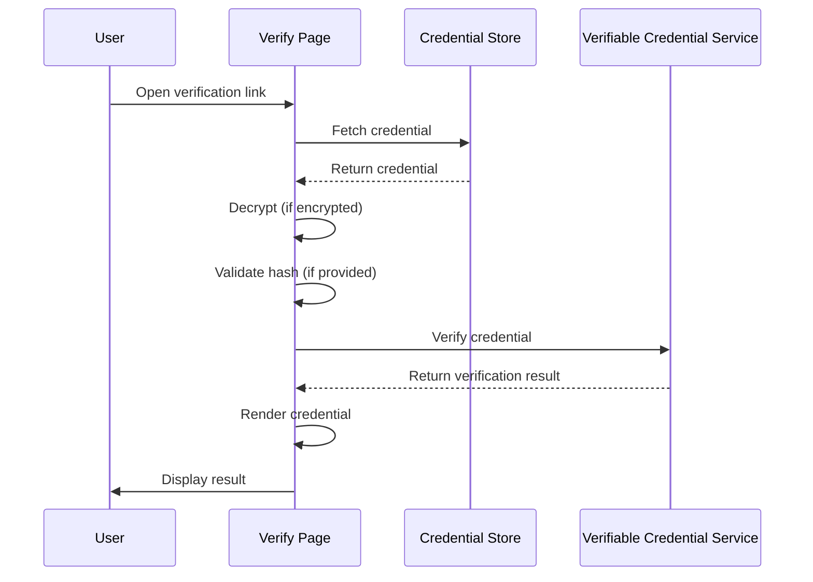

# Verify Page

The verify page (`/verify`) is a publicly accessible web page for verifying UNTP credentials. It does not require authentication — anyone with a [verification link](#verify-link) can use it. This is the primary entry point for credential recipients, specification readers following links to example credentials, and supply chain partners verifying credentials they have received.

## How It Works

When a user navigates to the verify page via a [verification link](#verify-link), the page:

1. Fetches the credential from the URL provided in the verification link
2. Decrypts the credential, if it is encrypted (the decryption key is included in the verification link)
3. Validates the credential's integrity against the hash, if one is included in the URL
4. Sends the credential to the verifiable credential service for verification — this checks that the credential was issued by the entity claiming to have issued it, that it has not been tampered with, that it is temporally valid (issued in the past and not expired), and that it has not been revoked
5. Renders the verified credential for the user



The verified credential is displayed with its type, issuer, and issue date. The credential itself contains a `renderMethod` property that specifies the template used to render it for human review. Users can switch between the rendered template and the raw JSON data, and download the credential.

## Verification Link Format

The verify page supports two URL formats for passing credential parameters.

### Direct Query Parameters {#verify-link}

The preferred format passes parameters directly as query parameters:

```
/verify?uri=<credential-url>&hash=<sha256-hex>&decryptionKey=<hex-key>
```

| Parameter | Required | Description |
|-----------|----------|-------------|
| `uri` | Yes | The URL of the stored credential |
| `hash` | No | A SHA-256 hash of the credential for integrity validation |
| `decryptionKey` | No | The decryption key for encrypted credentials |

**Example:**
```
https://example.com/verify?uri=https://storage.example.com/credentials/dpp-1234.json&hash=595d8d20c586c6f55f8a758f294674fa85069db5c518a0f4cbbd3fd61f46522f&decryptionKey=a1b2c3d4e5f6...
```

### Legacy JSON Envelope

:::warning[Deprecated]
This format is supported for backwards compatibility and will be removed in a future release. Use direct query parameters instead.
:::

The legacy format encodes parameters as a JSON object in a single `q` query parameter:

```
/verify?q={"payload":{"uri":"...","hash":"...","key":"..."}}
```

The legacy format accepts both `key` and `decryptionKey` for the decryption key. If both are present, `decryptionKey` takes precedence.

If both direct query parameters and a legacy `q` parameter are present, the direct parameters take precedence.

## Hash Validation

A verification link may include a SHA-256 hash of the credential. When present, the verify page computes the hash of the fetched credential and compares it to the value in the URL. If they do not match, the credential is flagged as potentially tampered with. The hash is optional — if not included in the URL, this check is skipped.

## Decryption

If the credential is encrypted, the decryption key is included in the verification link. The verify page uses this key to decrypt the credential before proceeding with verification. This allows private credentials to be shared via a single link without requiring the recipient to manage keys separately.
