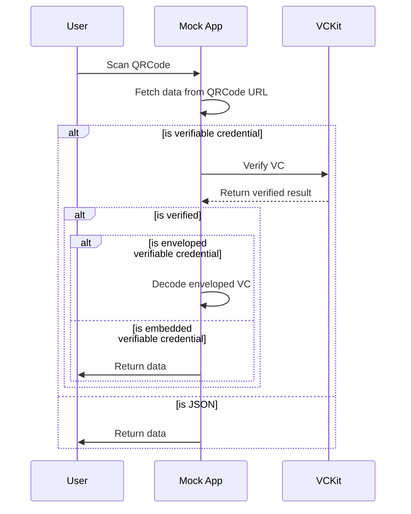

import Disclaimer from '../../\_disclaimer.mdx';

<Disclaimer />

## Description

The QRCodeScannerDialogButton component is responsible for rendering a button that allows the user to scan a QR code. The component will return the data that is scanned by the user.

## Example app-config

```json
{
  "name": "QRCodeScannerDialogButton",
  "type": "EntryData",
  "props": {
    "style": { "margin": "40px auto", "paddingTop": "40px", "width": "80%" }
  }
}
```

## Diagram



## Definitions

| Property | Required | Description                                                      | Type                                                                    |
| -------- | -------- | ---------------------------------------------------------------- | ----------------------------------------------------------------------- |
| name     | Yes      | The name of the component(should be "QRCodeScannerDialogButton") | String                                                                  |
| type     | Yes      | The type of the component (should be "EntryData")                | [ComponentType](/docs/mock-apps/common/component-type)                  |
| props    | Yes      | The properties for the QRCodeScannerDialogButton                 | [Props](/docs/mock-apps/components/qr-code-scanner-dialog-button#props) |

### Props

| Property  | Required | Description                                                                                           | Type                                                                            |
| --------- | -------- | ----------------------------------------------------------------------------------------------------- | ------------------------------------------------------------------------------- |
| style     | No       | The style for the component                                                                           | [Style](/docs/mock-apps/common/style)                                           |
| type      | No       | The type of data (should be 'VerifiableCredential' and 'JSON'), the default is 'VerifiableCredential' | [PayloadType](/docs/mock-apps/common/payload-type)                              |
| vcOptions | No       | The options for the VC data processing                                                                | [VC component configuration](/docs/mock-apps/configuration/vc-component-config) |

## Data Structure

The data payload of the QR code URL will should be any JSON object. The component will fetch the data from the URL and return the data to the user. The returned data will be an array with one object that has the key as the URL of the QR code and the value as the data that is fetched from the URL.
In the case of a verifiable credential, the data will be verified based on the `vcOptions` provided in the component. When the data is enveloped VC, the component will decode the enveloped VC and return as the same level path as the original VC.

### Example data structure

- When import a file that contains a JSON object:

  ```json
  // imported JSON file
  {
    "name": "Alice",
    "age": 25
  }
  ```

  The return data will be:

  ```json
  // return data
  [
    {
      "data.json": {
        "name": "Alice",
        "age": 25
      }
    }
  ]
  ```

- When import a file that contains a VC and the vcOptions is set as below:

  ```json
  // vcOptions
  {
    "credentialPath": "/",
    "vckitAPIUrl": "https://vckit-api.com",
    "headers": { "Authorization": "Bearer test" }
  }
  ```

  ```json
  // imported VC file
  {
    "@context": ["https://www.w3.org/ns/credentials/v2"],
    "type": ["VerifiableCredential"],
    "credentialSubject": {
      "id": "did:example:123",
      "name": "Alice"
    }
  }
  ```

  The return data will be:

  ```json
  // return data
  [
    {
      "VC1.json": {
        "@context": ["https://www.w3.org/ns/credentials/v2"],
        "type": ["VerifiableCredential"],
        "credentialSubject": {
          "id": "did:example:123",
          "name": "Alice"
        }
      }
    }
  ]
  ```

  The imported data will be verified and return the original VC.

- When import a file that contains a enveloped VC and the vcOptions is set as below:

  ```json
  // vcOptions
  {
    "credentialPath": "/",
    "vckitAPIUrl": "https://vckit-api.com",
    "headers": { "Authorization": "Bearer test123" }
  }
  ```

  ```json
  // imported VC file
  {
    "@context": ["https://www.w3.org/ns/credentials/v2"],
    "id": "data:application/vc-ld+jwt,jwt",
    "type": "EnvelopedVerifiableCredential"
  }
  ```

  The return data will be:

  ```json
  // return data
  [
    {
      "VC1.json": {
        "vc": {
          "@context": ["https://www.w3.org/ns/credentials/v2"],
          "id": "data:application/vc-ld+jwt,jwt",
          "type": "EnvelopedVerifiableCredential"
        },
        "decodedEnvelopedVC": {
          "@context": ["https://www.w3.org/ns/credentials/v2"],
          "type": ["VerifiableCredential"],
          "credentialSubject": {
            "id": "did:example:123",
            "name": "Alice"
          }
        }
      }
    }
  ]
  ```

  Based on the above example, the imported data will be verified and transformed to an object that contains the original VC and the decoded VC.
