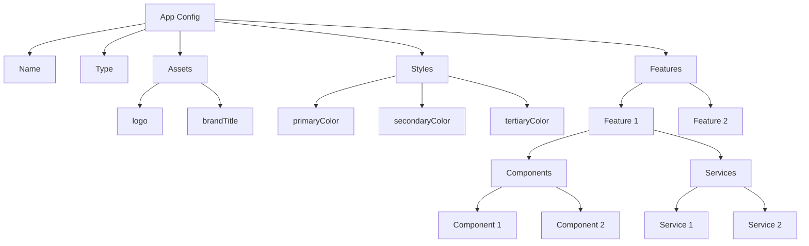

import Disclaimer from '../.././\_disclaimer.mdx';

<Disclaimer />

Apps are used to represent and encapsulate the process/business logic of each actor within the value chain. Each app is independently configured to ensure the appropriate functionality can be implemented dependent on the role that actor in the value chain plays.

Not only can the functionality/business logic be configured but the style of each app can be too, e.g. logo, app name and colours. This allows the implementor to create a visual distinction between value chain actors which can also help convey their role. 

Each app is a page within the mock app system where the name of the value chain actor set in the config file is used as a path segment just as the general feature `{mock_app_system_base_url}/{actor_name or general_feature_name}`. Each app defined in the config file will be displayed in the sidebar menu.

Apps are composed of features which have ids and names to be able to discern between features within the UI of the respective app and the entry point of each feature (button) is displayed on the home page of the respective app just as the [general features](/docs/mock-apps/configuration/general-feature-config).

## Diagram



## Config
<!-- TODO: Find out what id and type are used for -->
| Property | Required | Description                                         | Type   |
| -------- | -------- | --------------------------------------------------- | ------ |
| name     | Yes      | The name of the app                                 | String |
| type     | Yes      | The type of the app (e.g., "producer", "processor") | String |
| assets   | Yes      | Assets associated with the app                      | [Asset](/docs/mock-apps/common/asset) |
| styles   | Yes      | Styling information for the app                     | [Style](/docs/mock-apps/common/style) |
| features | Yes      | Array of features available in the app              | [Feature](/docs/mock-apps/configuration/feature-config)[]  |

## Example

```json
{
  "name": "Steel Mill 1",
  "type": "producer",
  "assets": {
    "logo": "https://example.com/Logo.jpg",
    "brandTitle": "Steel Mill 1"
  },
  "styles": {
    "primaryColor": "#b22166",
    "secondaryColor": "#391561",
    "tertiaryColor": "#ffffff"
  },
  "features": []
}
```