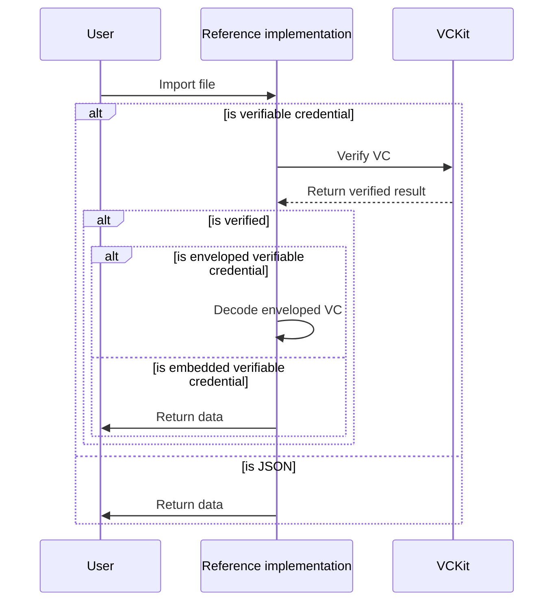

import Disclaimer from '../../\_disclaimer.mdx';

<Disclaimer />

## Description

The ImportButton component is responsible for rendering a button that allows the user to import data. The component will return the data that is imported by the user.

## Example app-config

```json
{
  "name": "ImportButton",
  "type": "EntryData",
  "props": {
    "label": "Import JSON",
    "style": { "margin": "40px auto", "paddingTop": "40px", "width": "80%" }
  }
}
```

## Diagram



## Definitions

| Property | Required | Description                                         | Type                                                    |
| -------- | -------- | --------------------------------------------------- | ------------------------------------------------------- |
| name     | Yes      | The name of the component(should be "ImportButton") | String                                                  |
| type     | Yes      | The type of the component (should be "EntryData")   | [ComponentType](/docs/reference-implementation/common/component-type)  |
| props    | Yes      | The properties for the ImportButton                 | [Props](/docs/reference-implementation/components/import-button#props) |

### Props

| Property  | Required | Description                                                                                           | Type                                                                            |
| --------- | -------- | ----------------------------------------------------------------------------------------------------- | ------------------------------------------------------------------------------- |
| label     | Yes      | The label for the import button                                                                       | String                                                                          |
| style     | No       | The style for the component                                                                           | [Style](/docs/reference-implementation/common/style)                                           |
| type      | No       | The type of data (should be 'VerifiableCredential' and 'JSON'), the default is 'VerifiableCredential' | [PayloadType](/docs/reference-implementation/common/payload-type)                              |
| vcOptions | No       | The options for the VC data processing                                                                | [VC component configuration](/docs/reference-implementation/configuration/vc-component-config) |

## Data structure

The file extension should be JSON and the data structure can be any JSON object. The component will return data that will be an array of objects, each object has key as the file name and value as the data that is imported.
In case the data is a verifiable credential (VC) or contains a VC, the component will use the vcOptions to verify and decode the VC. The decoded enveloped VC will be set as the same level as the original VC.

### Example data structure

- When import a file that contains a JSON object:

  ```json
  // imported JSON file
  {
    "name": "Alice",
    "age": 25
  }
  ```

  The return data will be:

  ```json
  // return data
  [
    {
      "data.json": {
        "name": "Alice",
        "age": 25
      }
    }
  ]
  ```

- When import a file that contains a VC and the vcOptions is set as below:

  ```json
  // vcOptions
  {
    "credentialPath": "/",
    "vckitAPIUrl": "https://vckit-api.com",
    "headers": { "Authorization": "Bearer test" }
  }
  ```

  ```json
  // imported VC file
  {
    "@context": ["https://www.w3.org/ns/credentials/v2"],
    "type": ["VerifiableCredential"],
    "credentialSubject": {
      "id": "did:example:123",
      "name": "Alice"
    }
  }
  ```

  The return data will be:

  ```json
  // return data
  [
    {
      "VC1.json": {
        "@context": ["https://www.w3.org/ns/credentials/v2"],
        "type": ["VerifiableCredential"],
        "credentialSubject": {
          "id": "did:example:123",
          "name": "Alice"
        }
      }
    }
  ]
  ```

  The imported data will be verified and return the original VC.

- When import a file that contains a enveloped VC and the vcOptions is set as below:

  ```json
  // vcOptions
  {
    "credentialPath": "/",
    "vckitAPIUrl": "https://vckit-api.com",
    "headers": { "Authorization": "Bearer test123" }
  }
  ```

  ```json
  // imported VC file
  {
    "@context": ["https://www.w3.org/ns/credentials/v2"],
    "id": "data:application/vc-ld+jwt,jwt",
    "type": "EnvelopedVerifiableCredential"
  }
  ```

  The return data will be:

  ```json
  // return data
  [
    {
      "VC1.json": {
        "vc": {
          "@context": ["https://www.w3.org/ns/credentials/v2"],
          "id": "data:application/vc-ld+jwt,jwt",
          "type": "EnvelopedVerifiableCredential"
        },
        "decodedEnvelopedVC": {
          "@context": ["https://www.w3.org/ns/credentials/v2"],
          "type": ["VerifiableCredential"],
          "credentialSubject": {
            "id": "did:example:123",
            "name": "Alice"
          }
        }
      }
    }
  ]
  ```

  Based on the above example, the imported data will be verified and transformed to an object that contains the original VC and the decoded VC.
