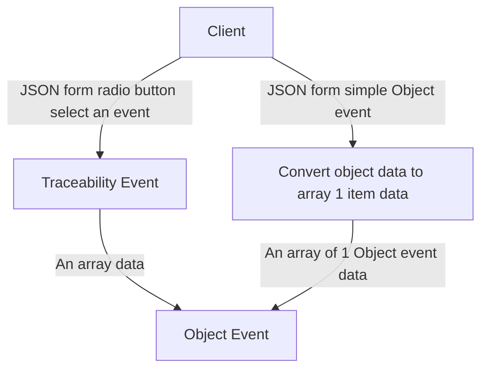

import Disclaimer from '../../\_disclaimer.mdx';

<Disclaimer />

## Description

The `convertObjectToArray1Item` service is responsible for converting an object to an array with one item. This service is used to convert an object to an array with one item to be used in the individual event services like [processObjectEvent](/docs/reference-implementation/services/process-object-event), [processAggregationEvent](/docs/reference-implementation/services/process-aggregation-event), [processTransformationEventOnly](/docs/reference-implementation/services/process-transformation-event-only), [processAssociationEvent](/docs/reference-implementation/services/process-association-event), and [processTransactionEvent](/docs/reference-implementation/services/process-transaction-event). The service will convert the data that is from the JSON form of the JSON schema with the root type is an object to an array with one item.

## Diagram



## Example

```json
{ "name": "convertObjectToArray1Item", "parameters": [{ "path": "/data" }] }
```

## Definitions

| Property | Required | Description                                                                                      | Type                                                            |
| -------- | -------- | ------------------------------------------------------------------------------------------------ | --------------------------------------------------------------- |
| path     | No       | The path of the data wants to convert. If the path is undefined, it will convert the whole data. | [IdentifierKeyPath](/docs/reference-implementation/common/identifier-key-path) |

## Function type

| Type       | Description                                                                                                              |
| ---------- | ------------------------------------------------------------------------------------------------------------------------ |
| ReturnData | It processes the input data or generates data independently and returns the processed result after successful execution. |
