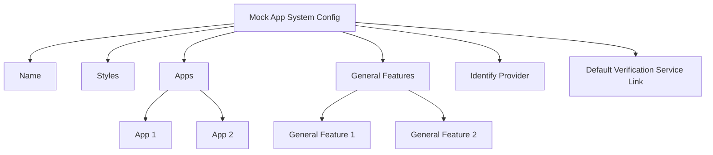

import Disclaimer from '../.././\_disclaimer.mdx';

<Disclaimer />

This is a high-level system configuration used to brand the Mock App system, define the apps contained within the Mock App system, and define the connections to common external services that each app can use.

An example of a common service that is shared across all Mock Apps is a mock or real service which serves information about products like the global VerifiedByGS1 service, which given an identifier, can return generic information about that product, but more importantly a link to the [Identity Resolver](https://uncefact.github.io/spec-untp/docs/specification/IdentityResolver) service of the value chain actor.

## Diagram 


## Config

| Property | Required | Description | Type |
|----------|----------|-------------|------|
| name | Yes | The name of the mock app system (displayed in the header) | String |
| styles | Yes | Custom styling options for the overall system | [Style](/docs/mock-apps/common/style) |
| generalFeatures | Yes | A list of common features accessible across all apps | [GeneralFeature](/docs/mock-apps/configuration/general-feature-config)[] |
| apps | Yes | A collection of individual apps representing different actors in the value chain | [App](/docs/mock-apps/configuration/app-config)[] |
| identifyProvider | Yes | The service used to resolve identifiers to their respective Identity Resolver Services (E.g. Mock Verified By GS1 Service) | [IdentifyProvider](/docs/mock-apps/common/identify-provider) |
| defaultVerificationServiceLink | Yes | The default link to the verification service for credential verification (used by the verify page) | [DefaultVerificationServiceLink](/docs/mock-apps/common/default-verification-service-link) |

## Example
``` json
{
  "name": "Steel Value Chain Example",
  "styles": {
    "primaryColor": "rgb(255, 207, 7)",
    "secondaryColor": "black",
    "tertiaryColor": "black"
  },
  "generalFeatures": [
    {
      "name": "General features",
      "type": "",
      "styles": {
        "primaryColor": "rgb(255, 207, 7)",
        "secondaryColor": "black",
        "tertiaryColor": "black"
      },
      "features": []
    }
  ],
  "apps": [
    {
      "name": "Steel Mill 1",
      "type": "producer",
      "assets": {
        "logo": "https://example.com/Logo.jpg",
        "brandTitle": "Steel Mill 1",
        "passportVC": "",
        "transactionEventVC": ""
      },
      "styles": {
        "primaryColor": "#b22166",
        "secondaryColor": "#391561",
        "tertiaryColor": "#ffffff"
      },
      "features": [
        {
          "name": "Issue DPP",
          "id": "produce_product",
          "components": [
            ...
          ],
          "services": [
          ...
          ]
        },
        {
          "name": "Sale Steel",
          "id": "transaction_product",
          "components": [...],
          "services": [...]
        }
      ]
    },
    {
      "name": "Steel Mill 2",
      "type": "producer",
      "assets": {
        "logo": "https://example.com/Logo.jpg",
        "brandTitle": "Steel Mill 2",
        "passportVC": "",
        "transactionEventVC": ""
      },
      "styles": {
        "primaryColor": "#b22166",
        "secondaryColor": "#391561",
        "tertiaryColor": "#ffffff"
      },
      "features": [
        {
          "name": "Issue DPP",
          "id": "produce_product",
          "components": [
            ...
          ],
          "services": [
          ...
          ]
        },
        {
          "name": "Sale Steel",
          "id": "transaction_product",
          "components": [...],
          "services": [...]
        }
      ]
    },
    {
      "name": "Steel Processor",
      "type": "processor",
      "assets": {
        "logo": "https://example.com/Logo.jpg",
        "brandTitle": "Steel Processor",
      },
      "styles": {
        "primaryColor": "#b22166",
        "secondaryColor": "#391561",
        "tertiaryColor": "#ffffff"
      },
      "features": [
        {
          "name": "Process Steel",
          "id": "process_product",
          "components": [...],
          "services": [...]
        }
      ]
    }
  ],
  "identifyProvider": {
    "type": "gs1",
    "url": "http://localhost:3333/products"
  },
  "defaultVerificationServiceLink": {
    "title": "Default Verification Service",
    "context": "Default Verification Service",
    "type": "application/json",
    "href": "http://localhost:3332/agent/routeVerificationCredential",
    "hreflang": ["en"],
    "apiKey": "test123"
  }
}
```