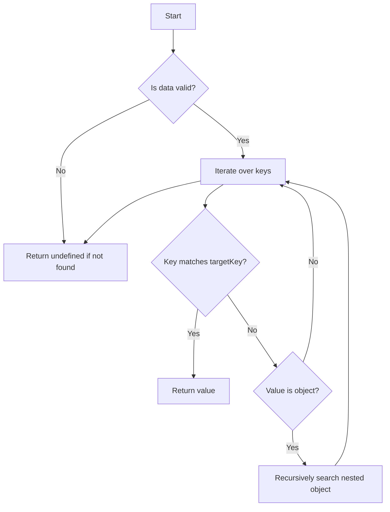

import Disclaimer from '../../\_disclaimer.mdx';

<Disclaimer />

## Description

The `findFirstMatchingKeyValue` service searches for the first occurrence of a specific key within a deeply nested object and retrieves its corresponding value. If the key is found, the function immediately returns the value. If the key does not exist, the function returns `undefined`.

The function uses a recursive approach to traverse the nested structure. It supports cases where the input data is null, undefined, or empty and ensures the search is performed safely.

## Diagram



## Example

```json
{
  "name": "findFirstMatchingKeyValue",
  "parameters": {
    "targetKey": "key"
  }
}
```

## Definitions

| Property | Required | Description | Type |
| -------- | -------- | ----------- | ---- |
| data     | Yes      | The nested object to search through | Object |
| targetKey | Yes     | The key to search for within the nested object | String |

## Function type

| Type       | Description                                                                                                              |
| ---------- | ------------------------------------------------------------------------------------------------------------------------ |
| ReturnData | It processes the input data or generates data independently and returns the processed result after successful execution. |
