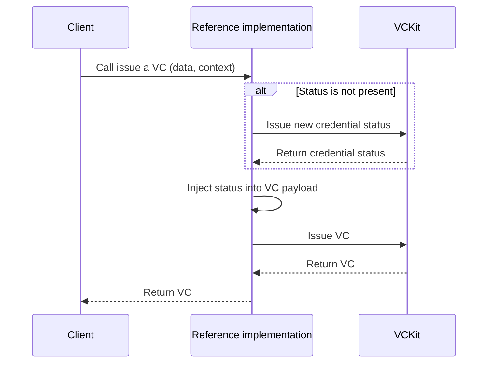

import Disclaimer from '../../\_disclaimer.mdx';

<Disclaimer />

## Description

The Issuing Credential feature in the reference implementation is responsible for issuing a Verifiable Credential (VC) along with its credential status. The status is added to the VC payload before the VC is issued and is managed by the VC issuer.

## Diagram

The sequence diagram below illustrates the process of issuing a VC along with its status.

## Managing the status of a Verifiable Credential

To manage the status of a Verifiable Credential ([activate](https://uncefact.github.io/project-vckit/docs/get-started/api-server-get-started/basic-operations#activating-a-vc) or [revoke](https://uncefact.github.io/project-vckit/docs/get-started/api-server-get-started/basic-operations#revoking-a-vc)), you can refer to the [VCkit](https://uncefact.github.io/project-vckit/docs/) documentation.

