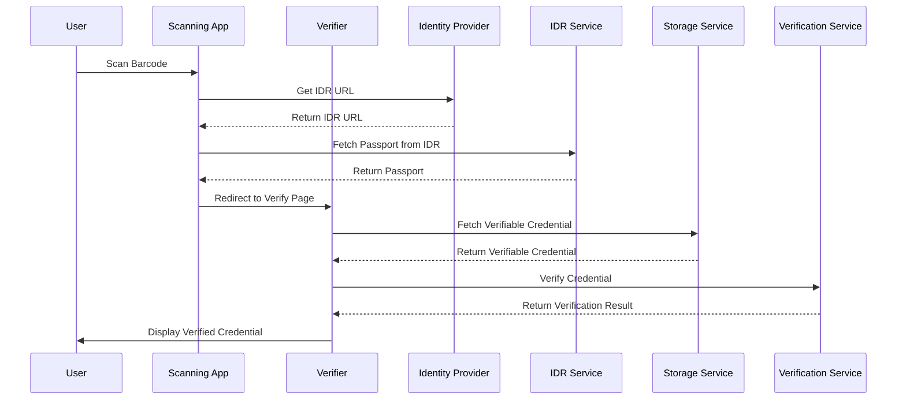

import Disclaimer from '.././\_disclaimer.mdx';

<Disclaimer />

## Description
The Scanning App is a dedicated page within the Reference implementation system, designed to enable users to scan barcodes and verify/view associated credentials. This page incorporates several key functions to manage the scanning and verification process efficiently. 

It begins by fetching the link to the associated passport from the [Identity Resolver service](/docs/reference-implementation/dependent-services/identity-resolution-service) based on the identifier extracted from the barcode. The app then redirects to the [Verify App](/docs/reference-implementation/verify-app), where it retrieves the credential from the [Storage service](/docs/reference-implementation/dependent-services/storage-service). Subsequently, it sends the fetched Verifiable Credential to the [Verifiable Credential service](/docs/reference-implementation/dependent-services/verifiable-credential-service) for verification. Finally, it displays the rendered Verified Credential to the user, completing the seamless process of credential verification and visualisation.

## Diagram

## Configuration
The some components of the Scanning App can be configured by modifying the [configuration file](/docs/reference-implementation/configuration/):

- [Apps configurations](/docs/reference-implementation/configuration/system-config)
- [Identity provider settings](/docs/reference-implementation/common/identify-provider)
- [Default verification service link](/docs/reference-implementation/common/default-verification-service-link)

## Usage
To use the Scanning App:

- Navigate to the home page of the Reference implementation system.
- Select the Scanning option within the sidebar to open the barcode scanner.
- Scan a valid barcode containing an identifier associated with a product.
- The app will process the scanned data and redirect to the [Verify App](/docs/reference-implementation/verify-app).
- The [Verify App](/docs/reference-implementation/verify-app) will display the verified credential.