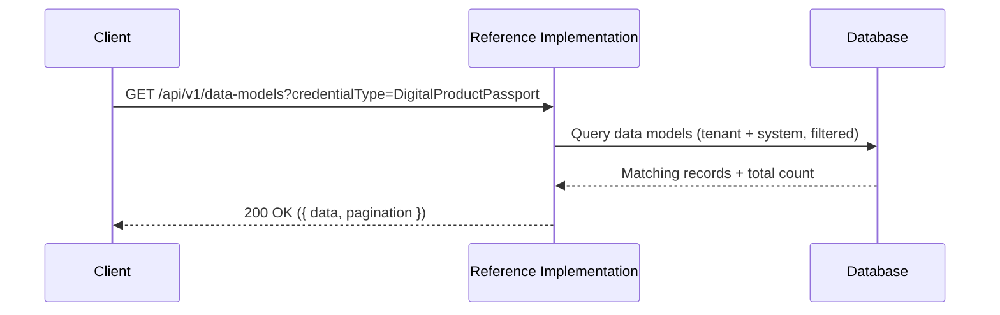
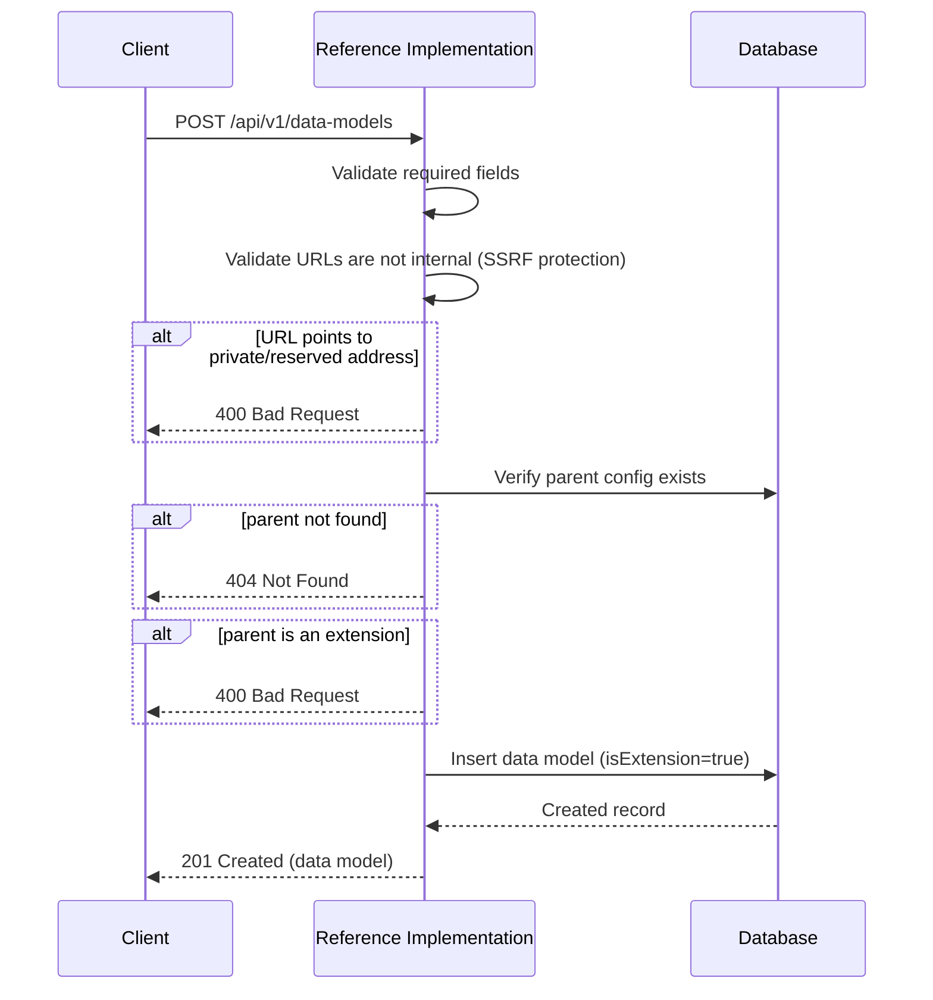
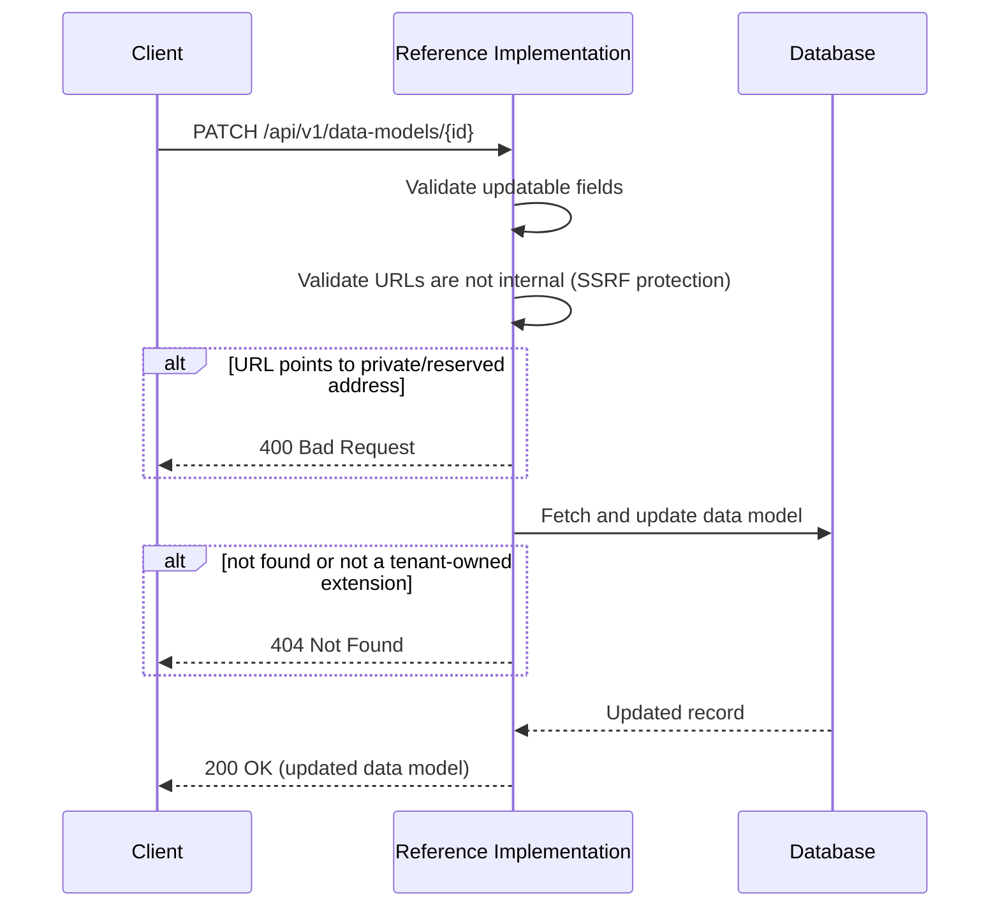
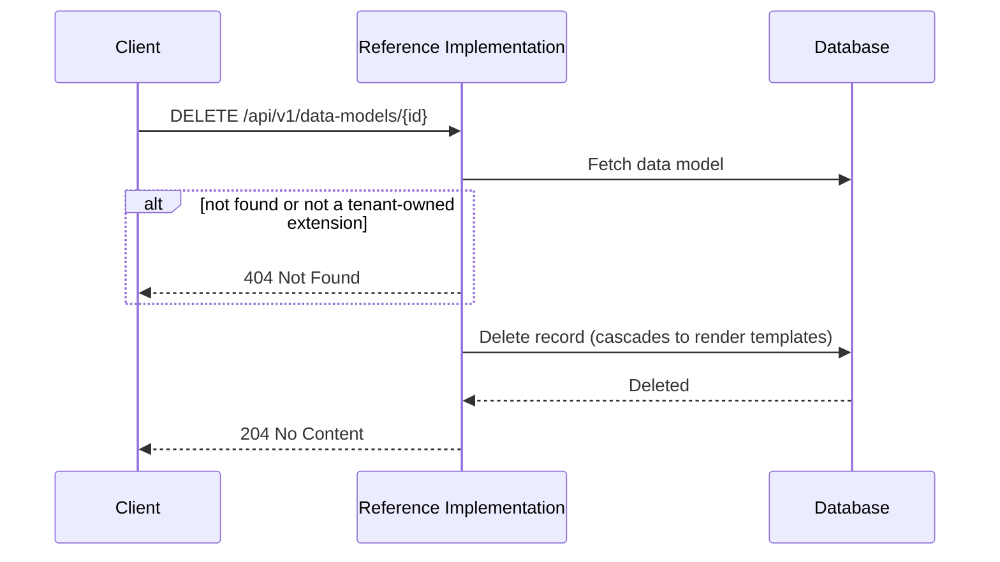

# Data Models API

The data models API manages **data models** — the schema definitions that describe the structure and semantics of each [UNTP](https://untp.unece.org/)-compliant verifiable credential type. All credentials issued by the Reference Implementation are based on UNTP core data models at a specific version.

## Why data models?

The [UNTP specification](https://untp.unece.org/) defines several credential types — Digital Product Passport, Digital Conformity Credential, Digital Facility Record, and others. Each has a defined semantic structure: a [JSON-LD context](https://www.w3.org/TR/json-ld/#the-context) that gives meaning to its fields and a [JSON Schema](https://json-schema.org/) that validates its structure. Because the specification evolves over time, every data model is pinned to a specific **type and version** pair. For example, a Digital Product Passport at version `0.6.0` has a different schema and context than the same type at version `0.5.0`.

These credential structures all reference real-world things — the organisation issuing the credential, the facility where a product is made, the product itself, conformity assessments, and so on. The Reference Implementation defines its own internal models for these — **entities** such as organisations, facilities, products, and conformity vocabulary profiles — that are stable over time. A tenant's organisation record doesn't change just because a new version of the UNTP specification is released.

But the credential structures that *reference* those entities do change. A product identifier might sit in a different position in version `0.6.0` than it did in `0.5.0`. A new version might introduce new fields or restructure how facility data is nested. This creates a mapping problem: how does the system connect stable entity records to credential structures that evolve?

This is what [**data model bridges**](#data-model-bridges) solve. Each UNTP core data model type and version has a corresponding bridge that maps between the evolving UNTP credential structure and the Reference Implementation's stable internal entity models. This enables the system to:

- [**Extract**](../data-models/index.md#extraction) entity references from issued credentials and link them to database records
- [**Populate**](../data-models/index.md#population) credential payloads from existing entity data, so users don't re-enter information for each credential
- [**Validate**](../data-models/index.md#validation) credential content against expected requirements

Beyond UNTP core data models, tenants can create [extensions](#untp-core-data-models-and-extensions) for industry-specific or regional variants. Each data model — whether core or extension — also has associated [render templates](./render-templates) that control how credentials of that type and version are visually presented.

:::tip[Interactive API documentation]
The Reference Implementation includes a Swagger UI at [`/api-docs`](http://localhost:3003/api-docs) with full request/response schemas you can try directly from the browser. The endpoint descriptions below focus on behaviour and internal logic — refer to Swagger for exact payload shapes. All endpoints require authentication — see [Authentication](../authentication#obtaining-a-token) for how to obtain a Bearer token.
:::

## Concepts

### UNTP Core Data Models and Extensions

Data models are divided into two categories:

**UNTP core data models** (`isExtension: false`) are the base credential definitions provided by the [UNTP specification](https://untp.unece.org/docs/specification). Each core data model at each version has a corresponding schema and context that defines its semantic structure. The Reference Implementation is provisioned with the full set of UNTP core data models from version `0.6.0` onwards — these are system-provisioned and read-only. As new versions of the UNTP specification are released, the corresponding core data models will be added to the Reference Implementation.

**Extensions** (`isExtension: true`) are custom variants that build on top of a UNTP core data model. An extension extends a specific core data model at a specific version — for example, a "Digital Livestock Passport" extension might extend the Digital Product Passport at version `0.6.0`. The extension has its own name, its own version (e.g., the Digital Livestock Passport might be at version `0.4.0` independently of the parent), and its own schema and context URLs that add fields on top of the core structure. Extensions can be added in two ways:

- **System extensions** — the individual or community provisioning an instance of the Reference Implementation can include extensions that are made available to all tenants. This is useful for making industry-specific or regional extensions available across the instance. System extensions are owned by the [system tenant](../system-architecture#system-tenant), provisioned during [startup](../operations/startup#step-2-database-seed), and are read-only.
- **Tenant extensions** — individual tenants can create their own extensions through this API, scoped exclusively to their tenant. Tenants can only update or delete their own extensions.

When listing or retrieving data models, tenants see their own extensions alongside all system data models (both UNTP core data models and system extensions).

Every extension must reference its parent UNTP core data model via `parentConfigId`. This relationship is essential because extensions are expected to retain the core properties defined by the parent — they add to the core structure but should not remove from it. This is also a requirement for producing conformant UNTP-compliant credentials. This allows the Reference Implementation to apply the parent's [data model bridge](#data-model-bridges) to extension credentials on a best-effort basis: because the core properties are expected to be present, the same bridge that works for the core data model can also be applied to any extension of that type and version. Not all core properties are required, so extraction results depend on which properties are populated in the credential payload.

Extensions cannot currently be nested — an extension must reference a UNTP core data model as its parent, not another extension. Support for nested extensions is anticipated but not yet implemented.

### Credential Types

The `credentialType` field identifies which UNTP core data model the data model represents. The supported types align with the [UNTP specification](https://untp.unece.org/):

| Credential Type | Description |
|-----------------|-------------|
| `DigitalProductPassport` | Product-level sustainability and provenance data |
| `DigitalConformityCredential` | Conformity assessment results and certifications |
| `DigitalFacilityRecord` | Facility-level operational and compliance data |
| `DigitalIdentityAnchor` | Identity verification and anchoring |
| `DigitalTraceabilityEvent` | Supply chain events (object, aggregation, transformation, transaction, association) |


### Data Model Bridges

Each UNTP core data model type and version has a corresponding **data model bridge** that maps between the credential structure and the Reference Implementation's internal entity models. Bridges handle [extraction](../data-models/index.md#extraction), [population](../data-models/index.md#population), and [validation](../data-models/index.md#validation) of entity data.

For a detailed understanding of how bridges work, see the [Data Models](../data-models/index.md) documentation section. For the technical architecture including the delta pattern and version composition, see [Bridge Architecture](../data-models/bridge-architecture).

### Schema and Context URLs

Each data model specifies two required URLs:

| Field | Description |
|-------|-------------|
| `schemaUrl` | The [JSON Schema](https://json-schema.org/) that defines the structure and validation rules for credentials of this type |
| `contextUrl` | The [JSON-LD context](https://www.w3.org/TR/json-ld/#the-context) that provides semantic meaning to the credential's fields |

For extensions, both the parent's and extension's schema and context URLs are used during credential issuance — the parent provides the base structure and the extension adds its custom fields.

An optional `websiteUrl` can be provided as a link to human-readable documentation about the data model.

All URL fields (`schemaUrl`, `contextUrl`, `websiteUrl`) are validated to ensure they do not point to private or reserved network addresses. This prevents SSRF attacks where a stored URL could later be used to target internal services.

### Cascading Deletes

Deleting a data model cascades to all associated [render templates](./render-templates) linked to the data model.

## Endpoints

### List data models

```
GET /api/v1/data-models
```

Returns data models visible to the authenticated tenant, including system-provisioned UNTP core data models and extensions. Results are paginated and can be filtered.

| Parameter | Type | Default | Description |
|-----------|------|---------|-------------|
| `credentialType` | string | — | Filter by credential type (e.g., `DigitalProductPassport`) |
| `version` | string | — | Filter by version (e.g., `0.6.0`) |
| `isExtension` | string | — | Filter by extension status (`true` or `false`) |
| `limit` | integer | `20` | Maximum results per page (clamped to 100) |
| `offset` | integer | `0` | Number of results to skip (must be non-negative) |



---

### Create a data model

```
POST /api/v1/data-models
```

Creates a new data model **extension** for the authenticated tenant. All data models created through the API are extensions (`isExtension: true`) — UNTP core data models are system-provisioned and cannot be created by tenants.

The `parentConfigId` must reference an existing UNTP core data model (`isExtension: false`) — use the [list endpoint](#list-data-models) with `isExtension=false` to retrieve available core data models and their IDs. Extensions of extensions are not permitted at this time.



---

### Get a data model

```
GET /api/v1/data-models/{id}
```

Retrieves a specific data model by its database ID. The tenant can access data models they own and system defaults. The response includes the full `parentConfig`, `extensions`, and `renderTemplates` relations.

---

### Update a data model

```
PATCH /api/v1/data-models/{id}
```

Updates one or more fields of a data model extension owned by the tenant. System data models and UNTP core data models cannot be updated.

Only the following fields can be updated: `name`, `schemaUrl`, `contextUrl`, `websiteUrl`. The `credentialType`, `version`, `isExtension`, and `parentConfigId` are immutable — they cannot be changed after creation.

At least one updatable field must be provided.



---

### Delete a data model

```
DELETE /api/v1/data-models/{id}
```

Permanently deletes a data model extension owned by the tenant. System data models and UNTP core data models cannot be deleted.

Deletion cascades to all associated [render templates](./render-templates).



---

### Get form configuration

```
GET /api/v1/data-models/{id}/form-config
```

Returns entity picker metadata for the web UI, describing which entity types a credential of this type requires and where to fetch them. This endpoint is primarily used by the frontend to render dynamic credential issuance forms.

| Credential Type | Required Entities |
|-----------------|-------------------|
| `DigitalProductPassport` | Organisation, Facility, Product |
| `DigitalConformityCredential` | Organisation |
| `DigitalFacilityRecord` | Organisation, Facility |
| `DigitalIdentityAnchor` | Organisation |
| `DigitalTraceabilityEvent` | Organisation, Product |

For credential types that support conformity (Digital Product Passport, Digital Conformity Credential, Digital Facility Record), the form configuration also includes optional conformity scheme and profile pickers. The profile picker uses a `dependsOn` field to indicate it depends on the scheme selection — see [Conformity Handling](../data-models/conformity-handling#form-configuration) for details.

Unregistered credential types return an empty `sections` array.
